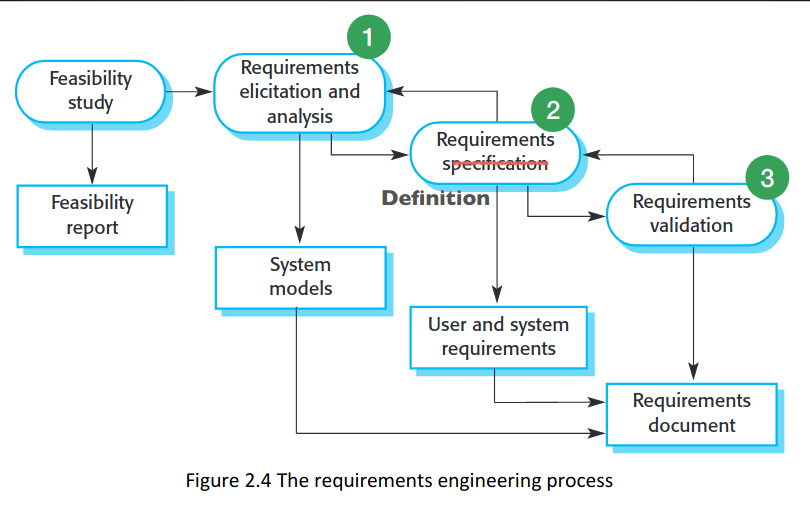
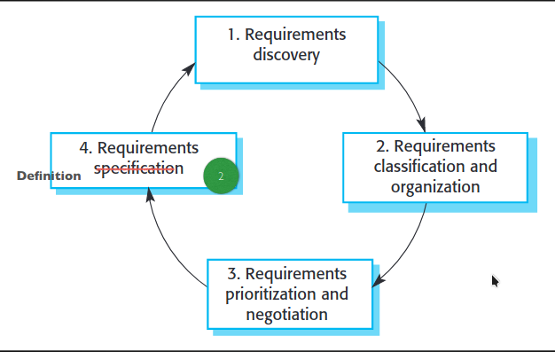

# Requirements
## Why requirements are important
Requirements are normally the problem
Incomplete requirements and lack of user involvement rank top of the list of causes of project failure
Understand product requirements is the major problem in software development
Coding or programming is not a major problem

Difficult to to build the software exactly how its wanted.
Cheaper to find and fix errors in requirement stage rather than maintenance stage
## The problem
Understanding 'stakeholder' requirements is key to effective systems development
Have to learn how to identify their requirements
Need to be able to determine them, by working with clients

## Requirements engineering

## Requirements Elicitation

### Initial Methods
Breaking down the requirements, 
1. Personas and user profiles
2. Requirements gathering
3. Task analysis
4. Contextual enquiring 
#### Stakeholder Analysis 
Determine all the people that will use the system
Mixture of
- working with initial briefs
- problem analysis
- interviews/discussions
Have to identify the different types of stakeholders e.g. primary,secondary, tertiary
Different ways of classifying/analysing then
- Importance/Priority
- Impact of their needs
#### Personas
Represents a real type of user from your stakeholders
**Main Aim: Personas should differentiate stakeholders clearly**
Identify: motivations, expectations
Usage: Help you to put yourself in the shoes of..
Ideally: Try to have a small number - all one page at most

Not a report on real people from the client company, choose generic representative.
Create a few that demonstrate key user types
Might be several stakeholders can be represented by one - lectures/module convenors etc
Whereas might be that one type needs several personas - regular gamers, casual gamers

*Externalisation* - SE mistakes are often from 'what was not said and not documented'

#### Use Case Diagrams
Need to elaborate the tasks that each stakeholder will do
They represent the people who use the system and the tasks they have to perform
People = 'actors'

Use case can be an extension of a task (that should have been done first)
Some tasks may necessarily include other tasks