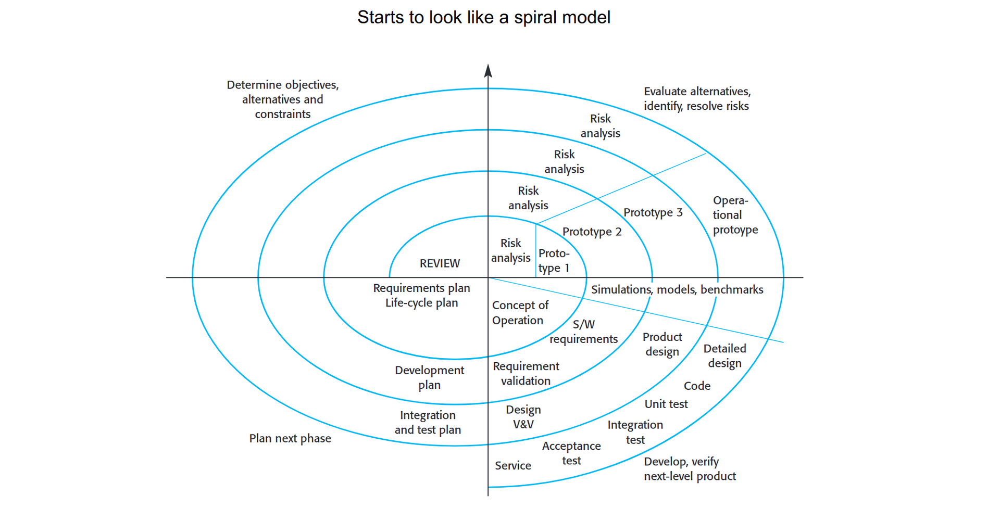

# Requirements Documents
SRS = Software Requirements Specification (IEEE Standard 830-1998)
- Usually a big set of nested lists, with uniqueness IDs
- Diagrams produced go with them (and cross reference those IDs)
- Lists should be categorised - e.g. importance, risk, etc
- Usually define the 'acceptance testing' t the end of the project

Users look at SRS documents, have to be written in a way so they can understand it as well. Managers will also use it.

# Requirements Validation
## Why need requirement validation
1. Checking that you are right
	- Is it what the customer really wants?
2. Avoiding ReWorking
	- Errors are expensive and can take longer. Cost of fixing a requirements problem is greater than repairing design or coding errors
	- Fixing mistakes in maintenance is expensive
	- 
		- Cycle looks like a spiral model 
3. Contractually Agreeing
	- Decide what exactly to build
	- Want to agree with the customer to get exactly what they want

## Requirements Validation
### Internal - Present it to your boss and colleges
- Using a focused method - requirements review
- Reviews appear in several stages
- First sanity check
- Do with team first
- Benefits
	- Client manager gets a clear picture before taking it to the client
	- If can explain it to them, can explain it to client
### External - Present it back to participants/clients/users
- Do they agree 
- People in the room are the key people from both companies
- By the end of this validation, should have 'the plan'
## Requirements Conflicts
Missing aspect - then need to do more elicitation
Conflict - Need to document the conflicting ideas
