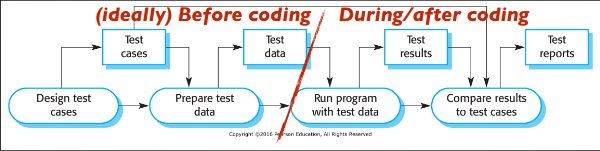

## Final spec output
**Architecture Design** - Internal architecture of the objects, classes, use of APIs
**Interface Design** - Detailed *blueprints* of final user interface, also any interfaces with other services
**Database Design** - What they can request from the DB in their code
**Component Design** - The exact class structure 

Class Description Documents
- Adding detail to Classes
- For each variable
- For each method/ Function
- How to know it works as expected

# Test Plans
- Something often ignored
- Determines when a programmer has 'finished' building something
- Used for Test Driven Development
- Part of the design phase
---
- Development Test Plans
	- Prove that a class functions correctly. Shows the code is actually working
- System/Integration Test Plans
	- Lets us prove that the software meets the specs. Shows that different components are working together
- Acceptance Test Plans
	- Shows that the software meets the requirements

## Why they're used?
Define what counts as 'finished'
1. Developers use TPs to test code before delivering it
2. Managers use it can estimate testing workload, and schedule it - and include it in the budget
3. Testing documentation serves as evidence to clients

## Overall Document
- Testing process
- Specifications Traceability
- Tested Items
- Testing Schedule
- Test Recording Procedures
- Hardware/Software Requirements
- Constraints
- **System Tests - a list of all the exact test cases that will be tested**

## Designing Test Cases

Now - Plan the test cases, and what data will test it
After Built - You run the test until it passes

## Each Test Case
1. Statement of what is being tested
2. Specifications of the inputs to the test
3. What the expected output from the system is
4. Specify the steps needed to carry out the data

## Types
- Validation Testing
	- Tests that show the software produces the right answer
- Defect Testing
	- Tests that show the software doesn't break

Need to deal with the program if it fails a test at some point
If fixed the issue, have to redo the test on where it failed, with notes on why and what.

