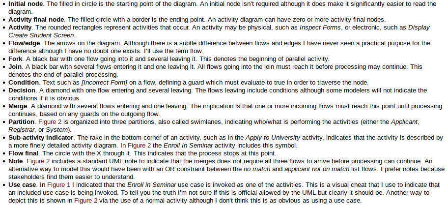
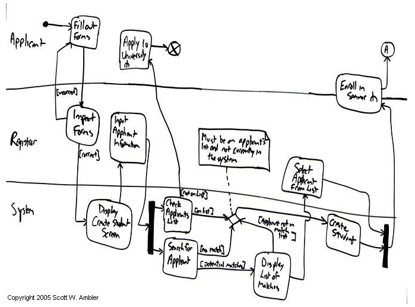
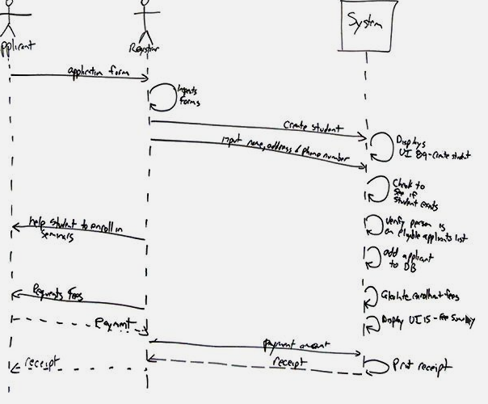

# User Stories
Very slim and high-level requirements artefacts.
Important considerations for writing user stores (informal)
1. Stakeholders write user stories
2. Use the simplest tool
3. Remember non-functional requirements
4. Indicate the estimated size
5. Indicate the priority
6. Optionally include a unique identifier

2 errors where user stories affect the planning process on agile projects:
1. Scheduling
2. Estimating

Epics are large user stories, ones which are too big to implement in a single iteration.

Themes are a collection of related user stories. Used to organise stories into releases.
# Activity Diagrams

Can have 'swim' lanes so show who/what is performing the activity.
Can have a timer Icon to signify when the action should be carried out

# Sequence Diagrams
Most popular for dynamic modelling.
Typically used to model:
- Usage scenarios
- The logic of methods
- The logic of services 

Helps identify significant methods/services, such as checking to see if the applicant already exists.

The sequential nature of the logic is shown via the ordering of the messages. The first message starts in the top left corner, then appears below and so forth

Top of the diagram represents classifiers of their instances, typically use cases, objects, classes or actors.

Dashed lines are object lifetimes, represent the life span of the object during the scenario

Asynchronous message - where the sender doesn't wait for the result of the message, instead it processes the result when and if it ever comes back
Synchronous message- where the sender waits for the results before continuing on.

Sequence diagrams are effectively a form of visual coding
Dont create a complete set of sequence diagrams for the system. Only create a sequence diagram when you have complex logic that you want to think through
# Top Risks of requirements engineering
Need to get the requirements right, otherwise the project will fail.
- Overlooking a crucial requirement
	- Common issue scalability, not thinking how demand/use can increase dramatically. Most solutions to fix this is by starting over from scratch
- Inadequate customer representation
	- Need to interact with customers
- Modelling only functional requirements
	-	Focused on the things the systems supposed to do
- Not inspecting requirement
- Attempting to perfect requirements before beginning construction
	- Don't need to understand the entire project in the beginning(requirement)
- Representing requirements in the form of designs
	- Don't include technology as this relates to design. 
	- Don't let designs creep into the requirements specification, run the risk of choosing a particular solution that might not be the best one to implement

Biggest risk is not performing requirements engineering at all. These are your projects foundations. If let them unstated, no opportunity to examine and negotiate them with the customer. And wont know when you're ready to release your product.