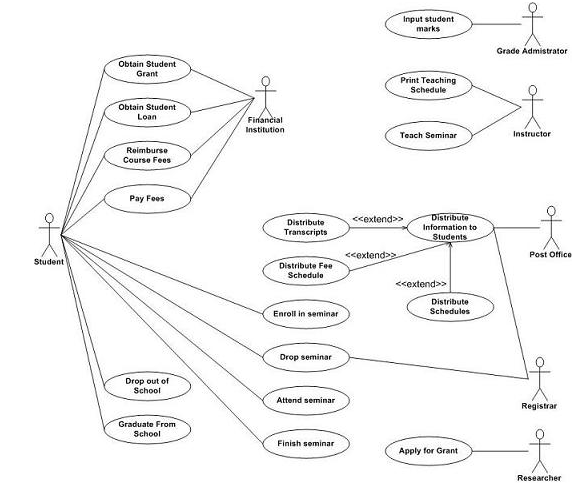

Create reliable and realistic representations of your key audience segments for reference
- Represent a major user group
- Express and focus on the major needs and expectations of the most important user groups
- Give a clear picture of the users expectations and how they're likely to use it
- Aid in uncovering universal features and functionality
- Describe real people with backgrounds, goals and values

To ensure personas are accurate representations of users, should:
- Conduct user research
- Condense the research
- Brainstorm
- Refine
- Make them realistic 

## Elements of a persona
- Persona Group (i.e. web manager)
- Fictional name
- Job titles and major responsibilities
- Demographics such as age, education, ethnicity, and family status
- The goals and tasks they are trying to complete using the site
- Their physical, social, and technological environment
- A quote that sums up what matters most to the persona as it relates to your site
- Casual pictures representing that user group

# Use Case
Useful for presentations to management or project stakeholders.
Use case diagrams contain:
- Use cases
- Actors
- Associations
- System boundary boxes
- Packages

Best to identify as many actors as possible, then connect them to use cases
Inheritance can be used to reuse section
Can remain agile by being open so can modify the diagram as needed