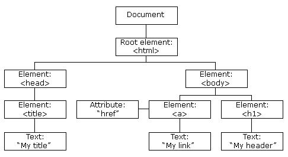

# Part 1
Javascript is embedded in a webpage. Java is used to write desktop and enterprise apps. Boundaries are becoming more blurred

- **Interpreted Language** with browser as the interpreter
- **Client-side** rather than **server-side**. Means it runs in the users browser rather than on the webserver
- **Compatibility** depends on browser version, but virtually every browser supports it
- **Security** cannot access the clients system beyond their web browser, so no file access

Javascript is not OOP, does not support class-based inheritance

Javascript can change any elements in HTML document

To declare variables in JS, have to declare it using `var`, JS doesnt care if it is a `int` etc. Can mix and match variables throughout the program. Can convert int to string and string to int
`NaN` - Not a Number

## Arrays
If added item to index 7, with only 2 elements, will fill in the gaps with `undefined`
`.push()` - adds an elements to the end of the array
`.indexOf()` - Check whether an array already contains a specific value
`.join()` - Gives control over how the array values are concatenated together

## Functions
Variables declared in functions are local. Return value is the parameter of return
### Parameters
- There is no type checking of parameters, nor is the number of parameters checked
- All arguments are sent through a property array
- Can access this array inside the function

## Objects
- Are like variables but they can contain many values.
- Can add new properties to an existing object simply by giving it a value.
- Can use the delete keyword to delete a property

# Part 
DOM - abstract model that defines the interface between documents and application programs - an API
HTML DOM is a standard object model and programming interface for HTML. Defines:
- Properties of all HTML elements
- Methods to access all HTML elements
- Events for all HTML elements

DOM have a tree like structure

Can find elements by id, tag name and class name

`.getElementById`
`.getElementsByClassName`

## Events and Event Handling
- An *event* is a notification that something specific has occurred
- Is a script that is implicitly executed in response to the appearance of an event
- The process of connecting an event handler to an event is called registration

## Dynamic HTML
HTML document whos properties can be changed after the document has been and is still being displayed by the browser

## Form Validation
- Most popular use for JS
- Should primarily be used for assistance for users to verify that the data inserted is in the right format. Would need to do further validation through PHP

## Screen Output
`alert` - Single ok button
`confirm` - Ok and Cancel button
`prompt` - Ok and Cancel button and input field