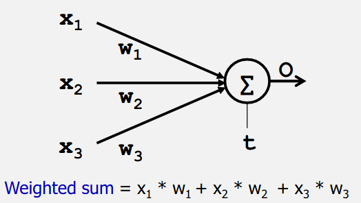
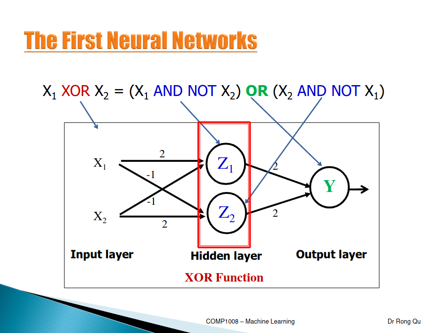

# Introduction to Machine Learning
# Neural Networks
Instead of writing program by hand, give computer a lot of examples / data with the output, so computer can learn to improve

## Machine Learning
Machine learning is concerned with computer programs that automatically improve their performance through experience 

Study of computer algorithms that can improve automatically through experiences without being explicitly programmed

- Top-down/Classic: model all different functions and wire all these 'agents' together
- Bottom-up / Deep learning: give the system a lot of data 
## Artificial Neural Networks
- Simulate, in the computer, neural networks in the brain
- McCulloh and Pits (1943): 1st neural networks
	- Combine simple inputs, idea of threshold
	- Weights design by humans
- Hebb (1949): First learning rule
	- Would adjust weights as it was ran
- 50s/60s
	- Perceptrpm: great excitement
	- Coverage to correct weights: learning $\to$ thinking
- 1969: death/winter of ANN 
	- Perceptron cant learn certain type of important functions (non- linear separable)
- Mid 80s: discovered multi-layer networks to solve problem of non-linear separable

### Neurons
- Signals "move" between neurons
- Sum of inputs >= threshold, neuron **fires** (output of 1)
- Long-term firing patters - basing learning
- Theory behind first neural network

### First Neural Networks
- Fundamental processing unit of a brain: a neuron
- A processing element - (neuron)
- Inputs (dendrites)
- Output (axon)
- Weights (synapses)

Positive weight: excitatory, otherwise inhibitory 


As long as the sum is above the threshold its correct



### Training a NN
Weights are normally randomly assigned
- **Epoch**: Entire training set feed into the neural network. The AND function: an epoch consists of four sets of inputs(patterns) feed into the network
- **Training Value, T**: Value that we require the network to produce
- **Error, Err**: The amount the output by the network O differs from the training value T
- **X_i**: Inputs to Neuron
- **w_i**: Weight from input X_i, to the output 
- **LR (Learning Rate)** How quickly the network converges. It is set by the experimentation, typically 0.1. This is the adjustment amount

```
While epoch produces an error
	Check next inputs(pattern) from epoch
	Err = T - O
	If Err <> 0 then
		w_i = w_i + LR * X_i * Err
	End If
End While
```

Performance Measure:
- Mean squared error = `[(T-O)^2]/n`
	- (n) number of items

Linearly Separable: Functions which can be separated. Only linearly separable functions can be represented by a single layer NN, i,e, perception

If you can separate your inputs and outputs with a straight line then you have found the weights


## Current AI Developments
AlphaCode - Writes computer programs at a competitive level. Ranked top 54% in real-world programming competitions

Deep Learning - Fathers of Deep Learning, Handwriting image recognition, language processing, vision etc.

Learning From Experience - Deep neural networks learn by adjusting the strengths of their connections to better convey input signals through multiple layers to neurons associated with the right general concepts