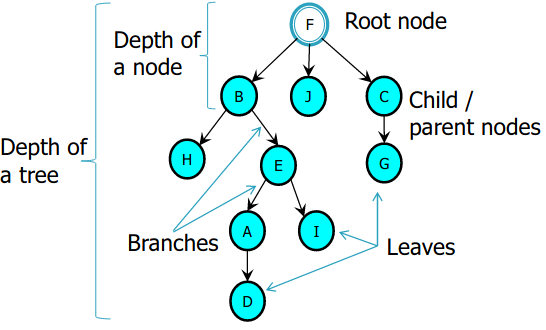

## Problem Search Space
Define the problem as a search. Important in science and engineering. Any problem can be seen as a search for the 'right answer'

Search Space - Set of all possible solutions to a problem
Search Algorithms - Input: a problem, Return: a solution to the problem

## Trees

Shows how the data can be represented
## Trees vs. Search Space
States - nodes | Possible states of the problem
Search Space - all nodes in the tree | Set of all states reachable from the initial state
Operator - branches | Set of actions that move one state to another

Neighbourhood - All possible states reachable from a given state
Goal Test - Test to a state tell if the search reached a state that solves the problem
Path cost - How much it costs to take a particular path

By using states and operators we can define the problem into the nodes and branches in a search tree. If you check all of the possible states, the possible states should be included in the tree.

Improve Search Techniques:
1. Define the problem into smaller search tree
2. Improve search efficiency through the tree
## Search Trees
### Issues
Tree Size:
Branching Factor: Average no. of branches of all nodes in a tree.

Claude Shannon (1949): how computers could play chess

Search trees grow very quickly (exponentially)

### General Search
```
Function General-Search(p, QUEUING-FN) returns a solution or failure
	nodes = Make-Queue(Make-Node(Initial-State[p]))
	Loop do
		If nodes is empty then return failure
		node = Remove-Front(nodes)
		If Goal-Test[p] on State(node) succeeds then returm node
		nodes = QUEUING-FN(nodes, Expand(node, Operators[p]))
	End
End Function
```
Data structures: `nodes:Queue`; `nodes:state`;