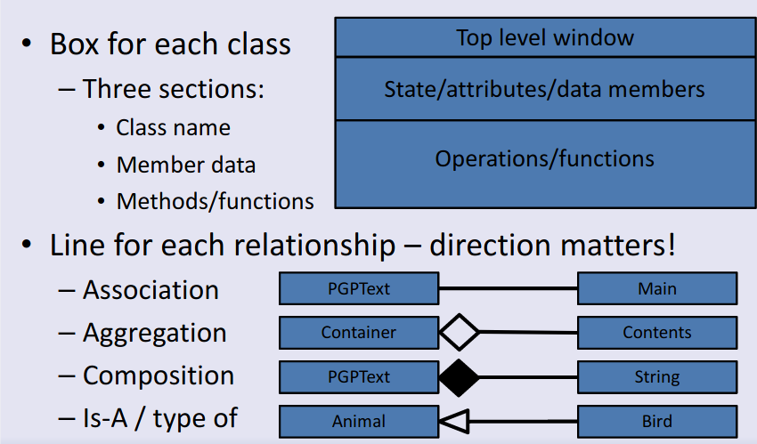

# Class Diagrams
Use diagrams to represent the relationship between classes. 

**Aggregation (containment)**: is a specialised form of association. Defines **one way relationship** that specifies a **'has a'** relationship between two classes.
**Association**: Indicates that a class knows about, and holds a reference to another class. 
**Composition**: Way to combine objects or data types into more complex ones
## Object
All classes in java are subclasses of Object. If dont say what a class extends then it extends the class called Object

Object has a few methods of its own. Every object inherits these and can add their own implementation
- `toString()` - get a String object to represent it
- `equals (Object obOther)` - Determine whether two objects are equivalent
- `hashCode()` - Get unique id for the object
- `getClass()` - Get a class object for the object

# Exceptions
- Like extra return value types to report exceptional events
- When is thrown, function will end unless the exception is caught
- Could be a problem
	- Function COULD raise an exception then you must either:
		- Catch the exception in the function
		- Label the function so that it is clear that it raises an exception
	- Least the caller knows of the risk

- Allows you to report error conditions that can be handled, not catching will cause an end to the program

## Background Info
- Can throw any Throwable object, not just an Exception object

## RuntimeException
- Special subclass of Exception. Covers things that are not predictable or are common from many places and you don't want to have to always check for
- Don't have to declare throwing a RuntimeException
- Avoid using them unless you don't want to force the claler to check for the exception

## Throwing your own exceptions
- Can throw your own exception types to indicate an error that you cant indicate through a return value
- Create sub-class of Exception

## Object lifetime in Java
Compiler creates .class files from .java files which are platform independent. Can compile on one os and execute on another
JVM is responsible for everything else inc memory management etc