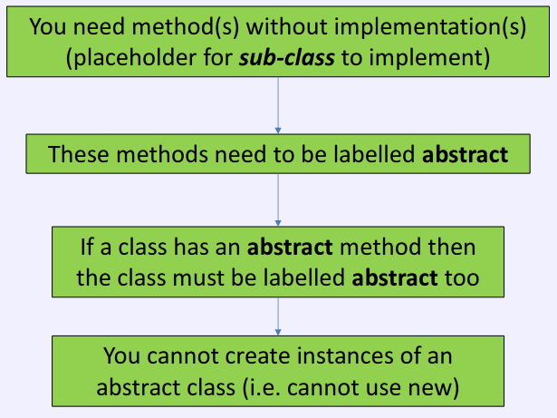
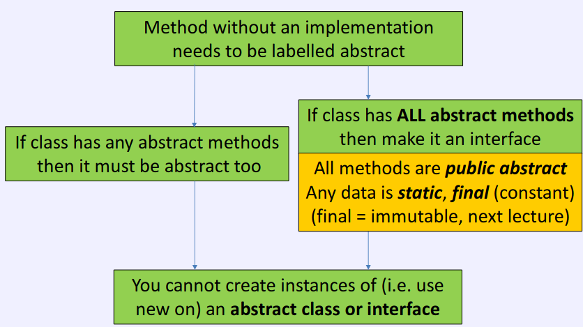

# Interfaces, Buttons and Event Handlers

# Design Patterns
## Patterns
- Patterns help us to identify ways in which a problem can be solved
	- Can identify the problem
	- Look at how people have solved this in the past
	- Much less 'thinking' and 'working out'
	- Avoid potential pitfalls later on
- Usually many good ways to solve a problem

## Layout managers
- Containers ask their layout manager to do the work
- Container calls functions in the base class Layout Manager
- Positioning of components
- Key design pattern feature: the container has delegated some of its work to another class - the layout manager

## Strategy Pattern
- This is a **Behavioural Pattern**
- Allow objects *behaviour* to change at runtime
- Strategies should be interchangeable
	- Should be same regardless of layout manager

# (Sub-type) Polymorphism and Interfaces

- Normally hide the data inside the class, and expose some kind of interface to the outside world
- When using polymorphism to allow behaviour to be changed at runtime, don't care how it is implemented inside the class
- Only care what functions/methods are available
- An abstract method is a method without implementation

## Summary

## Interfaces
- If not have implementations for any of the methods, can use an interface instead of a class
- Interface is a set of functions without implementations
	-	Sub class MUST implement ALL functions (or be abstract)
- Subclass implements interfaces but extends a class
- Class can only extend one class
- Can 'implement' many interfaces 

# JButtons
- Java Swing uses the Observer Pattern to monitor event handlers
- Uses an interface, the ActionListener
	-	An interface is just an abstract class which can use as a superclass

## Observer Pattern
- Is a common pattern to use when we want to notify other objects that something has happened
	- Object to notify supports some interface (Observer)
	- Notifying object keeps a list/array/etc of there to notify
	- Notifying object considers these as the base class/interface and calls a method

## JButton
To handle key presses, JButton needs an object to tell