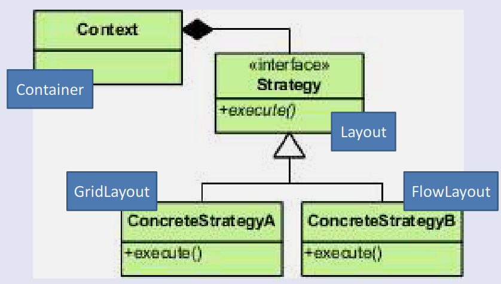
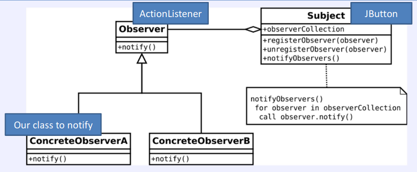

# final
- Variables can be final: cant change the value once you have initialised them.
- Methods can also be final, so you cant change their implementation in a subclass.
- Classes can be final: cant subclass them

# Reviewing out classes so far
## User interface Classes
- Every class is derived from object
- As we work down the class hierarchy, get more specialised
## Containers have components
- A container can contain components
- A container IS-A component and can containers containers
## Layout managers
- Containers have layout managers associated with them
- Can set the layout manager to use what layout
- A FlowLayout IS-A layout manager so a container can use it

# Patterns
## Strategy Pattern

Delegates some work to another class
- Get situations where a class has a number of responsibilities and it can implement each in multiple different ways
- Decide on the set of responsibilities and create an interface for them
- Can create different sub-classes which implement the responsibilities differently 
- Main object asks the implementer of interface to do the action whenever it is needed, rather than doing it itself
## Observer Pattern

Notifying an object (or multiple objects) of a different class that an even has occurred
### Java listeners
- Can notify an object of something by calling a method on it
- Caller knows that listener IS-AN ActionListener, so it knows it can call its actionPerformcd() method to tell it when something happens
- Caller does not know what the listener will do in reaction to being told
- Listener could also support other interfaces

# Nested and Inner Classes
Can defined classes inside classes. Cant make the classes:
- static: not associated with object of outer class or not

# Using Inner Classes
Classes inside another class
Adaptors - Exist for many of the interfaces. These are classes which have empty implementations of the methods, so would only need to implement one