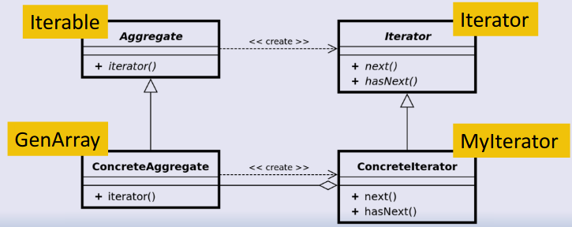

# Iterator Pattern
- Method to move through (iterate through) the elements of something
- Retrieve an iterator, which remembers its position and allows you to move to the next element
- Retrieve/create an iterator, which remembers its position and allows you to move to the next element



## Java support for Iterator and Iterable
Iterator interface exists. For each loops can be used with them - simplified version
```java
public interface Iterator<T>{
	boolean hasNext();
	T next();
}
```

Iterable interface also exists, to create an Iterator. 

## Two interfaces to know
- Iterable (on the container to iterate through). Interface with a method to create an iterator
- `Iterator <T> iterator()`
- Iterator (object to do the iteration). Interface to allow checking if there is a next object and if so retrieving it and moving on
- `boolean hasNext() \n T next()`