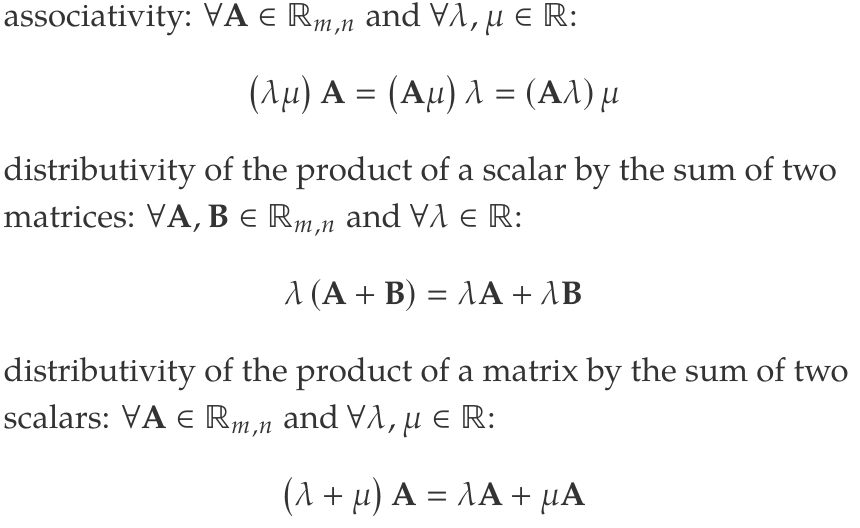
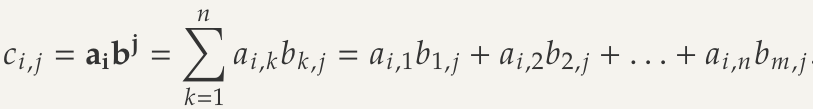
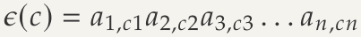
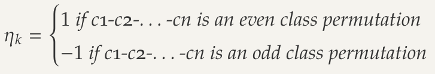
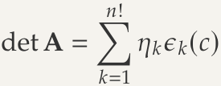
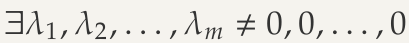
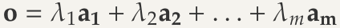

# Numeric Vector
## Numeric Vector
- Let $n\in \N$ and $n>0$
- Indicated with $\R^n$, set of ordered *n*-tuples of real numbers
- Generic element a = ($a_1,a_2,...,a_n$) is named *numeric vector* or simply vector of order *n* 

## Sum of Vectors
- Sum of vectors: $c = (a_1 + b_1 , a_2 + b_2 , . . . , a_n + b_n )$
- Can also do the same for $a-b$

## Scalars
Numeric value $\lambda \in \R^1$ is a scalar
The product of a vector by a scalar is the vector $c=(\lambda a_1,\lambda a_2,...,\lambda a_n)$
Very similar to $\times$

## Scalar Product
Generated by the sum of the products of each pair of corresponding components
$ab = c = a_1b_1 + a_2b_2,...,a_nb_n$
Example:
- $a = (1, 0, 3)$
- $b = (2, 1, −2)$
- $ab = (1 · 2) + (0 · 1) + (3 · (−2)) = 2 + 0 − 6 = −4$
### Properties
- Symmetry: $ab=ba$
- Associativity: $\lambda (ba) = (\lambda a)b = a(\lambda b)$
- Distributivity: $a(b+c)=ab+ac$

# Matrices
## Matrix
2 natural numbers > 0. A matrix ($m\times n$) is a generic table of the kind

$A=\begin{pmatrix}
a_1,_1&a_1,_2&...&a_1,_n \\
a_2,_1&a_2,_2&...&a_2,_n \\
...&...&...&...\\
a_m,_1&a_m,_2&...&a_m,_n \\
\end{pmatrix}$
where each *matrix element* $a_i,_j\in \R$ 

- m=rows, n=columns
- *n order square matrix* - $A \in \R_n,_n$ 
-  *rectangular* - $m \ne n$

## Matrix Transpose
- Transpose matrix is $A^T$ whose elements are the same of A but $\forall i,j : a_j,_i = a^T_i,_j$
- Change index of row with index of columns (rotate it)

## Symmetry
- Only on square matrix
- When $\forall _i,_j : a_i,_j = a_j,_i$

## Diagonal and Trace
- Diagonal of a matrix is the ordered *n*-tuple that displays the same index twice. From 1 to $n a_i,_j$
- Trace is the sum of the diagonal elements tr($A$)

## Null Matrices
- Is said *null* $O$ if all elements are zeros

## Identity Matrices
- Square matrix whose diagonal elements are all ones while all the other extra-diagonal elements are zero

# Matrix Operations: Sum and Product
## Matrix Sum
$\forall i,j:c_i,_j = a_i,_j + b_i,_j$
Both matrices must be the same size! Can be subtracted from one another
### Properties of the matrix sum
- commutativity: $A + B = B + A$
- associativity: $(A + B) + C = A + (B + C)$
- neutral element: $A + O = A$
- opposite element: $∀A ∈ Rm,n : ∃!B ∈ R m,n \ni ‘ A + B = O$

## Product of a scalar and a matrix
Matrix $C$ defined as: $\forall i,j:c_i,_j = \lambda a_i,_j$
Similar to $\times$ by the scalar

### Properties of multiplying by a scalar
- associativity: $\forall A \in \R_m,_n$ and $\forall \lambda , \mu \in \R$:
	- $(\lambda \mu )A = (A\mu ) \lambda = (A \lambda) \mu$

## Matrix product
*Product of matrices* $A$ and $B$ is a matrix $C = AB$

- Just the scalar product of **row** vectors of $A$ with **column** vectors of $B$
- Number of columns in the first matrix must be the same as the number of rows in the second

$c_2,_1 = a_2b^1$

- left distributivity: $A (B + C) = AB + AC$
- right distributivity: $(B + C) A = BA + CA$
- associativity: $A (BC) = (AB) C$
- transpose of the product: $(AB)^T = B^T A^T$
- neutral element: $\forall A : AI = A$
- absorbing element: $\forall A : AO = O$

Commutable - $AB=BA$, one with respect to the other
Every matrix $A$ is commutable with $O$ (and the result is always $O$) and with $I$ (and the result is always $A$)

# Determinant of a Matrix $\to$ takes decades to understand
- Most important concepts of maths

- Permutation: Different ways of grouping items, can be checked with factorials
- Fundamental Permutation - Reference a sequence
- Inversion - Every time two objects in a permutation follow each other in a reverse order with respect to the fundamental
- Even class permutation - Permutation undergone to an even number of inversions
	- Also have Odd class permutation

## Associated Product
Never in the same column/row. Product of this is referred to as *associated product* and is indicated with the symbol $\epsilon$(c). Wont be the same number either.
Order the factors according to the row index:
	
	
## Coefficient of nk
Consider 1-2-...-n as fundamental permutation, the scalar nk is defined as:

## Determinant of a Matrix
indicated as det $A$ is the function
det: $\R_n,_n \to \R$
defined as the sum of n! associated products:

Do it as left to right diagonal +, then right to left diagonal as -

# Linear Dependence/Independence 
## Linear Combination
If row can be represented by other rows with weighted sum by means of the same scalars
## Linear dependence
If null vector can be expressed as the linear combination of the $m$ rows ($n$ columns) by means of nun-null scalars
Rows are linearly dependent if

such that

## Linear Independence
If only way to express a row of all zeros as the linear combination of the m rows(n columns) is by means of null scalars
## Fundamental property of Linear Dependence 
r rows are linearly dependent if and only if at least one row can be expressed as the linear combination of the others