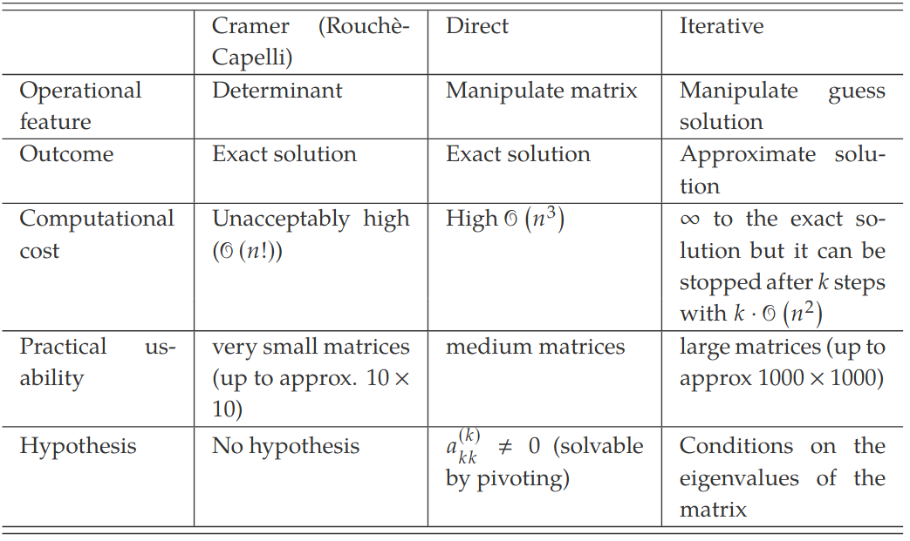

- [Cramers Method](../1043%20-%20Maths%202/22.02.23%20-%20Systems%20of%20Linear%20Equations-2.md#cramers-theorem) requires the calculation of 1 determinant of a $n$ order matrix and $n$ determinate of $n$ order matrices
- Means $n!+n(n!)$ elementary operations
- Need to find alternative methods as takes too long

# Theoretical Foundations of Direct Methods
## Elementary Row Operations
- $E_1$: Swap of two rows $a_i$ and $a_j$
$$a_i \leftarrow a_j$$
$$a_j \leftarrow a_i$$
- $E_2$: Multiplication of a row $a_i$ by a scalar $\lambda\in\R$
$$a_i\leftarrow\lambda a_i$$
- $E_3$: Substitution of a row $a_i$ by the sum of the row $a_i$ to another row $a_j$:
$$a_i\leftarrow a_i+a_j$$

## Equivalent Matrices and Equivalent Systems
**Equivalent Matrices**: Apply the elementary row operations on $A$, obtain new matrix $C\in\R_{m,n}$. 

**Equivalent Systems**: 2 systems of linear equations in the same variables: $Ax=b$ and $Cx=d$. These two systems are equivalent if they have the same solutions

Consider a system of $m$ linear equations in $n$ variables $Ax=b$. Let $A^c\in\R_{m,n+1}$ be the complete matrix associated with this system.
If another system of linear equations is associated with a complete matrix $A^{'c}\in\R_{m,n+1}$ equivalent to $A^c$, then the two systems are equivalent

- $E_1$: The swap of two rows, the equations of the system are swapped, no effect on the solution of the system
- $E_2$: Same solutions, modified systems is equivalent to the original one
- $E_3$: After operation, the modified system is equivalent in solutions to the original one

## Direct Methods
Direct methods are methods for solving systems of linear equations by manipulating the original matrix to produce an equivalent system that can be easily solved. A typical manipulation is the transformation of a system of linear equation into triangular system

# Gaussian Elimination 
$Ax=b$
1. Construct the complete matrix $A^c$
2. Apply the elementary row operations to obtain a staircase complete matrix and triangular incomplete matrix, that is **we add rows to obtain a null element in the desired position**
3. Write down the new system of linear equations
4. Solve the $n^{th}$ equations of the system and use the result to solve the $(n-1)^{th}$
5. Continue recursively until the first equation

To obtain the matrix would do:
$$r^{(2)}_2=r^{(1)}_2+(\frac{-a^{(1)}_{2,1}}{a^{(1)}_{1,1}})\times r^{(1)}_1$$
As it keeps going on, it gets longer and longer, to create a matrices with leading zeros

Dan Method:
$$a_{n,m}-(a_{n,1}\times a_{n-1,m})$$
This completes the first 2 rows and first column. Then have to increase m, to do second column

# LU factorisation
Direct method that transforms a Matrix into a matrix product $LU$ where $L$ is a lower triangular matrix having the diagonal elements all equal to 1 and $U$ is an upper triangular matrix
$$Ax=b\Rightarrow LUx=b$$
Pose $Ux=y$ solve at first the triangular system $Ly=b$ and then extract $x$ from the triangular system $Ux=y$
Does not alter the vector of known terms $b$. 

If working with non singular matrix, then split any matrix into a product such that $A=LU$.
If non-singular matrix and is square, and has det of 0, then $\exists!$ lower traingular matrix $L$ having all the diagonal elements equal to 1 and $\exists!$ upper triangular matrix $U$ such that $A=LU$

# Equivalence of Gaussian elimination and LU factorisation
- Gaussian elimination and LU factorisation are both direct methods
- They are not identical but they are equivalent
- Whilst performing the algorithm the LU factorisation is implicitly performed
- Both Gaussian elimination and LU factorisation have a lower complexity than theoretical methods
- The complexity is in the order of $n^3$ operations

# Short introduction to Iterative Methods
Jacobi's Method - Starts from an initial guess $x^{(0)}$, iteratively apply some formulas to detect the solution of the system. 
Unlike direct methods that converge to the theoretical solution in a finite time, iterative methods are *approximate* since they *converge*, under some conditions

