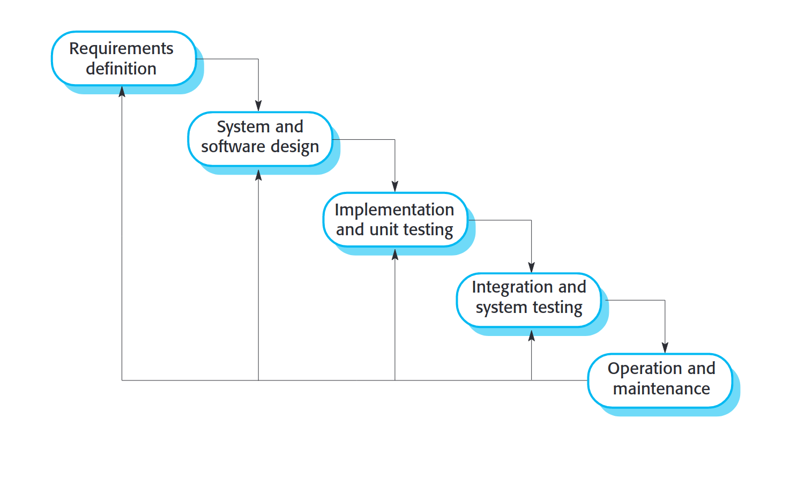
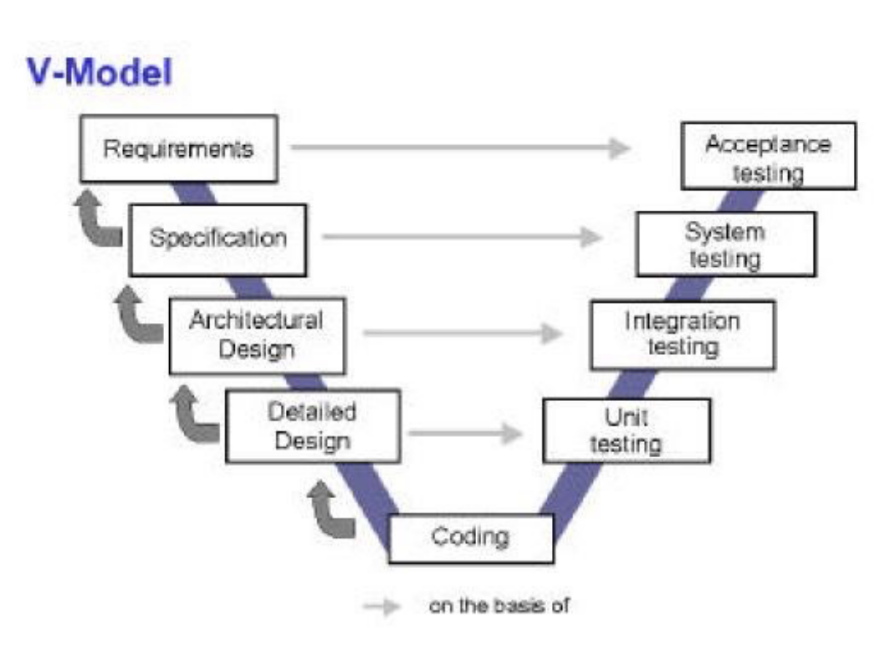

# 22.01.31 - Introduction to Software Engineering

## Aims
1. Overview of the whole Software Engineering process
2. Give you initial practical experience of work at different stages of the process
3. Prepare you for Software Engineering group project in year 2
## Top 10 SE mistakes
1. Presume 'good code' is the only thing that matters
2. Aim to finish at the delivery deadline 
3. Don't design a data model, let the code produce data it needs
4. Use a Technical Lead that has never built a similar system, rather than choose/hire someone who has
5. Hire 40 developers to make the coding go faster
6. Build the system in the language you know best, rather than 'the best tool for the job'
7. Hire a junior developer to handle the migration
8. Skip the testing phase because the project is behind schedule
9. Change code, without planning, to meet newly discovered requirements
10. Buy a commercial, off the shelf package and customise it a lot
### Dorseys Conclusions
1. Don't cut corners. In long run, this result is system failure or an inadequate system that doesn't meet the user requires.
2. Audit each major deliverable and step along the way for accuracy and correctness
3. Carefully monitor top management support for the project
4. Secure the correct technical lead for the job
## Core Process Stages
- **Specification** - What the system should do and its development constraints 
- **Development** - Production of the software system
- **Validation** - checking that the software is what the customer wanted
- **Evolution** - Changing code in response to demands
### Waterfall Model

### V-Model

### Problems with waterfall and V
- Needs stable and 'perfect' requirements
- Can't always anticipate what you are going to have to do
- Does not account for revision or refactoring
- Too inflexible and static
- Depends on getting each stage exactly right
### Problems with iterative models
- Lack of process visibility
- Too much doing and not enough planning
- Special skills
- Lightweight documentation tone to mean no documentation

