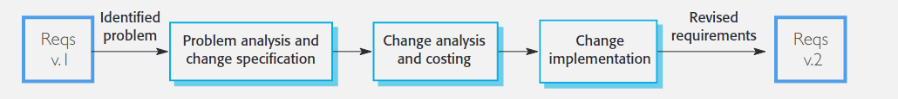

# Change is Inevitable

- Need to change code to keep it unique and not a copy cat when programming mobile games. 
- Change is inevitable as company needs will change and so will the managers
- Some people will keep using the same software as the software is big and good. Companies are more likely to update their current software 
- Building whole new piece of software is risky, errors might occur. 

## 3 Types of change
1. Fault Repairs - fix coding errors
2. Environmental Adaption - Updates to new OS
3. Functionality Addition - to meet business changes#

# Change is expensive
This is costly, teams change, staff skills change, the age of the program and has to be redesigned more. Poor development practices

## Poor development practises
- Need to have good requirements as wont be able to tell whats changed. 
- Low readability code makes it hard to figure out
- Undocumented designs means cant be understood
- Poor code = limited documentation

Companies cut corners at development to speed up, but this creates cost

# Part 2 - Change Management
Changes are new requirements which change everything
Have to start with requirements change management
Need to think of all the knock on effects from the change

## Requirements Change Management
- Process of understanding and controlling changes to requirements
- Tracing which requirements have changed, in light of new requirements
- Need unique ids to they can be cross-referenced 
- Impact on Specs/Designs can only be understood if specify which reqs and specs supported in the first space

### Problem Analysis and Change Specifications
- Specification changes, doesn't get created again
- Analysing a specific proposed change request, see how it will change the spec

### Change analysis and Costing
- Trace changes to specs - estimate the size of change
- Estimate a cost - with project manager and design manager
- Decide whether to proceed given the cost

### Change Implementation
- Change the requirements not coding
- Change all of the documentation
- End with a new system design

Basically dont change arbitrarily, dont start with the code straight away. 
Understand the change and the cost. Then can decide whos paying and if its within the contracts term

# Emergency Changes
Often happens really quickly, and updating the code takes priority over documentation
Best do document emergency changes
Later, 'proper' solutions to changes can be designed for the next release
Real danger, multiple subsequent emergency repairs occur, which mask the fixes of the original emergency repairs

# Refactoring
Look at the code, and realise they can do the code structure better

Better to male intelligent change to the code than to just make a fix.
Many ways the code can be improved:
- Duplicate/similar code - should be a method to call
- Long methods - which should be broken down
- Data clumping - when patterns of functions -> a new class
- Speculative generality - speculative future code - remove it

Concern is that all changes are deviations from the original plan - so all changes are reducing code quality
# Starting Code Again
Some point the cost of change gets high, can be cheaper to rebuild the code. Software company and client need to discuss long-term strategy

Overtime messy code takes longer and longer to understand and read. Keep making more and more messes, driving the productivity ever further toward zero.
Sometimes its better to start again

# Part 3 - Is evolution really different to SE
# Change during development
- Happens as you show 
- Cheaper because its before the maintenance phase actually
- More agile software engineering approaches are designed to get the client as involved as early as possible. So changes are part of the process
# Change after delivery 
- This is the maintenance/delivery phase
- Changes now might mean significant 're-working'
- Change management is important for future maintenance
- Starting a new software engineering process from the top

Software Evolution - Moving from V1 to V2 is just another iteration. Most projects are spiral-for-years.