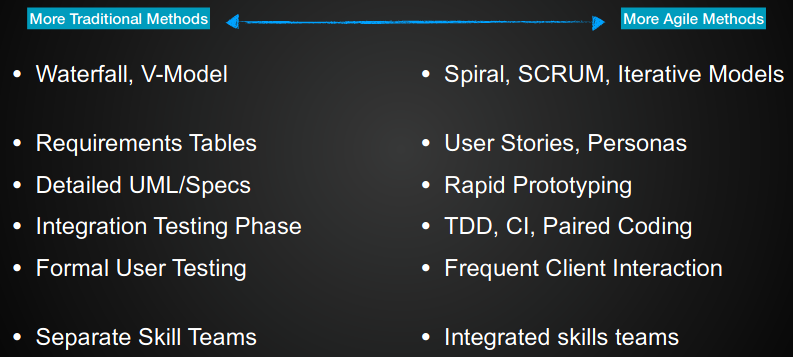

# Agile vs Traditional 

## 1990s
- Rapid software development was getting more important
- Proposed methods integrated major stages, specification, design and implementation are inter-leaved
- Waterfall model and others where very heavy top down approaches. Do all planning, then work, then testing, expensive and slow.
- Many limitations:
	- depends on lots of documentation to be successful
	- Lots of waiting time between different teams
	- Expensive to fix buggy code
## 2001
SCRUM and TDD exits. Want to find a better way of development. Thing SE methodologies can be adaptable in order to be effective for the situation and to avoid unnecessary bureaucracy

# Agile Principles
Agreed on 12 things:
1. Satisfy the customer through early and continuous delivery of valuable software.
2. Harness change for the customers competitive advantage. (Welcome any changes)
3. Deliver working software frequently, with a preference to the shorter timescale
4. Business people and developers must work together daily
5. Give developers the environment and support they need
6. Do face-to-face conversation
7. Working software is the primary measure of progress
8. Promote sustainable development
9. Continuous attention to technical excellence
10. Art of maximising the amount of work not done
11. Best architectures, requirements and designs emerge from self-organising teams
12. Team reflects on how to become more effective

## The 4 Core Agile Values
1. **Individuals and interactions** over process and tools
2. **Working software** over comprehensive documentation
3. **Customer collaboration** over contract negotiation
4. **Responding to change** over following a plan

# How to agile
## Overall vs Stage Specific
Overall Approach - Spiral model is already an adaptive approach, but the agile principles apply to adapt your approach
Each stage and activity:
- agile requirements - user stories not requirement docs
- agile design - prototypes not spec docs
- agile implementation - test driven paired development
- agile testing

## Scrum vs Kanban vs XP
All three are designed to uphold the agile principles 
Scrum - About optimising by time and delivery
Kanban - speed of feature delivery
XP - Team effectiveness

## eXtreme Programming
- XP is a fast extreme approach to iterative development
- New versions build everyday and increments are delivered to customers every 2 weeks. 
- All tests are applied before a build is accepted

- **Customer Collaboration** means full-time customer engagement with the team
- **Working Software** is supported through small, frequent system releases
- **Individuals and interactions** through pair programming, collective ownership and a process that avoids long working hours
- **Responding to change** through regular system releases

## Scrum
- A sprint is a fixed time period to achieve the current plan - 2-4 weeks
- Are intermittent points, and involve continuous group communication
- Get managed by a Scrum Master

## Kanban
- Rather than what will be achieved in the cycle, instead is what shall we build next. Use a board to manage current work
- All features to build are kept in a list, same with the others. Similar to trello
- Team effectiveness is managed by limiting the number in cols
- Release cycles is a measure of time taken to build features

## Combining agile methods
These techniques aren't mutually exclusive. Can do paired programming in Scrum, can use TDD in all three

Challenge is to be agile by the principles not by agile methods

# Summary
- Agile techniques were designed because all the rigour in SE became too big and too slow
- Agile techniques still have rigour, but in a fast adaptive way that is responsive to change
- All sorts of ways to be Agile - not just a big overall approach
- Following a strict agile method misses the point about being agile