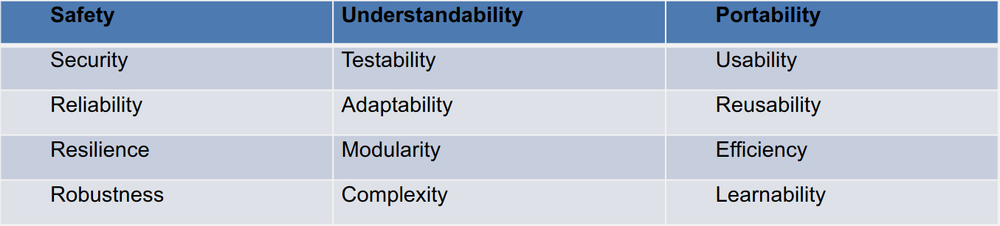

# 22.03.29 - Software Quality
## Software Quality Management
- Introduced in 1960s due to software being of bad quality
- All SE processes are designed to improve software quality
- The software quality team air to make sure:
	- A good SE process is chosen for the project
	- All aspects of the SE process are all done well
- SQ means doing every aspect well

1. Planning for quality to help create project plans
2. Defining standards and procedures for the whole company
3. Checking that projects a conform to company standards

## Planning for Quality
A Project Quality Plan - sets the bar for the team to achieve
Key Sections of a quality plan document for a project
1. **Product Introduction** - intended market
2. **Product Plans** - critical release dates, maintenance etc
3. **Process Description** - what process will be followed for this project
4. **Quality Goals** - Critical quality attributes for final product
5. **Risks and Risk Management** - expected key risk areas.

Identifying standards that will be met
Recommended quality promoting processes for the project
Make sure everyone knows what the target quality is
Aim of the QA Team: improve the process between projects, documenting what worked well, apply successful processes to other projects

## Defining Quality
Product standards - documentation standards, coding conventions etc
Process Standards - when reviews, testing etc is done
ISO created for specific standards

### Quality-Driven Culture
- Risk is that the Quality Assurance Team become the nasty people that make you have to do unnecessary work
- Its good to get teams to be in charge of what excellence is for them
- Invest in tools which makes it easier, helps them faster not slow them down

## Checking for Quality - Inspections
Inspections during coding process.
Fagen (1986) - Estimated that 60%+ of bugs can be found by inspecting code
Prowell (1999) - Claims they found more than 90% of defects

### Traditional Inspections
3-7 people examine a concrete SE output. Takes around 2 hours
Focus on:
- finding problems and non-conformance to standards
- checking for completeness or missing logical steps
- do code segments, diagrams, tests, reqs, specs

Need to make sure documentation is produced - evidence of quality for client acceptance

### QA Reviews and Inspections
- People independently examine the document in advance and are familiar with it. 
- Review should take place
- Output is a list of problems that need fixing

### Common Inspection Problems
- Criticising the people who built the document
- People worry that their performance will be judged
- People dont properly prepare before the inspection. Need to ensure they read the document first
- People try to discuss every problem as they find it

Traditional inspections are important and common but Paired Programming is more agile inspection for coding.

### Retrospectives vs Postmortems
Both a form of review/inspection
#### Agile Retrospectives
- After each sprint
- Dev team reflects on progress, good and bad things that happened
- See if they can improve/optimise/try anything
- FEEDS INTO: next round of dev on same project

#### Agile Postmortems
- End of project review - focus on issues experienced
- Considered hard to do without blaming/being negative
- Looks for Root-Causes
- More likely to be led by QA team, with Devs
- FEEDS INTO: QA process improvement for future projects

## Checking for Quality - Measures
QA Team help to define how to answer questions in a way that is corporately acceptable/agreeable.

These non-functional aspects that often define quality. Hard to measure and conflict.

### Things you can measure
Some of these subjective measures of quality can be indirectly inferred from objective metrics
**Code/Predictor Measures**: Number of lines/ the Fog Index(readability of comments)
**Control/Process Measures**: Number of reported faults reported after delivery/ number of person days for coding

### Measure types
**Code/Predictor Measures**: Help you to judge aspects of code quality, but are only predictors of quality
**Control/Process Measures**: Measuring the success of your SE process. Help decided whether to improve the processes later

Can only make limited assumptions about code measures, depends on language aswell. Metrics can only be used as predictors

