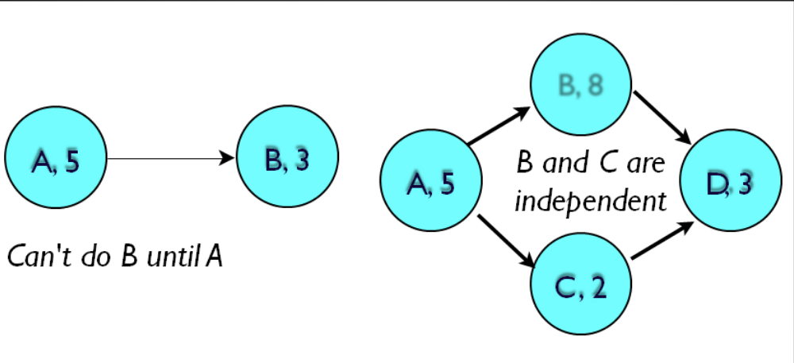
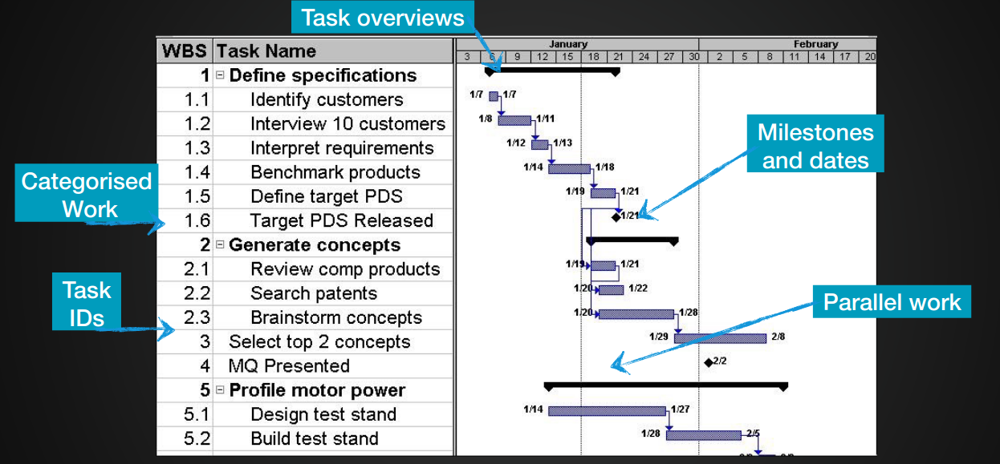
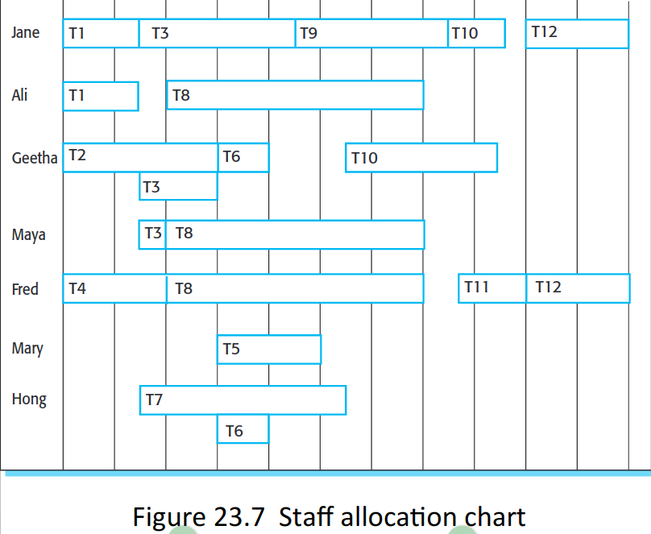
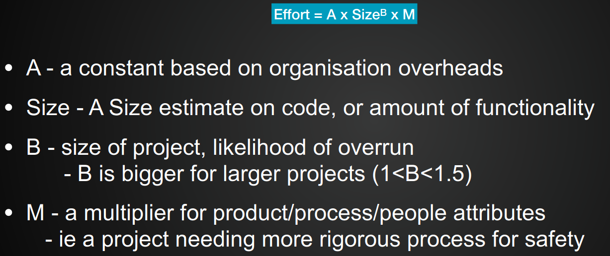

# 22.04.05 - Agile Planning & Project Management
## Project Planning
### Project Scheduling
- Activities should produce some **measurable outcome**
- A milestone is the end point of an activity
- Deliverables are results delivered to customers
- If having a meeting with supervisor etc, have something to show them that you have completed
### Identifying the tasks
Might take a few days to complete, but requires multiple people
### Milestones and outputs
- Every activity/task should produce a tangible output
- Tasks should be a few weeks in size, at least 1, at most 5-6. If longer, should be broken down into person-days of efforts.
- Project needs certain milestones, which produce project deliverable. These might be times when a few activities/tasks all finish

## Planning Diagrams
### PERT

*A will take 5 days, B will take 3 days. A has to be done before B or C. D requires B and C to be done.*
Can be designed in different ways. Simple or detailed, which has extra data (optimistic time, pessimistic time, most likely)
#### Critical Path
What the worse case is throughout the entire project
- Identify all the paths through the PERT chart
- Identify the length of time taken for each path
- The longest path (worst case) is the critical path. 
	- This helps you cost the effort for the worst case, rather than the best case.

Critical path is the bottleneck route, any modification will affect the project duration.
### Gantt Chart

Shows milestones, how many people are required etc. 
#### Reviewing Progress
- Milestones are times to review progress and the plan
- A plan was an estimate, and sou need to check for slippage.
- If serious, you set into action your risk strategies, and re-plan the project
- If new plan is more expensive, then need to change the tasks or negotiate for more money
### Staff Allocation Chart

What staff are doing and when.
### Agile Planning
- Set deadlines - the output is always 'working' software + something
- Fixed number of people in the team
- Estimate what work can be done in between
- Productivity is then 'daily point score'
#### Reviewing Progress
- Project reviewing is build right into e.g. Scrum
- The aim of the start of every sprint: plan ahead, overall backlog, targets, reflection

## Project Budgets
### Overall approaches
- By work that needs doing (then estimating developer time)
- By developer time (and defining how much work to do)

### Based on plan/charts
- Analysed the main risks and activities
- First - estimate the min/max time the project will take
- Option 1: Add a contingency estimate (30-50%) extra, risks that didn't plan for
- Option 2: Using a formula
### Costing a project > Cost of project
- Experience-based techniques; based on experience of prior similar projects
- Algorithmic cost modelling; mathematical calculations 
#### Algorithmic Cost Modelling

- Are often complex and make people nervous of using them
- Are typically inaccurate

### COCOMO
An empirical independent model based on project experience. Created in 1981
### Actually pricing the project
- Very hard and relies on lots of experience
- Can estimate how much work a project will take, but that estimate is only as good as the spec of the project
- May add time/costs for projects risks
- May reduce cost for competitiveness

### Project Pricing Factors
- Market Opportunity
- Cost estimate uncertainty
- Contractual terms
- Requirements volatility
- Financial health