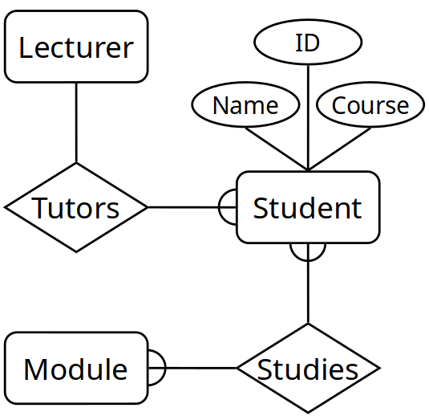

# 22.02.07 - Entity Relationship Modelling
## Database Design
- Can create a design that is independent of DBMS
- Often results in a more efficient and simpler queries once the database has been created
## Entity/Relationship Modelling
Used for Conceptual design
- **Entities** - objects or items of interest
- **Attributes** - properties of an entity
-  **Relationships** - links between entities

Represented as E/R diagrams that
- Give a conceptual view of the database
- Independent of the choice of DBMS
- Identify some problems in a design

### Entities
Represent objects or things of interest. Physical things or more abstract things
Entities have:
- General types or class
- Instances of that particular type
- Attributes

Have attributes, but attributes have no smaller parts
Can have relationships between them, but an attribute belongs to a single entity
*Represent Entities as boxes with rounded corners. Labelled with the names of the class of objects represented by that entity*

### Attributes
Facts, aspects, properties or details about an entity
Attributes have:
- A name
- Associated entity
- Domains of possible values
- Each instance of the associated entity, a value from the attributes domain

Attribute belongs to a single entity
*Represented as ovals. Linked to its entity by a line. Name of the attribute is written in the oval.*

### Relationships
Are an association between two or more entities
Relationships have:
- Name
- Set of entities that participate in them
- A degree - number of entities that participate
- Cardinality Ratio

#### Cardinality Ratios
Each entity in a relationship can participate in zero, one, or more than one instances of that relationship
- One to One (1:1)
- One to Many (1:M)
- Many to Many (M:M)

Relationships are shown as links between two entities
Name is given in a diamond box. Ends of the link show cardinality 

## Making E/R Models
Need to identify:
- Entities (Nouns)
- Attributes (Nouns, facts or properties)
- Relationships (Verbs, between two entities)
- Cardinality Ratios
Obtain these from a problem description

### Removing M:M relationships
Many to Many relationships are difficult to represent in a database
Can split a many to many relationship into two one to many relationships by creating an additional entity

Entities can have attributes but attributes have no smaller parts
Entities can have relationships between them, but an attribute belongs to a single entity  

### 1:1 Relationships
Some relationships between entities, A and B, might be redundant if
- It is a 1:1 relationship between A and B
- Every A is related to a B and every B is related to an A

## Debugging Designs
E/R diagrams can be used to plan queries. If cant find useful information from diagram, need to change the design
