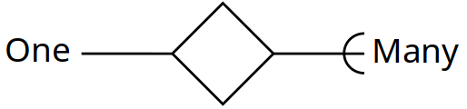

# Revision
## Introduction to relational databases
- **Database**: Shared collection of logically related data and a description of the data designed to meet the needs of an organisation
- **Database Management System**: Software system which enables the user to control the database
- **Application Program**: Program which interacts with a database through the DBMS

### Relations
- Information stored as records in relations (tables)
- Data is stored in relations (tables)
- Relations are made up of attributes (columns) | Set of tuples with the same schema | Each column has a domain, a set from which all possible values for that column can come.
- Data takes the form of tuples (rows)


**Degree of a relation** - How long each tuple is or how many columns the table has
**Cardinality of a relation** - How many different tuples there are, or how many rows a table has

**Attributes** are named columns in a relation
**Schema** defines the attributes for a relation. (Set of attributes)

**Candidate Keys**: Set of attributes in a relation in which, every tuple has a unique value and no proper subset (minimality). Can have multiple columns joined together to create candidate keys.
**Primary Key**: One Candidate key is chose to identify the tuples in a relation. Often a special ID is used.
**NULL**: Missing information/unknown value. 
**Entity Integrity**: Primary Keys cannot contain NULL values as it contradicts the notion of the key.
**Foreign Keys**: Used to link data in two relations. If it matches a primary/candidate key value in a second relation. (Referential Integrity)
### Referential Integrity
When relations are updated, this might be violated. Usually occurs when a referenced tuple is updated or deleted

Number of options when this occurs:
- **RESTRICT** – stop the user from doing something
- **CASCADE** – let the changes flow on
- **SET NULL** – make referencing values null
- **SET DEFAULT** – make referencing values the default for their column

## E/R Modelling
Can create a database design that is independent of DBMS, which is often more efficient and simpler queries once the database has been created.
- **Entities** - Object or items of interest
- **Attributes** - Properties of an entity
- **Relationships** - Links between entities

 Drawing a relation

### Removing M:M relationships
M:M are difficult to represent in a database. We can split a many to many into two one to many relationships by creating an additional entity.

Entities can have attributes but attributes have no smaller parts. Attribute belongs to single entry, entities between them all.

## Introduction to SQL
| Relations   | E/R Diagrams     | SQL             |
| ----------- | ---------------- | --------------- |
| Relation    | Entity           | Table           |
| Tuple       | Instance         | Row             |
| Attribute   | Attribute        | Column or field |
| Foreign Key | M:1 Relationship | Foreign Key     |
| Primary Key | Attribute        | Primary Key     |
- When implementing, can approximate the domains of the attributes by assigning types to each columns, Relationships may be represented by foreign keys.
- When creating relationships, 1:1 are not used, only M:1
- Can specify the engine used to store files onto disk, have to declare which specific table to use.
	- **MyISAM** - Default, very fast, ignores all foreign key constraints
	- **InnoDB** - Offers transactions and foreign keys (We use this one)
	- **Memory** - Stored in RAM
	- 
*`ON UPDATE CASCADE`: Referencing rows are updated in child tables when its updated in the parent table*
*`ON DELETE CASCADE`: Referencing rows are deleted in child tables when its deleted in the parent table*
### SQL Syntax
- `DROP` - Delete table
- `ALTER TABLE` - Change columns, and definitions
- `INSERT` - Add new row to a table
- `UPDATE` - Change rows in a table
- `DELETE` - Remove row from table
- `WHERE` - Specifies query, conditional statement
- `SELECT` - The get query. Can be nested inside another query to form a subquery.
	- `IN`, `EXISTS`, `ALL/ANY`, `NOT`
- `DISTINCT` - Removes duplicates
- `ALL` - Retains duplicates. Used as default if neither is supplied
- `IN` - Can see if a given value is in a set of values. Use `NOT` to do opposite
- `EXISTS` - Cant see whether there is at least one element in a given set
- `ANY/ALL` - Compare a single value to a set of values

Can combine information from two or more tables. If the tables have columns with the same name, ambiguity will result. Can be resolved by referencing column names with the table name. `TableName.ColumnName`

Subqueries can be used to search a selected value of data. Have options for handling sets; `IN`, `EXISTS`, `ALL/ANY`, `NOT`

`[AS]` - Aliases. Rename columns or tables

|Type|Description|Example|
|---|----|---|
|DATE| A Day, Mont, Year | '1981-12-16’ or ‘81-12-16'|
|Time| House, Minutes, Seconds| ’15:24:39’|
|DATETIME| Combination of above| ‘1981-12-16 15:24:39’|

## HTML & CSS
URL = Uniform Resource Locator. `scheme://prefix.domain:port/path/filename`

- Static HTML - Web page is a file on a server
- Dynamic HTML - Web pages consist of HTML that is generated by software (PHP)
- Client-Server Paradigm - Information flows between server and client based on requests.
- URL = Uniform Resource Locator
- Use of tags are controlled by CSS. A tag together with its content is called an element
- **Attributes** - Optionally a start tag, may include one or more attributes
- **Empty Elements**- Elements with no content (`<br>`, `<hr>`)
- `<div>` - blocks of content
- `<span>` - inline content
- `<em>` - Emphasised
- `<mark>` - highlighted
- `<del>` - deleted (strikeout)
### Tables & Lists
`<table>` - Starts table
`<th>` - Table Heading/Column
`<tr>` - Table ro w
`<td>` - Table data
`<ul>` - Unordered List
`<ol>` - Ordered List
`<li>` - List Item
### DOM
- Document Object Model
- Allows scripts to identify and change elements of a web page.
- HTML ID is used to uniquely identify elements
- DOM values are the content of tags
- DOM methods are actions that you can perform on HTML elements

## Javascript
- Interpreted language, client-side rather than server-side.
- Variables declared using `var`. Doesn't care about `int` etc. Can mix and match variables throughout the program
- Arrays will fill in gaps with `undefined`
	- `push()` - adds an element to the end of the array
	- `indexOf()` - Check whether an array already contains a specific value
	- `join()` - Gives control over how the array values are concatenated together
- No type checking of parameters
- Objects are like variables but contain many values.
- DOM - Abstract model that defines the interface between documents and application programs
- API HTML DOM - Standard object model and programming interface for HTML.
- An *event* is a notification that something specific has occured, function executed in response to the appearance of an event
- Registration - Connecting an event handler to an event
- When doing JS forms, use `getElementById`, then get values by doing that.name.value.
- Regex can be used for validation. Put it inside of `/ /`. `[]` indicate range, `a-z` means all letters, `0-9` means all numbers. `^` denotes negation. `test` checks if fields contains characters other than the ones side of `[]`.
## PHP
- `$` - to declare and use variables. Don't have to specify what data type it is
- `.` - String concatenation uses the period. 
- `""` - Use with echo to evaluate PHP literals
- `echo` - output to display, similar to how print works
- Multiple string functions:
	- strlen, strcmp, strpos, substr
	- chop - remove white space from the right end
	- trim - remove white space from both ends
	- ltrim - remove white space from the left end
	- strtolower, strtoupper
- `NULL` - Avoid `NOT IN` when using `NULL`. Should instead use `IS NULL`  or `IS NOT NULL`
### Arrays
- PHP array is a generalisation of the arrays of other languages. Also a mapping of keys to values, where the keys can be numbers or strings.
- `is_array()` - check if a variable is an array
- `unset()` - to destroy an array
- `count()` - to sort an array
- `shuffle()` - to shuffle the elements of an array
- `explode()` - to convert the words of a sentence into an array

---
- **Functions**: Objects can be passed by reference whereas everything else by value
- **Inheritance**: Data members can be declared public, private, protected. Can override a function implemented in the base class with  function derived class.

- `$_POST` - retrieves data from post request.
### SQL
Connecting to database:
```php
$conn = new mysqli($db_host, $db_user, $db_pass, $db_name);
if($conn->connect_error){
	die($conn->connect_error);}
```
Parsing a query and fetching/executing it
```php
$query = "SELECT * FROM db_user";
$result = $conn->query($query);
$row = $result->fetch_array(MYSQLI_ASSOC)){...}
```

Prepare Stage: Statement template is sent to the database server so it can perform syntax check and initialise the server
```php
$query = "INSERT INTO db_user VALUES (?,?,?)";
$stmt = $conn->prepare($query);
$stmt->bind_param('sss',$forename,$surname,$username);
```
- Execute Stage: Client binds parameter values and sends them to the server, where the server creates a statement