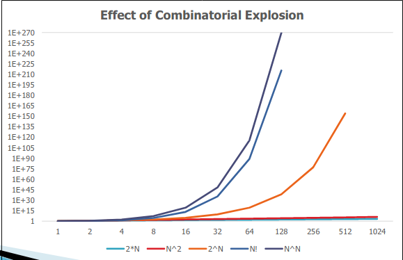

# AI fundamental Issues
## Travelling Salesman Problem
Has to visit a number of cities, start at any city and must end at the same city
Solving: Find the minimum distance / cost solution 
Combinatorial Explosion Problem: One of the major unsolved theoretical problems in Computer Science
## Towers of Hanoi
Group of Tibetan monks move 64 gold rinks which blacked on diamond pegs from one peg to another. Rule: bigger rings at the bottom. Would take years to compute
## Combinatorial Explosion
The feature where the number of problem solutions grows exponentially with its size
An exhaustive search is not an option 

## The Turing Test
An interrogator is connected to a person and a machine via a terminal and cannot see either of them
Task: to find out which candidate is the machine or human, only by asking them questions
If the machine can fool the interrogator 30% of the time, the machine is considered intelligent
## Chinese Room Experiment
Simple rule processing system where the "rule processor" happens to be intelligent, but has no understanding of the rules
Just comprises a rule book
System acts as it understands Chinese! Behaving intelligently was not enoguh to prove a computer was intelligent