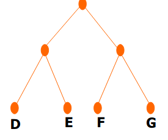
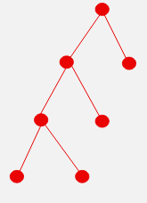
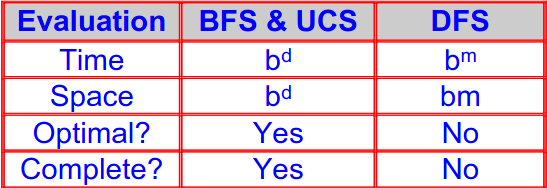

# Breadth First Search
Dan Words: FInds it by going wide

## Method
- Expand root node first
- Expand all nodes at level 1 before expanding level 2 OR
- Expand all nodes at level *d* before expanding nodes at level *d+1*

Queuing function: Adds nodes to the **End** of the queue

## Searches - Implementation
Three types of nodes during the search in tree search
- Fringe nodes (open nodes, leaves) in the queue
	- Have been discovered
	- Have not yet been processed
		- Children not yet explored; not yet tested if they are goal
- Visited nodes (closed nodes)
	- have been discovered and processed
		- Nodes explored; tested if they match goal
- Undiscovered nodes
	- Have not yet been discovered

## Evaluating a Search
1. Completeness
	- Guaranteed to find a solution if one exists 
2. Time Complexity
	- How long does it take to find solution
	- Number of nodes in the tree in the worst case
3. Space Complexity
	- How much memory required to perform the search
	- Number of nodes in the tree
4. Optimality
	- Find the optimal solution 

# Depth First Search
Dan Words: Finds it by going narrow, and finding route, then reversing back 

Taught in [22.03.08 - Heuristic Search ](../1008%20-%20AI/22.03.08%20-%20Heuristic%20Search.md) but fits into this topic area
## Method
Expand root node first
Explore one branch before exploring another branch
Queuing function: adds nodes to the front of the queue

## Evaluation
Space Complexity - Store the path from the root to the leaf node as well as the expanded neighbour nodes
Time Complexity - $b^m$ in the worst case
Completeness - Infinite branch, never terminate if no goal state exist in that branch
Optimality - Finds a solution: Is there a better solution at a lower lever?

# Uniform Cost Search (vs. BFS)
BFS: finds the path SAG (of a cost of 11)
UCS: finds the cheaper solution (SBG). It finds SAG but doesn't expand it, as it is not the cheapest queue.

- Total cost of the path from the root to node *n*  (under consideration)
- Always remove the smallest cost node first 

`Return General-Search(problem, ENQUEUE-BY-COST)`

## UCS vs BFS
BFS - Optimality | Only if the branch costs are the same
UCS - Optimality | Even branch costs are different
Both have a completeness of Systematically search the whole tree(worst case) and both have $b^d$ for time and space complexity

# Summary
