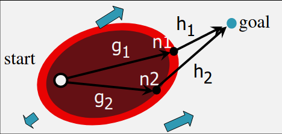
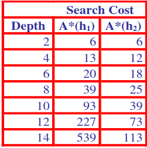

Also learnt about:
[Depth First Search](../1008%20-%20AI/22.03.01%20-%20Search%20Strategies.md#depth-first-search)
[Uniform Cost Search vs BFS](../1008%20-%20AI/22.03.01%20-%20Search%20Strategies.md#uniform-cost-search-vs-bfs)

## Blind Search vs. Heuristic Searches
**Blind Search** (DFS, BFS, UCS) Use same search just different queue - Blindly choose where to search in the search tree. But when problems get large, not practical any more

## Heuristic Search
- Explore the next best node: more likely to lead to the goal state
- Using domain knowledge, so called informed search
- **Heuristic function**: Educated guesses, intuitive judgements on how close a node is to the goal.

### A* Algorithm
Combines the cost so far and the estimated heuristic cost to the goal
$f(n) = g(n) + h(n)$ 
- g - path cost from the initial state to current state
- h - heuristic cost from current state to a goal state
- f - an evaluation of the state: estimated cost of the cheapest solution through $n$

h = 0 | A* becomes UCS, complete and optimal, but search undirected
h too large thus dominates g | becomes greedy and lose optimality

#### How to estimate h
- Optimal and complete: if the heuristic is admissible
- Admissible: the heuristic must never over estimate the cost to reach the goal. h(n) a valid lower bound on cost to the goal 

$h_1$ in the wrong position
$h_2$ sum of the distances from their goal position
Good Heuristics

1. Admissible
2. The closer the estimate of the heuristic to the actual cost, the better

# Computerphile Video
A* - Small extension to djstraks which adds a heuristic to say how much closer were getting. Tells you how far have we got to go