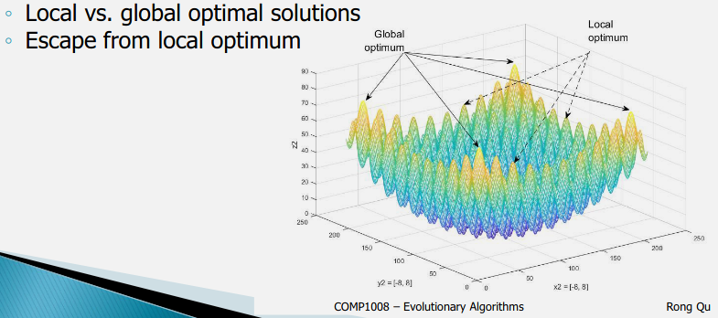
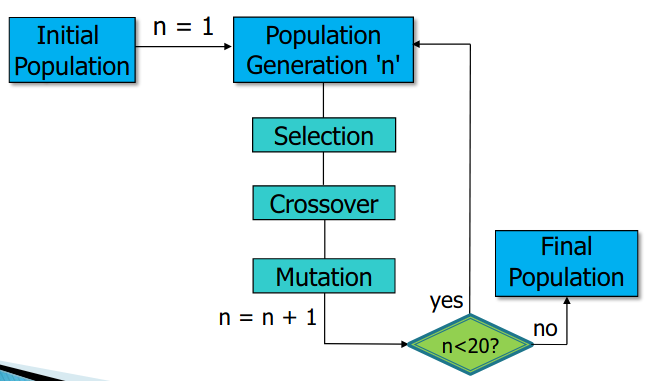
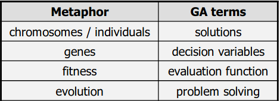

### Tree Search
Search tree: Partial solutions of the problem into nodes (states), connected by branches (operator)
Search: different strategies (DFS, BFS, heuristics)
## Modern search algorithms
- Solution encoding: represents complete solutions for the problem
- Search: different operators(local search, evolutionary algorithms)

### Local Search Algorithms
- Starts with a single complete solution
- Neighbourhood operators: neighbouring solutions step by step
- Tabu search, simulated annealing

### Evolutionary algorithms
- Starts with a population of complete solutions
- Genetic operators: offspring solutions generation by generation
- Genetic algorithms, particle swam intelligence etc
- Family of population-based algorithms
- Encoding: decision variables of real-world optimisation problems

# Genetic Algorithms
Evolution of population (Set of solutions) into new populations using operators: selection, mutation and crossover

## Encoding
Solution representation: Decision variables of an optimisation problem. Normally encoded in finite length string, but dont always have to apply

## Operators

### Parent Selection
- Selects a pair of parent solution
- Roulette Wheel Selection: Selected proportional to the fitness of the parent solutions
- Tournament selection: Best out of *n* randomly selected solutions
### Crossover
- Generates a pair of offspring solutions
- Crossover rate Pc: usually a larger value: >70%
### Mutation
- Modifies some genre of solutions
- Mutation rate Pm: usually a small value: <10%. Change some gestures, to avoid premature convergence

# Computerphile explanation
- **Population**: Randomly selected combinations of values
- **Roulette wheel selection**: Each solutions get a chunk of roulette wheel, bigger the score, bigger the chunk. Have a higher chance of being selected
- **Tournament selection**: randomly select 2 members of population, highest score wins
- Parents would be winners of the tournaments
- **Crossover**: Combination of the 2 parents. Normally do half and half. This will produce 2 children which will have a bit of each parent
- **Mutation**: Go through each digit in each child, if randomly generated number is below certain threshold, the bit gets flipped.

Keep repeating this until have equivalent amount of children as those in the population. Would randomly generate another 2 children from the original population. Once done that's 1 generation, that would repeat