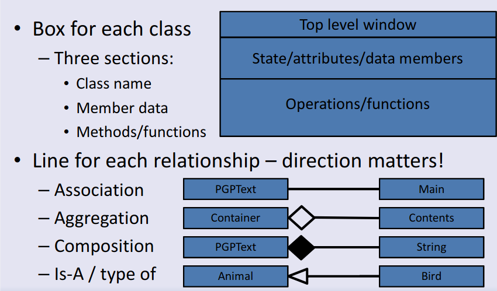

# Intro to OOP
- Benefits of OO: Improved understanding of program structure. Easy to re-use, adapt and/or modify existing work. Also ease to debug.
- Things will be in memory and will be able ot track itself. Objects have limits on what can change the data.
- Can use OO features in other languages by faking them.

## Classes and Objects
- **Class**: A definition of a structure. Blueprint for creating an object. (What is in the object, what can you do to it)
- **Objects**: Instances of the structure. Some collection of data that exists at runtime, which can apply functions to. One copy of data of that type for a specific thing. Can have multiple objects of the same class.
- **public**: Means anything can access it
- **private**: means only the class members can access it

# Using Objects
- Create main as the only static method in a class. 
- Static is like a global functions which is callable anywhere. 
- Using static, the code is not being executed on a specific object

+ **Java Conventions**: Capital letter for class name. Lower case first letter for variable names and method/function names. Capitalise letter of subsequent words.
+ **Objects**:
	+ Use object references to refer to objects, similar to C pointers
	+ Use `new` to create the object.
	+ Assigning one reference to another refers to the same object
	+ Passing an object reference into a function refers to the same object
+ **String**: Dont need to create them, using `+` will create a new string. Use `StringBuffer` object if need to change a strings contents
+ **Autoboxing**: Classes to wrap each of the basic data types. Can sometimes treat basic types as if they are objects
+ **Applying Functions**: Expressed as `object.function()`
+ **Decomposition**: Reduces how much you have to consider at the same time. Procedural decomposition splits the program into a number of procedures/functions. The data 

# Aggregation
- **Constructors**: Methods called to initialise new objects. A function which will automatically be called when the object is created. Has same name as the class.
- **Current Object Reference**: Methods (non-static member functions) know which object they are acting on.
- **Static Members**: Are not associated with any specific object
- **ArrayList**: Is a generic type, which is parameterised with another class. Has a `<type>` added at the end of the name to say what it is. Behaviour must be the same regardless of the type of object. This is known as Parametric Polymorphic
- **Abstraction**: 'Hiding all but the information the user needs'. Don't need to know how the classes are implemented in order to use them.
- **Composition/Aggregation**: Can be though of as one object containing another, or 'having' another. Both mean the object is composed of, or 'aggregates' other objects. Use them to reuse classes within other classes
- **Aggregation**: Items are contained in, or form a part of, the container item, but have a lifetime of their own
- **Composition**: The composed items only last as long as the containing item lasts, so they cease existing when container does.
# Inheritance
What OO people mean when they talk about polymorphism
- **Inheritance**: IS-A relationship. Can be specialisation of another class
- **Polymorphism**: Many forms, but not fixed to specific types
- **Parametric Polymorphism**: Code works with multiple types, or regardless of types.
- **Ad-hoc Polymorphism**: Function overloading. Same function name, but multiple versions with different parameter types
- **Sub-type Polymorphism**: Sub-classing. What we mean by polymorphism in OO terms. Often called inheritance. 
	- Original class is called 'super-class' or 'base class'
	- New type is called a 'sub-class' or 'derived class'
- **Private**: Only this class can access this
- **nothing**(package): This class + this package can access this.
- **Protected**: This class + this package + subclass can access this
- **Public**: Anything can access this
# Class Diagrams

- **Aggregation (containment)**: Is a specialised form of association. Defines **one way relationship** that specifies a **'has-a'** relationship between two classes
- **Association**: Indicates that a class knows about, and holds a reference to another class
- **Composition**: Way to combine objects or data types into more complex ones
- **Class**: Blueprints for objects. Has sub-classes of Object.
- **Objects**: Classes specify the format of these
## Exceptions
+ Extra return value types to report exceptional events.
+ When exception is thrown, function will end unless caught
+ **Trowable**: Can throw any Throwable object, not just an Exception object.
+ **RuntimeException**: Common from many places and don't want to always check for them. Avoid throwing this, unless you don't want to force the caller to check for the exception.
+ **Own Exceptions**: Can throw your own. Create sub-class of **Exception**.
## Object Lifetime
- JVM is responsible for allocating the memory, freeing the memory.
- Works out when objects no longer have object references to them
- Garbage Collection
- Set `br=null` when no longer need the object
# Swing GUI
- **Class Library**: Can re-use existing classes to make our program.
- **Nouns**: Help identify objects
- **Verbs**: Used to identify functionality
- **ER Diagrams**: Care about data, how to group it and how its related to other data. In OO class diagrams care about what is done and what is doing it.
- **Class Library use**: Usually start by looking at what it can do and fit our plans around it
# Layouts
- **Threads**: When a window is created, a thread will be started, but `main()` will remain running.
- **JLabel**: Can use the sub-class object as if it was the super-class. This overwrites sections, similar tpublic class Board
{
	static Board theBoard;
	private Board() {}
	Board get()
	{
		if (theBoard == null)
			theBoard = new Board();
		return theBoard;
	}
}o a theme.
- **JPanel**: Container for components. Set preferred size
- Have multiple layout (`FlowLayout()`,`BorderLayout()`,`GridLayout()`)
# Interfaces
- **Patterns**: Help us to identify ways in which a problem can be solved. Much less thinking and working out.concre
- **LayoutMangers**: Containers as their layout manager to do the work.
- **Strategy Pattern**: Behavioural pattern. Allows objects behaviour to be changed at runtime. Code will remain the same, but layout manager will be specified.
## (Sub-type) Polymorphism and Interfaces
- Hides the data inside the class.
- When using polymorphism to change the behaviour at runtime, dont care how its implemented inside the class. Only care what functions/methods are available.
- An **abstract** method is a method without implementation
- If you have an abstract method, cannot create instances of the class
- Summary:
	- Need method(s) without implementation(s) (placeholder for sub-class to implement)
	- These methods need to be labelled abstract
	- If a class has an abstract method then the class must be labelled abstract too
	- Cannot create instances of an abstract class.
- **Interfaces**: If dont have any implementations for any of the methods, can use an interface instead of a class. Set of functions without implementations.
	- A sub-class implements interfaces but extends a class
	- Class only extend on class, and can implement many interfaces
- **JButton**: Uses the Observer Pattern, and has an interface, the `ActionListener`
- **Observer Pattern**: Common pattern to use when want to notify other objects the something happened.
# Patterns & Inner Classes
- **Final**: Variables (cant change value), methods(cant change implementation in subclass), classes(cant subclass them)
## Patterns
- **Strategy Pattern**: Often get scenarios where a class has a number of responsibilities and it can implement each in multiple different ways. 
	- Decide on the set of responsibilities and create interface for them. 
	- Create different sub-classes which implement the responsibilities differently
	- Give the main object  a reference to the object to use.
- **Observer Pattern**: Notifying an object of a different class that an event occurred
	- Caller knows that listener IS-AN ActionListner, so knows to call `actionPerformed()` method to tell it when something happens.
## Inner Classes
+ **static**: Not associated with object of outer class or not
+ Classes inside another class.
+ **Adaptors**: Exist for many of the interfaces. These are classes which have empty implementations of the methods, so only implement the one that you want.

# Parametrstrong textic Polymorphism and Boxing
- **Generic**: Can use parametric polymorphism to make a class generic, which can store ANY type of object. One type which is parameterised on another type.
	- Parameterise the original class to avoid having to create different types. But still check the types at COMPILE time. 
	- Add `<T>` after the class name
- **Type Erasure**: Type exists at compile time but not at runtime. This causes issues as removing the type at compile time means you cannot write code which needs to know the real type at runtime.
	- To fix this can cast the object - because we know they are all of type T, from when we stored them.
- Int, boolean, float are NOT classes. For each basic data type there is a wrapper class, which will wrap up the data in an object
- **Boxing**: Wrapping up a data type in an object
- **Unboxing**: Extracting the data again
- **Auto-boxing**: Automatically doing this
- **Parametric Polymorphism**: Create classes which are generic.
# Iterator Pattern
- A method to move through (iterate through) the elements of something
	- Iterable interface also exists, to create an Iterator
- Iterable (on the counter to iterate through). Interface with a method to create an iterator. `Iterator<T> iterator()`
- Iterator (object to do the iteration). Interface to allow checking if there is a next object and if so retrieving it and moving on. `boolean hasNext() \n T next()`

# Anonymous Classes
- Inner classes with no name.
- Class is defined at the same place as the object is created
- **Lambda**: Simpler syntax for an anonymous class when it sub-classes: an interface which has **only one method** 
	- Compiler has to know to expect an interface, and to be able to work out the type of interface.
	- You give it an implementation of **the** method. (Only one method on the interface, knows return type and the parameter types)
	- *parameters* `->` *expression to evaluate to return the result value*
- Lambda expressions can also capture final variables from the surroundings. Think of it as putting a copy of this variable inside the Lambda.
- Think of Lambda Expressions as a way of wrapping up a function in an object.
- Can use sub-type polymorphism and treat it as the base-case in the code.
# Design Patterns
- Help us to identify ways which a problem can be solved
- If class has multiple responsibilities, best to split it into multiple classes.
- **Creational Patters**: Patterns related to creation of objects.
	- **Singleton**: Only one instance of this class. Whenever anything wants an instance, give the same one. Basic ones use a static method
	- **Factory**: Wrap up the creation of another object(s), particularly when you don't know what to create. Because factory creates the object for you, done need to know which precise sub-class it will create-can let the factory decide.
	- **Similarities**: Both had a method for creating objects for you.
	- **Differences**: Factory has an object which is responsible for creating the objects. Single has a static member function and always returns the same code.
## Design Pattern Summary
- **Observer**: tell me when something happens
- **Strategy**: lets another object modify the behaviour of an object
- **Iterator**: Lets you iterate through the contents
- **Singleton**: Create just one instance and use it anywher
- **Simple Factory**: Delegate the job of choosing which class to actually create to another object.