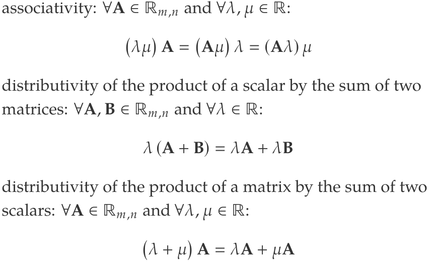
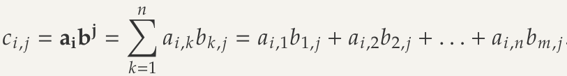
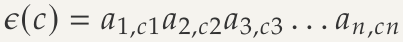
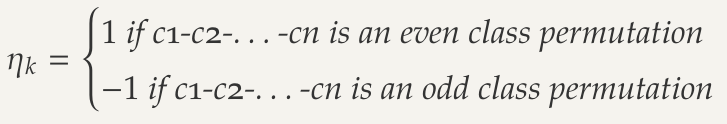
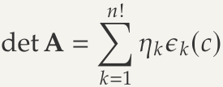
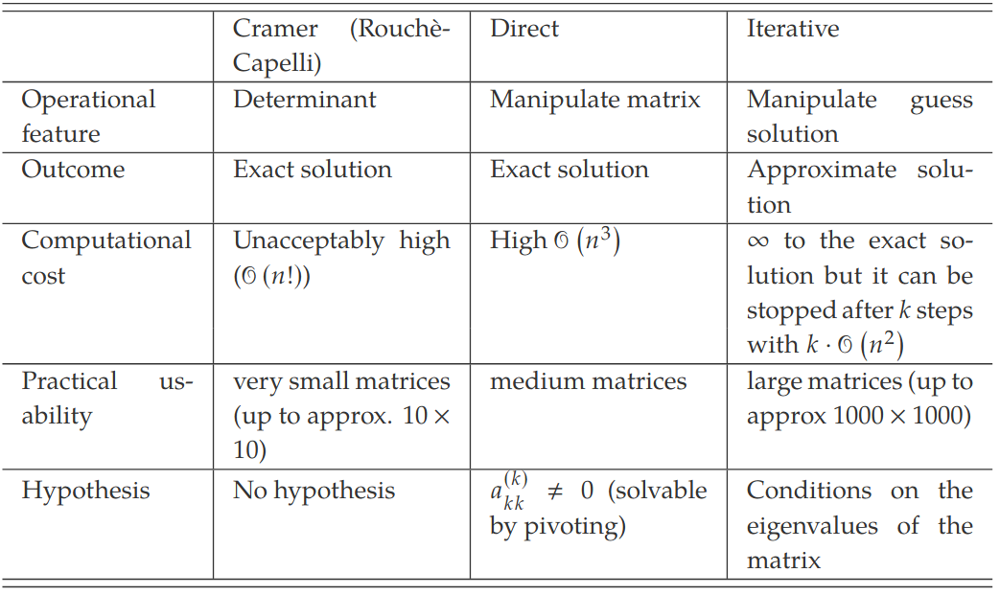

# 0. Presentation of the Course
## Exams
100%, can use any notes including internet
Take hop exam
### Types of Questions
- Numerical Questions
- Theoretical questions
### Difficulty Levels
- 60-80 marks: questions of the same type of those solved during the lectures
- 20-40 marks: questions that require some creativity and reasoning
## Topics
Mainly about algebra and calculus
- Matrices
- Systems of Linear Equations
- Vector Spaces
- Linear Mappings

# 1. The Basics
## Basic Definitions and notation
Set is a collection of items, name elements, characterised by a certain property
$A = \{ 2,4,7,D,24\}$
Element $x$ belgons to $A$ indicated as $x \in A$
Several elements of $A$ compose a *subset* $S:S\subset A$

Want to inidcate all the elements of the set:
$\forall x \in A:$
Want to say there exists(at least) one element of $A$ which has a certain property (such that):
$\exists x \in A \ni '$  
Want to say there exists only/exactly one element of $A$ which has certain property
$\exists! x \in A \ni '$
if statement 1 THEN statement 2
$\rightarrow$
statement 1 IF AND ONLY IF statement 2
$\iff$
## Cardinality of a set
*coincident* - every element of $A$ is also an element of $B$ and every element of $B$ is also an element of $A$
*cardinality* of a set is *number* of elements contained in $A$
*empty* - indicated with $\emptyset$

## Intersection and Union
*intersection* - $C = A \cap B$ - set containing all the elements that are both in the sets $A$ and $B$
*union* - $C = A \cup B$ - set containing all the elements that are either or both the sets $A$ and $B$
*difference* - $C = A \setminus B$ - set containing all the elements that are in $A$ but not $B$

## Associativity of the Intersection
$(A\cap B) \cap C = A\cap (B\cap C)$
## Numbers and Number sets
Set is *finite* if its cardinality is a finite number. Set is *infinite* if its cardinality is $\infty$
*continuous* if $\forall x_0 \in A:\exists x \ni ' |x-x_0|$

## Types of Number Sets
*Continue from last semester*
ℂ - Set of number than can be expressed as $a+jb$ where $a,b\in \R$ and the imaginary uni $j=\sqrt {-1}$

## Cartesian Product
New set generated by all the possible pairs
$C=A\times B$
$A=\{ 1,5,7\}$
$B=\{ 2,3\}$
$C=A\times B = \{ (1,2),(1,3),(5,2),(5,3),(7,2),(7,3)\}$
## Relations
### Order Relation
Indicated with $\preceq$ if following properties are verified:
- reflexivity
- transitivity
- antisymmetry
#### Example
Let $x,y \in \N$ and let consider $(x,y) \in \mathscr{R}$ if and only if $x$ is a multiple of $y$. More formally
$(x,y)\in \mathscr{R}\iff \frac{x}{y} = k$ with $k\in \N$
### Equivalence
Indicated with $\equiv$ if following properties are verified:
- Reflexivity - $x \equiv x$
- symmetry - $x\equiv y$ then $y\equiv x$ 
- transitivity - $x\equiv y$ and $y\equiv x$ then $x \equiv z$
### Equivalence Classes
Let $\mathscr{R}$ be an equivalence relation defined on $A$. The *equivalence class* of an element $a$ is a set defined as 
$[a]=\{ x \in A|x \equiv a \}$ 
### Partition
Set of all the elements equivalent to $a \in A$ is called equivalence class and is indicated with $[a]$
## Functions/Mapping
Relation is to be a *mapping* or *function* when it relates to any element of a set unique element of another. Let $A$ and $B$ be two sets, a mapping $f:A \to B$ is a relation  $\mathscr{R} \subseteq A\times B$ such that:
$\forall x \in A\exists! y \in B\ni '(x,y) \in \mathscr{R}$
(Every element, find only 1 element in other set such that y is = x)

The statement $(x,y) \in \mathscr{R}$ can be expressed also as $y=f(x)$
*Unary operator* - $f:A \to B$
*Binary operator* - $f:A \times A \to B$ or $f:A\times C\to B$
*Internal composition law* - $f:A\times A\to A$

*algebraic structure* - set endowed with 1+ internal composition laws
$(A,+,.)$

### Injective Functions
$f A \to B$ is injection if the function values of two different elements is always different: $\forall x_1$ and $\forall x_2$ if $x_1 \ne x_2$ then $f(x_1) \ne f(x_2)$
Never crosses horizontal line twice. Doesnt cross it twice
### Surjective Functions
$f A \to B$ is surjective if all elements of $B$ are mapped by an element of $A: \forall y\in B$ it follows that $\exists x \in A$ such that $y=f(x)$
Graph has no holes. Y axis as got a function, eg crosses graph
### Bijective Functions
$f A \to B$ is bijective when both injection and surjection are verified

# Numeric Vector
## Numeric Vector
- Let $n\in \N$ and $n>0$
- Indicated with $\R^n$, set of ordered *n*-tuples of real numbers
- Generic element a = ($a_1,a_2,...,a_n$) is named *numeric vector* or simply vector of order *n* 

## Sum of Vectors
- Sum of vectors: $c = (a_1 + b_1 , a_2 + b_2 , . . . , a_n + b_n )$
- Can also do the same for $a-b$

## Scalars
Numeric value $\lambda \in \R^1$ is a scalar
The product of a vector by a scalar is the vector $c=(\lambda a_1,\lambda a_2,...,\lambda a_n)$
Very similar to $\times$

## Scalar Product
Generated by the sum of the products of each pair of corresponding components
$ab = c = a_1b_1 + a_2b_2,...,a_nb_n$
Example:
- $a = (1, 0, 3)$
- $b = (2, 1, −2)$
- $ab = (1 · 2) + (0 · 1) + (3 · (−2)) = 2 + 0 − 6 = −4$
### Properties
- Symmetry: $ab=ba$
- Associativity: $\lambda (ba) = (\lambda a)b = a(\lambda b)$
- Distributivity: $a(b+c)=ab+ac$

# Matrices
## Matrix
2 natural numbers > 0. A matrix ($m\times n$) is a generic table of the kind

$A=\begin{pmatrix}
a_1,_1&a_1,_2&...&a_1,_n \\
a_2,_1&a_2,_2&...&a_2,_n \\
...&...&...&...\\
a_m,_1&a_m,_2&...&a_m,_n \\
\end{pmatrix}$
where each *matrix element* $a_i,_j\in \R$ 

- m=rows, n=columns
- *n order square matrix* - $A \in \R_n,_n$ 
-  *rectangular* - $m \ne n$

## Matrix Transpose
- Transpose matrix is $A^T$ whose elements are the same of A but $\forall i,j : a_j,_i = a^T_i,_j$
- Change index of row with index of columns (rotate it)

## Symmetry
- Only on square matrix
- When $\forall _i,_j : a_i,_j = a_j,_i$

## Diagonal and Trace
- Diagonal of a matrix is the ordered *n*-tuple that displays the same index twice. From 1 to $n a_i,_j$
- Trace is the sum of the diagonal elements tr($A$)

## Null Matrices
- Is said *null* $O$ if all elements are zeros

## Identity Matrices
- Square matrix whose diagonal elements are all ones while all the other extra-diagonal elements are zero

# Matrix Operations: Sum and Product
## Matrix Sum
$\forall i,j:c_i,_j = a_i,_j + b_i,_j$
Both matrices must be the same size! Can be subtracted from one another
### Properties of the matrix sum
- commutativity: $A + B = B + A$
- associativity: $(A + B) + C = A + (B + C)$
- neutral element: $A + O = A$
- opposite element: $∀A ∈ Rm,n : ∃!B ∈ R m,n \ni ‘ A + B = O$

## Product of a scalar and a matrix
Matrix $C$ defined as: $\forall i,j:c_i,_j = \lambda a_i,_j$
Similar to $\times$ by the scalar

### Properties of multiplying by a scalar
- associativity: $\forall A \in \R_m,_n$ and $\forall \lambda , \mu \in \R$:
	- $(\lambda \mu )A = (A\mu ) \lambda = (A \lambda) \mu$

## Matrix product
*Product of matrices* $A$ and $B$ is a matrix $C = AB$

- Just the scalar product of **row** vectors of $A$ with **column** vectors of $B$
- Number of columns in the first matrix must be the same as the number of rows in the second

$c_2,_1 = a_2b^1$

- left distributivity: $A (B + C) = AB + AC$
- right distributivity: $(B + C) A = BA + CA$
- associativity: $A (BC) = (AB) C$
- transpose of the product: $(AB)^T = B^T A^T$
- neutral element: $\forall A : AI = A$
- absorbing element: $\forall A : AO = O$

Commutable - $AB=BA$, one with respect to the other
Every matrix $A$ is commutable with $O$ (and the result is always $O$) and with $I$ (and the result is always $A$)

# Determinant of a Matrix 
> (takes decades to understand)
- Most important concepts of maths

- Permutation: Different ways of grouping items, can be checked with factorials
- Fundamental Permutation - Reference a sequence
- Inversion - Every time two objects in a permutation follow each other in a reverse order with respect to the fundamental
- Even class permutation - Permutation undergone to an even number of inversions
	- Also have Odd class permutation

## Associated Product
Never in the same column/row. Product of this is referred to as *associated product* and is indicated with the symbol $\epsilon$(c). Wont be the same number either.
Order the factors according to the row index:
	
	
## Coefficient of nk
Consider 1-2-...-n as fundamental permutation, the scalar nk is defined as:

## Determinant of a Matrix
indicated as det $A$ is the function
det: $\R_n,_n \to \R$
defined as the sum of n! associated products:
$\sum ^{n!} _{k=1} ....$

Do it as left to right diagonal +, then right to left diagonal as -

# Linear Dependence/Independence 
## Linear Combination
If row can be represented by other rows with weighted sum by means of the same scalars
## Linear dependence
If null vector can be expressed as the linear combination of the $m$ rows ($n$ columns) by means of nun-null scalars
Rows are linearly dependent if

$$\exists \lambda_1,\lambda_2,...,\lambda_m\ne0,0,...,0$$
such that

## Linear Independence
If only way to express a row of all zeros as the linear combination of the m rows(n columns) is by means of null scalars
## Fundamental property of Linear Dependence 
r rows are linearly dependent if and only if at least one row can be expressed as the linear combination of the others

# Properties of determinants
Determinant of a matrix $A$ is equal to the determinant of its transpose matrix

- **Transpose Matrix**: $detA = det A^T$
- **Triangular Matrix**: Equal to the product of the diagonal elements
- **Row(Column) swap**: If two rows (columns) are swapped the determinant of the matrix $A_s$ is $-detA$
- **Null determinant**: if two rows(columns) are identical(sum) then $detA=0$
	- If and only if the rows(columns) are [linearly dependent](../1043%20-%20Maths%202/22.02.09%20-%20Matrices.md#fundamental-property-of-linear-dependence)  
	- if and only if at least one row(column) is a linear combination of the other rows(columns)
	- if a row(column) is proportional to another row(column)
- **Invariant Determinant**: Row(column) the elements of another row(column) all multiplied by the same scalar are added, the determinant remains the same
- **Row(column) multiplied by a scalar**: Row(column) is multiplied by $\lambda$ then $\lambda detA$
- **Matrix multiplied by a scalar**: If $\lambda$ is scalar, $det(\lambda A) = \lambda ^n detA$
- **Determinant of the product**: Product between two matrices is equal to the products of the determinants. $det(AB) = det(A)det(B) = det(B)det(A) = det(BA)$

# Adjugate Matrices
## Submatrix
Obtained from $A$ by cancelling $m-r$ rows and $n-s$ columns. Where r,s 2 positive integers such that $1\le r \le m$ and $1\le s\le n$

- Rows dont have to be continuous
- $A=\begin{pmatrix} 3&3&1&0\\ 2&4&1&2\\ 5&1&1&1\\ \end{pmatrix}$
- Can be obtained by cancelling the second row, second and fourth column 
- $\begin{pmatrix} 3&1\\ 5&1 \\ \end{pmatrix}$

---
- **Minor**: Determinant of submatrix
- **Major**: If submatrix is the largest square
- **Complement submatrices**: Obtained by cancelling on the $i^{th}$ row and the $j^{th}$ column from $A$ to the element $a_{i,j}$
- **Complement Minor**: Determinant, indicated $M_{i,j}$
- **Cofactors**: $A_{i,j} = (-1)^{i+j}M_{i,j}$

## Adjugate Matrix
$A=\begin{pmatrix}
a_{1,1}&a_1,_2&...&a_1,_n \\
a_2,_1&a_2,_2&...&a_2,_n \\
...&...&...&...\\
a_n,_1&a_n,_2&...&a_n,_n \\
\end{pmatrix}$

Let $A_{i,j}$ be the cofactor for $a_{i,j}$. The *adjugate matrix* (adjunct or adjoin) $A$ is:
$adj(A)=\begin{pmatrix}
A_1,_1&A_2,_1&...&A_n,_1 \\
A_1,_2&a_2,_2&...&A_n,_2 \\
...&...&...&...\\
A_{1,n}&A_{2,n}&...&A_{n,n}\\
\end{pmatrix}$

Dan Terms: Transpose it  (Flip i,j around), then calculate the determinate of the remaining rows once removed it(the sub matrix, as would do normally). Then alternate between 1 and -1.(Use cofactors formula!. $(-1)^{i+j}$)

Tutorial Def:
1. $A$
2. $A^T$
3. All Compliment miners
4. Multiple by coefficent = adjudigate matrix
5. $A^{-1} = \frac{1}{detA}\times adj(A)$

# Laplace Theorems
## Theorem 1
Determinant of $A$ can be computed as the sum of each row(column) multiplied by the corresponding cofactor
$det A = \sum ^n _{j=1} a_{i,j} A_{i,j}$ for any arbitrary $i$ 
$det A = \sum ^n _{i=1} a_{i,j} A_{i,j}$ for any arbitrary $j$ 

The determinant of a one-element matrix is just the element $(det(a = a))$, can compute the determinant of any square number 

## Theorem 2
Sum of the elements of a row(column) multiplied by the corresponding cofactor related to another row(column) is always zero
$\sum ^n _{j=1} a_{i,j} A_{k,j}=0$ for any arbitrary $k\ne i$ 
$\sum ^n _{i=1} a_{i,j} A_{i,k}=0$ for any arbitrary $k\ne j$ 

minors are the row you remove, so you take sub matrix of the remaining part. $k$ = minor

# Introduction to Matrix inversion
## Inverting a matrix
For a square matrix, $A$, the inverse is $A^{-1}$ which is define as the matrix for which $AA^{-1}=I$
- **Invertible Matrices**: $\exists$ a matrix $B \in \R _{n,n} | AB=I=BA$
- **Unique Inverse** $\exists!$ a matrix $B \in \R _{n,n} | AB=I=BA$
- **Inverse matrix $A^{-1}$**: $A^{-1} = \frac{1}{detA} adj(A)$
- **Singular/Non Invertable/ Linear Dependent**: $det(A) =0$
- **Non-singular**: $det(A)\ne 0$
- **Inverse of a matrix product**: $(AB)^{-1}=B^{-1}A^{-1}$

# Orthogonal Matrices
$A\in \R_{n,n}$ is said *orthogonal* if the product between it and its transpose is the identity matrix:

$$AA^T = I = A^TA$$

An *orthogonal* matrix is always [non-singular](../1043%20-%20Maths%202/22.02.16%20-%20Determinants%20and%20Matrix%20Inversion.md#inverting-a-matrix) and its determinant is either 1 or -1

A matrix is *orthogonal* if and only if the ssum of the squares of the element of a row(column) is equal to 1 and the scalar product of any two arbitary rows(columns) is equal to 0:
$$\sum^n_{j=1}a^2_{i,j} =1$$
$$\forall i,j a_ia_j=0$$

# Rank of a Matrix
Rank - $A\in \R_{m,n}$ of matrix $A$, indicated as $\rho_A$ is the highest order of the non-singular submatrix $A_ρ \subset A$. So max value of rank in 3x3 matrices would be 3. If there is linear independence, then go to 2x2 and so forth. 
If $A$ is the null matrix then its rank is taken equal to 0

$A\in \R_{n,n}$ Matrix $A$ has ρ [linearly independent](../1043%20-%20Maths%202/22.02.09%20-%20Matrices.md#linear-dependenceindependence) rows(columns). 

Rank is c

## Sylvester's Lemma
$A\in \R_{n,n}$ and $B\in \R_{n,q}$. Let $A$ be non-singular and $ρ_B$ be the rank of the matrix $B$. Follows that the rank of the product matrix $AB$ is $ρ_B$

### Law of Nullity
*follows from the previous lemma*
$ρ_A$ and $ρ_B$ be the ranks and $ρ_{AB}$ be rank of the product AB. FOllows that:
$$ρ_{AB}\ge ρ_A+ρ_B-n$$

# Systems of Linear Equations
Basically simultaneous equations. Can be written as $Ax=b$

The coefficient matrix $A$ is said *incomplete matrix*. The matrix  $A^c\in \R_{m,n+1}$ whose first $n$ columns are those of the matrix $A$ and the $(n+1^{th})$ column is the vector $b$ is said *complete matrix*

$$A^c=(A|b)=$$

# Cramer's Theorem
If $A$ is [non-singular](../1043%20-%20Maths%202/22.02.16%20-%20Determinants%20and%20Matrix%20Inversion.md#inverting-a-matrix) , the is only one solution simultaneously satisfying all the equations:
if $detA\ne 0$ then $\exist!x$ such that $Ax=b$

## Hybrid Matrix 
Hybrid matrix with respect to the $i^{th}$ column is the matrix $A_i$ obtained from $A$ by substituting the $i^{th}$ column with $b$
(Switch $a^i$ with $b$)

## Cramer's Method
For a given system of linear equations $Ax=b$ with $A$ non-singular, a generic solution $x_i$ element of $x$ can be computed as 
$$x_i=\frac{detA_i}{detA}$$

For a square matrices would repeat 3 times, change column 3 times with $b$

# Rouchè-Capelli Theorem
## Solutions for systems of linear equations
- *compatible* if it has at least one solution
- *determined* if it has only one solution
- *undetermined* if it has infinite solutions
- *incompatible* if it has no solutions. Has a split $A^c=A|b$

## Theorem
$Ax=b$ is compatible if and only if both the complete and incomplete matrices ($A|A^c$) are characterised by the same rank $\rho_A = \rho_{A^c}=\rho$ named rank of the system

### Cases
$\rho_a<\rho_{a^c}$ - Incompatible, no solutions
$\rho_a=\rho_{a^c}$ - system is compatible. Under these conditions, three cases can be identified:

1. $\rho_a=\rho_{a^c}=\rho=n=m$ - System is a Cramers system and can be solved Cramers method 
2. $\rho_a=\rho_{a^c}=\rho=n<m, \rho$ equations of the system  compose a Cramers system. The remaining $m-\rho$ are linear combination of the other, these equations are redundant and only 1 solution
3. $\rho_a=\rho_{a^c}=\rho\begin{cases}< n\\\le m\end{cases}$ is undetermined and has $\infty^{n-\rho}$

How to choose the equations to cancel?
- Cannot cancel any equations
- Need to ensure that the cancellation of an equation does not change the rank of the incomplete matrix $A$
- Have to cancel only linearly dependent equations, that is rows of the matrix $A^c$

## General Solutions of Undetermined Systems
- Select the $\rho$ rows linearly independent rows of the complete matrix $A^c$
- Choose (arbitrarily) $n-\rho$ variables and replace them with parameters
- Solve the system of linear equations with respect to the remaining variables
- Express the parametric vector as a sum of vectors, where each parameter appears in only one vector

# Homogeneous Systems of Linear Equations
Homogeneous if the vector of known terms $b$ is composed for only zeros and is indicated with O. Solution of at least null vector

## General solution of a system
If a solution of the homogeneous system then $\lambda$ is also a solution to the system

## Combination of solutions
If $\alpha$ and $\beta$ are both solutions then every linear combination of these two n-tuple is solution of the system.
$$\forall\lambda,\mu\in\R.(\lambda\alpha_1+\mu\beta_1,\lambda\alpha_2+\mu\beta_2,...,\lambda\alpha_n+\mu\beta_n)$$

## Special Property
Homogeneous system of $n$ equations in $n+1$ variables. System has $\infty^1$ solutions proportionate to the n-tuple

- [Cramers Method](../1043%20-%20Maths%202/22.02.23%20-%20Systems%20of%20Linear%20Equations.md#cramers-theorem) requires the calculation of 1 determinant of a $n$ order matrix and $n$ determinate of $n$ order matrices
- Means $n!+n(n!)$ elementary operations
- Need to find alternative methods as takes too long

# Theoretical Foundations of Direct Methods
## Elementary Row Operations
- $E_1$: Swap of two rows $a_i$ and $a_j$
$$a_i \leftarrow a_j$$
$$a_j \leftarrow a_i$$
- $E_2$: Multiplication of a row $a_i$ by a scalar $\lambda\in\R$
$$a_i\leftarrow\lambda a_i$$
- $E_3$: Substitution of a row $a_i$ by the sum of the row $a_i$ to another row $a_j$:
$$a_i\leftarrow a_i+a_j$$

## Equivalent Matrices and Equivalent Systems
**Equivalent Matrices**: Apply the elementary row operations on $A$, obtain new matrix $C\in\R_{m,n}$. 

**Equivalent Systems**: 2 systems of linear equations in the same variables: $Ax=b$ and $Cx=d$. These two systems are equivalent if they have the same solutions

Consider a system of $m$ linear equations in $n$ variables $Ax=b$. Let $A^c\in\R_{m,n+1}$ be the complete matrix associated with this system.
If another system of linear equations is associated with a complete matrix $A^{'c}\in\R_{m,n+1}$ equivalent to $A^c$, then the two systems are equivalent

- $E_1$: The swap of two rows, the equations of the system are swapped, no effect on the solution of the system
- $E_2$: Same solutions, modified systems is equivalent to the original one
- $E_3$: After operation, the modified system is equivalent in solutions to the original one

## Direct Methods
Direct methods are methods for solving systems of linear equations by manipulating the original matrix to produce an equivalent system that can be easily solved. A typical manipulation is the transformation of a system of linear equation into triangular system

# Gaussian Elimination 
$Ax=b$
1. Construct the complete matrix $A^c$
2. Apply the elementary row operations to obtain a staircase complete matrix and triangular incomplete matrix, that is **we add rows to obtain a null element in the desired position**
3. Write down the new system of linear equations
4. Solve the $n^{th}$ equations of the system and use the result to solve the $(n-1)^{th}$
5. Continue recursively until the first equation

To obtain the matrix would do:
$$r^{(2)}_2=r^{(1)}_2+(\frac{-a^{(1)}_{2,1}}{a^{(1)}_{1,1}})\times r^{(1)}_1$$
As it keeps going on, it gets longer and longer, to create a matrices with leading zeros

Dan Method:
$$a_{n,m}-(a_{n,1}\times a_{n-1,m})$$
This completes the first 2 rows and first column. Then have to increase m, to do second column

# LU factorisation
Direct method that transforms a Matrix into a matrix product $LU$ where $L$ is a lower triangular matrix having the diagonal elements all equal to 1 and $U$ is an upper triangular matrix
$$Ax=b\Rightarrow LUx=b$$
Pose $Ux=y$ solve at first the triangular system $Ly=b$ and then extract $x$ from the triangular system $Ux=y$
Does not alter the vector of known terms $b$. 

If working with non singular matrix, then split any matrix into a product such that $A=LU$.
If non-singular matrix and is square, and has det of 0, then $\exists!$ lower traingular matrix $L$ having all the diagonal elements equal to 1 and $\exists!$ upper triangular matrix $U$ such that $A=LU$

# Equivalence of Gaussian elimination and LU factorisation
- Gaussian elimination and LU factorisation are both direct methods
- They are not identical but they are equivalent
- Whilst performing the algorithm the LU factorisation is implicitly performed
- Both Gaussian elimination and LU factorisation have a lower complexity than theoretical methods
- The complexity is in the order of $n^3$ operations

# Short introduction to Iterative Methods
Jacobi's Method - Starts from an initial guess $x^{(0)}$, iteratively apply some formulas to detect the solution of the system. 
Unlike direct methods that converge to the theoretical solution in a finite time, iterative methods are *approximate* since they *converge*, under some conditions

# Definition of Vector Space
## Vector Space
- $E$ to be a non-null set and $K$ to be a scalar set
- Vectors: elements of the set $E$
- $+$ - Internal composition law, $E\times E \to E$
- $.$ - External composition law, $K\times E\to E$
- ($E,+,.$) is said vector space of the vector set $E$ over the scalar field ($K,+,$) if and olf if the ten vector space axioms are verified

### Axioms
- $E$ is closed with respect to the internal composition law: $∀u, v ∈ E : u + v ∈ E$
- $E$ is closed with respect to the external composition law: $∀u ∈ E and ∀λ ∈ K : λu ∈ E$
- Commutativity for the internal composition law: $∀u, v ∈ E : u + v = v + u$
- Associativity for the internal composition law: $∀u, v, w ∈ E × E : u + (v + w) = (u + v) + w$
- Neutral element for the internal composition law: $∀u ∈ E : ∃!o ∈ E|u + o = u$
- Opposite element for the internal composition law: $∀u ∈ E : ∃!−u ∈ E|u + −u = o$
- Associativity for the external composition law: $∀u ∈ E$ and $∀λ, μ ∈ K : λ(μu) = (λμ) u = λμu$
- Distributivity 1: $∀u, v ∈ E$ and $∀λ ∈ K : λ (u + v) = λu + λv$
- Distributivity 2: $∀u ∈ E and ∀λ, μ ∈ K : (λ + μ)u = λu + μu$ 
- Neutral elements for the external composition law: $∀u ∈ E : ∃!1 ∈ K |1u = u$

## Vector Subspace
($E,+,.$) be a vector space, $U \subset E$ and $U \ne ∅$
The triple ($E,+,.$) is a vector subspace of ($E,+,.$) if ($U,+,.$) is a vector space over the same field $K$ with respect to both the composition laws

Proposition shows that we do not need to prove all 10 axioms, just need to prove closure of the two composition laws.

## Null vector in Vector Spaces
($E,+,.$) be a vector space over a field $K$. Every vector subspace ($U,+,.$) of ($E,+,.$) contains the null vector.
For every vector space ($E,+,.$), at least two vector subspace exist

# Intersection and Sum Spaces
## Intersection Spaces
If ($U,+,.$) and ($V,+,.$) are two vector subspace of ($E,+,.$), then ($U\cap V,+,.$) is a vector subspace of ($E,+,.$)

## Sum Space
($U,+,.$) and ($V,+,.$) be a vector space of ($E,+,.$). Sum subset is a set $S=U+V$ defined as
$$S=U+V=\{ w\in E |\exists u \in U, v \in V|w=u+v \}$$

## Direct Sum
($U,+,.$) and ($V,+,.$) be two vector subspaces of ($E,+,.$). If $U\cap V = \{ o\}$ the subset sum $S=U+V$ is indicated as $S=U⊕V$ and named subset direct sum

# Linear dependence in $n$ dimensions
## Basic Definition
- [Linear combination](../1043%20-%20Maths%202/22.02.09%20-%20Matrices.md#linear-combination) of the $n$ vectors by means of $n$ scalars is the vector $\lambda_1v_1+\lambda_2v_2+...+\lambda_nv_n$
- Said to be [linear dependent](../1043%20-%20Maths%202/22.02.09%20-%20Matrices.md#linear-dependence) if the null vector o can be expressed as linear combination by means of the scalars $\lambda_1,\lambda_2,...,\lambda_n\ne 0,0,...,0$
- Vectors are [linearly independent](../1043%20-%20Maths%202/22.02.09%20-%20Matrices.md#linear-independence) if the null vector $o$ can be expressed as linear combination only by means of the scalars $0,0,...,0$
- Are linearly dependent if and only if at least one of them can be expressed as linear combination of the others
- Would then check them as you would do in matrices

# Linear Span
Set containing the totality of all the possibly linear combinations of the vectors, by means of $n$ scalars.
$L (v_1 , v_2 , . . . , v_n ) = \{ λ_1 v_1 + λ_2 v_2 + . . . + λ_n n |λ_1 , λ_2 , . . . , λ_n ∈ K \}$
## Properties
1. Span $L(v_1,v_2,...,v_n)$ with the composition laws in a vector subspace of ($E,+,.$)
2. $s\in \N$ with $s<n$. If $s$ vectors are linearly independent while each of the remaing $n-s$ vectors is linear combination of the linearly independent $s$ vectors, then  $L (v_1 , v_2 , . . . , v_n ) = L (v_1 , v_2 , . . . , v_s )$
3.  $L (v_1 , v_2 , . . . , v_n ) =  L (v_{(σ)1} , v_{(σ)2} , . . . , v_{(σ)no })$

# Basis of a Vector Space
## Basis
Vector space is said to be *finite-dimensional* if $\exists$ a finite number of vectors such that the vector space $(L,+,.)=(E,+,.)$ where the span $L$ is $L(v_1..)$.

A *basis* $B=\{v_1...\}$ of $(E,+,.)$ is a set of vectors $\in E$ that verify the following properties:
- They are [linearly independent](../1043%20-%20Maths%202/22.02.09%20-%20Matrices.md#linear-independence)
- They span $E$, i.e. $E = L(v_1..)$
## Null Vector and Linear Dependence
If one of the vectors is equal to the null vector, then these vectors are [linear dependent](../1043%20-%20Maths%202/22.02.09%20-%20Matrices.md#linear-dependence)
## Steinitz Lemma
 $(E,+,.)$ = Finite-dimensional vector space
 $L(v_1..)=E$ = E its span
 Let $w_1...$ be $s$ linearly independent vectors $\in E$
 Follows that $s\le n$, the number of a set of linearly independent vectors cannot be higher than the number of vectors spanning the vector space.
 ### Corollary of the Steinitz Lemma
 ^continuation
 $B=\{w_1...\}$ be its basis, it follows that $s\le n$.
 The vectors composing the basis are linearly independent. For the Steinitzs Lemma, it follows immediately that $s\le n$
# Dimension of a Basis
## Order of a Basis
Number of vectors composing a basis is said *order of a basis*
All the bases of a vector spaces have the same order
## Dimension of a Vector Space
The order of a basis is said dimension is indicated with dim $(E,+,.)$ or dim($E$).
The *dimension* dim $(E,+,.)=n$ of a vector space is:
- the maximum number of linearly independent  vectors of E
- the minimum number of vectors spanning E
## Linear independence and dimension
The vectors span the vectors if and only if they are linearly independent
# Grassmann Formula
## Reduction and Extension of a basis
**Basis Reduction Theorem** - If some vectors are removed a basis of $(E,+,.)$ is obtained
**Basis Extension Theorem** - Let $w_1..$ be $s$ linearly independent vectors of the vector space. If $w_1..$ are not already a basis, they can be extended to a basis (by adding other linearly independent vectors)

## Unique Representation
If the $n$ vectors are linearly dependent while $n-1$ is linearly independent, there is a unique way to express one vectors as linear combination of others
(How you would represent other lines with one another, identify them with lambdas)

## Grassmanns Formula
Let $(U,+,.)$ and $(V,+,.)$ be vector subspace of $(E,+,.)$. Then, 
$$dim(U+V)+dim(U\cap V) = dim(U) + dim(V)$$

# Basic Definitions of Mappings
## Mapping and Domain
$U$ be a set such that $U\subseteq E$
The relation $f$ is said *mapping* when 
$$\forall u\in U : \exists!w\in F \ni`f(u)=w$$
Said domain and is indicated with $dom(f)$

A vector $w$ such that
$$w=f(u)$$
is said to be the mapped (or transformed) of $u$ through $f$

## Image
Image ($Im$) is a set of all all vectors $w$ that exist such that $f(u)=w$
$$Im(f)=\{w\in F | \exist u\in E\ni`f(u)=w\}$$

dom/domain = Input
Image = output $\to$ also means a subset

## Surjective, injective, bijective
Mapping $f$ is **surjective** if the image of $f$ coincides with $F:Im(f)=F$

Mapping $f$ is **injective** if $\forall u,v \in E$ with $f(u)=f(v)\to u=v$
(if $u$ is different from $v$, then so will $f(u)/f(v)$)

Mapping $f$ is **bijective** if $f$ is **injective** and **surjective**

# Linear Mappings
## Linear Mapping
Linear mapping if the following properties are valid:
- Additivity: $\forall u,v \exists E:f(u+v)=f(u)+f(v)$
- Homogeneity: $\forall\lambda \in K$ and $\forall v\in E :f(\lambda v)= \lambda f(v)$

(This happens very very rarely)
## Affine Mapping
Said **affine** if 
$ g(v) = f(v) - f(u)$ is linear
## Linear Mappings
Image of $U$ through $f$, $f(U)$ is the set 
$$f(U)=\{w\in F | \exist u \in U \ni`f(u)=w\}$$
Follows that the triple $(f(u),+,.)$ is a vectors subspace of $(F,+,.)$
## Inverse Image
$$E\to W\subset F$$
The inverse image of $W$ through $f$, indicated with $f^{-1}(w)$ is a set defined as:
$$f^{-1}w=\{u\in E|f(u)\in W\}$$
## Matrix Representation
Linear mapping can be expressed as the product of a matrix by a vector $y=f(x)=Ax$
## Image from a matrix
The mapping $y=f(x)$ is expressed as a matrix equation $y=Ax$. Follows that the image of the mapping $Im(f)$ is spanned by the column vectors of the matrix
A:
$$Im(f)=L(a^1,a^2,...a^n)$$
where
$$A=(a^1,a^2,...a^n)$$

(Just convert matrix into (A). Columns into own (C))
# Endomorphisms and Kernel
## Endomorphism 
$E\to F$. If $E=F$, $f:E\to E$ then linear mapping is *endomorphism*
## Null Mapping
$O:E \to F$ is a mapping defined as $\forall v \in E: O(v) = O_F$
## Identity Mapping
(Should be same dimension)
$I:E\to F$ is a mapping defined as $\forall v\in E: I(v)=v$
## Matrix Representation
$E\to E$ be endomorphism.
Mapping of multiplication of a square matrix by a vector: $f(x):Ax$

$y=f(X)=Ax$. The inverse function $x=f^{-1}(y)=A^{-1}y$
## Linear dependence 
Needs to be endomorphism
$v_1...$ likely dependent then so are $f(v)...$
## Kernal 
$E\to F$ linear mapping
$$ker(f)=\{v\in E| f(v) = o_F$$
### Kernal as Vector Space
The triple $(Ker(f),+,.)$ is a vector subspace of $(E,+,.)$
### Kernal and Injection
$f:E\to F$ be a linear mapping $u,v\in E$. Follows that 
$$f(u)=f(v)$$
if and only if
$$u-v\in Ker(f)$$

#### Theorem
Mapping is injective if and only if:
$$Ker(f)=\{o_e\}$$

## Linear Independence and injection
$E\to F$
$V_1.....$ be $n$ linearly independent vectors $\in E$. If $f$ is injective then $f(v_1)...$ are also linearly independent vectors of $f$
Endomorphism $f$ is invertible if and only if it is injective

# Rank-Nullity Theorem
Let $f:E\to F$ be a linear mapping.
The rank of $f$ is the dimension of the image, $rk(f) := dim(Im(f))$
The rank is an invariant of the map.
  
The dimension of the kernel, $dim(ker(f))$ is said *nullity* of a mapping.
## Theorem
Under the hypothese: the sum of rank and nullity of a mapping is equal to the dimension of the vector space $(E,+,.)$:
$$dim(ker(f)) + dim(Im(f)) = dim(E)$$
*Usually $dim(Im(f))$ is the hardest to calculate and this theorem allows an easy way to compute it as $dim(E)-dim(ker(f))$*

## Proof
If $dim(ker(f))=0$ then $f$ is injective. If the basis spans the image, the vectors are linearly independent. 
## Corollaries of Rank-Nullity Theorem
Let $f:E\to E$ be an endomorphism where $(E,+,.)$ is a finite-dimensional vector space.
- If $f$ is **injective** then it is also surjective
- if $f$ is **surjective** then it is also injective
### Corollary
Let $f:E\to F$ be a linear mapping with $(E,+,.)$ and $(F,+,.)$. 
- Consider $dim(E)>dim(F)$. Follows that the mapping is not **injective**.
- Consider $dim(E)<dim(F)$. Follows that the mapping is not **surjective**
# Eigenvalues and Eigenvectors
Let $f:E\to E$ be an endomorphism where $(E,+,.)$ is a vectors space with dimension $K$.
Every vector $x$ such that $f(x)=\lambda x$ with a $\lambda$ scalar and $x\in E\div \{o_E\}$ is said *eigenvector* of the endomorphism $f$ related to the *eigenvalue* $\lambda$
*Eigenvalue and eigenvector are building blocks of reality*

Dan terms:
$\lambda$ = eigenvalue (num of x)
$x$ = eigenvector (any number)
homogeneous = (0,0)
# Eigenspace
Let $f:E\to E$ be an endomorphism
The set $V(\lambda)\subset E$ with $\lambda\in K$ defined as
$$V(\lambda)=e\{o_E\}\cup\{x\in E|f(x)=\lambda x\}$$
This is said *eigenspace* of the endomorphism $f$ related to the eigenvalue $\lambda$. The dimension of the eigenspace is said *geometric multiplicity* of the eigne value $\lambda$ and is indicated with $\gamma_m$
# Determining Eigenvalues and Eigenvectors
Let $f:E\to E$ be an endomorphism. Let $p(\lambda)$ be the order $n$ characteristic polynomial related to the endomorphism. The number of roots of $\rho(\lambda)$ is called algebraic multiplicity. 
# Introduction to Diagonalization
One variable for each line in a diagonal manner.
Not all the mappings/matrices can be diagonalized, Need to have enough linearly independent columns of $P$.

Let $f:E\to E$ be an endomorphism. The matrix is diagonalizable if and only if it has n linearly independent eigenvectors:
- All the eigenvalues are distinct
- The algebraic multiplicity of each eigenvalue coincides with its geometric multiplicity

## Symmetric Mappings
If the mapping is characterised by a symmetric matrix, then can prove that;
- The mapping is always diagonalisable
- The transformation matrix $P$ can be built to be orthogonal ($P^{-1}=P^{T})$. Also means the new reference system given by the eigenvectors is also a convenient orthogonal system