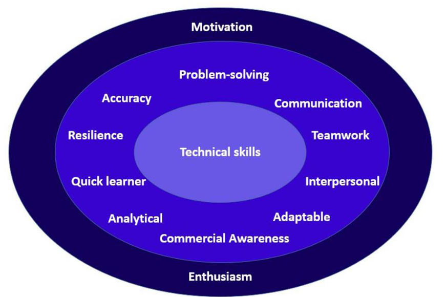

# 0. CV Workshop
_03/10/21_

## Suggested Content
- Personal Contact details
- Short personal statement
- Education and qualifications
- Work Experience
- Evidence of skills
- Interests, activities and achievements
- Referee details

Generally education and qualification before experience. 
Most relevant experience should be on first page.

## Tech Quickie
- CVs should be less than 2 pages
- No photos 
- No dob or marital status
- Focus on strengths
- Use name as a heading
- Include 'References available on request' 

## Technical Experience
- Could be under Project experience, Education or Relevant experience
- Programming projects and group projects
- Coding/I.T experiences
