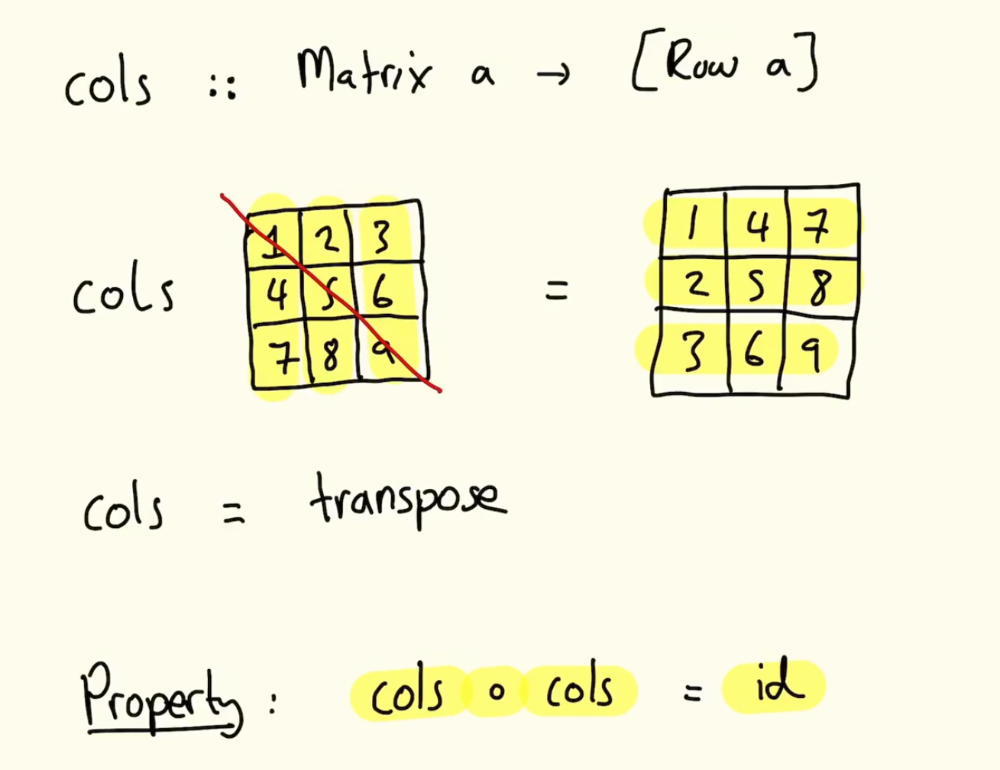
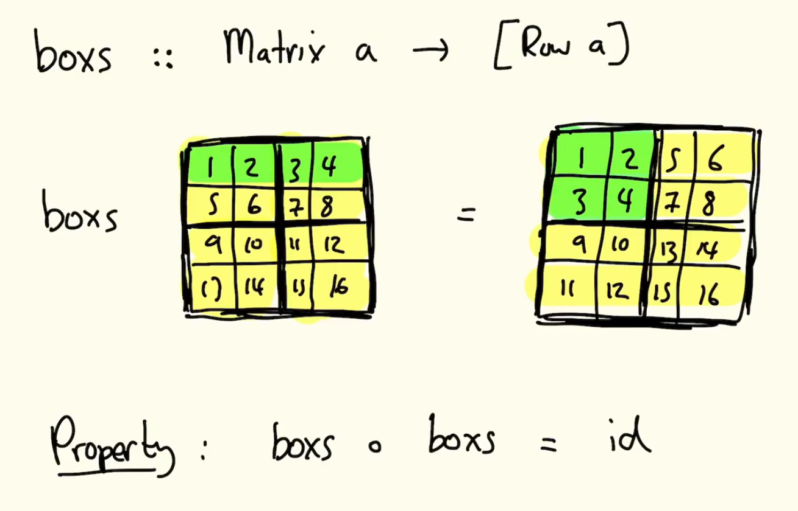

# 0. Introduction to AFP
_03/02/23_

- Functional languages represent the leading edge of programming language design, and the primary setting in which new programming concepts are introduced and studied

## Topics
- Programming with effects (Monoids)
- Reasoning about programs
- Improving program efficiency
- Recent and ongoing research

## Sudoku in Haskell

- Need to make some basic declarations. Top down manner. Suduko type

```haskell
type Grid = Matrix Value -- Matrix is 2d array
type Matrix a = [Row a] -- list of rows with type a. Param
type Row a = [a] -- Row is a list of things
type Value = Char -- Makes it easier to display them in a grid
```
Could define grid as `type Grid = [[Char]]`. But its useful to break it up

Example
```haskell
easy :: Grid
easy = ["2....1.38", "........5",".7...6...",...] -- Row is a string of characters. Represent a blank cell with a .
blank :: Grid
-- replicate :: Int -> a -> [a]. Part of a libirary
blank = replicate 9 ( replicate 9 '.')

rows :: Matrix a -> [Row a]
rows = id -- identity function

Property : rows(rows m) = m -- applies rows function twice, get back to where started
Property : rows . rows = id -- taking rows function and composing it by itself

cols :: Matrix a -> [Row a] -- 'rotates' columns. Transpose them

boxs :: Matrix a -> [Row a] -- converts boxes into rows

valid :: Grid -> Bool
valid g = all nodups (rows g) && all nodups (cols g) && all nodups (boxs g) -- ensures theres no duplicates
```





```haskell
-- all, simple lib function
all :: (a -> Bool) -> [a] -> Bool
all p xs = and [p x | x <- xs] -- Taking each value of x in p, RE WATCH 
```

```haskell
nodups :: Eq a => [a] -> Bool
nodups [] = True
nodups [x:xs] = not (elem x xs) && nodups xs
```