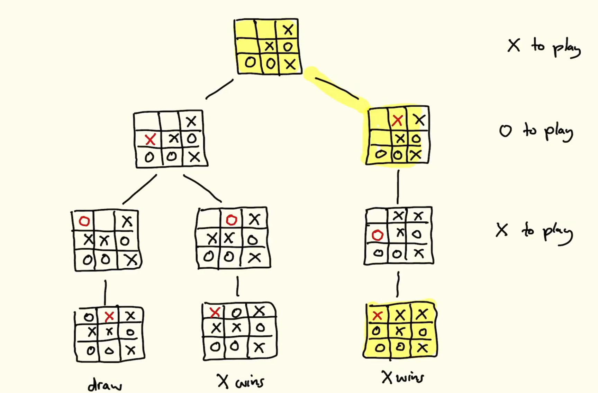

# 3.  Coursework - Connect 4
_13/02/23_

Run the Haskell code as `ghc -02 connect4.ls`

## The Board
```haskell
rows = 6
cols = 7
win = 4
depth = 6 --search depth

type Board = [Row]
type Row = [Player]

data Player = O  | B | X deriving (Ord, Eq, Show) -- Gives class instances for free
```

## What is deriving?
```haskell
class Eq a where 
	(==) :: a -> a -> Bool--infix operator. True if =, false if not
	(/=) :: a -> a -> Bool--Not equal, true if not equal
x /= y = not (x == y)
```

Class is a collection of related types

What happens when you do `deriving eq`
```haskell
instance Eq Player where
	O == O = True
	B == B = True
	X == X = True
	_ == _ = False
```

`Ord` - Ordering of values on type. Is dependent on the order you write the constructors. 
`Show` - Displays the requested item

## Game Trees
Essence in writing a strong computer player for connect 4.

Can have up to a million boards

## Strategy (minimax)
1. Produce the game tree to specified depth
2. Label each leaf with winner, or Blank if game not over or draw
3. Then work up the tree(propagate) 
	- If O to play, take min of children. (O<B<X)
	- If X to play, take max of children (O<B<X)
4. Best move is one with same label as root