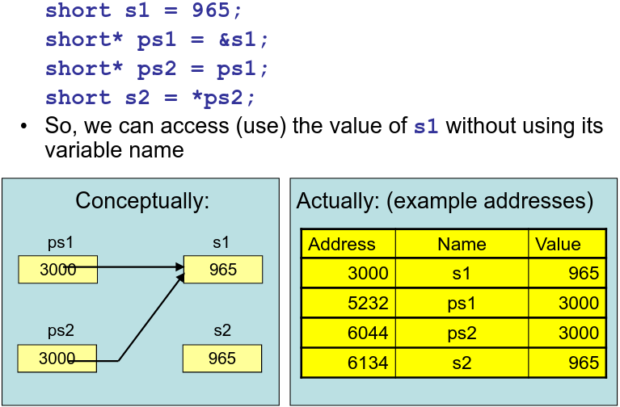
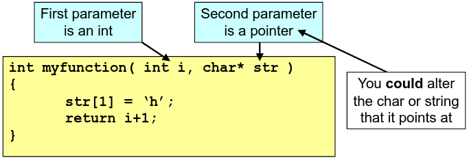

# 1. Pointers & Data Types
_02/02/23_
## Data Types
`bool` - `true/false`. `bool` and `int` can be converted implicitly/automatically. non-zero is defined to be `true`. Can use this inside a while loop;
```c++
int x = 6;
while(x)
{
	printf("X is %d\n",x);
	x-=2;
}
```

### Size of types
Size of types can vary based on compilers/operating system. Some guarantees are given:
- Minimum size (bits) - `char` 8, `short` 16, `long` 32.
- Relative sizes - `char` $\le$ `short` $\le$ `int` $\le$ `long`

`void` - type is used to mean no return value, no parameters, optional. Cannot create a variable of type `void`
`const` - means constant/unchangeable. Use `const char *` instead of `char*`
`auto` - Allows you to be lazy, don't bother about type. Can only be used for initialised variables.

## Pointers
`&` - Ask for the address of a variable
`sizeof()` - Size in chars - compile time
`*` - Used to denote a pointer. The value of the pointer is an address in memory. The type of a pointer says what type of data the program should expect to find at the address

Can think of pointers whichever what is easier for you
1. As an address in memory and a type/format
2. As a way of pointing to some other data, and a record of what type of data you think the thing pointed as is

### Dereferencing operator `*`
The `*` operator is used to access the *thing* that a pointer points at.
```c++
char c1 = 'h';
char* pc = &c1; //pc is a pointer to c1
char c3 = *pc; // *pc is thing pointed at
```



### Uninitialised Pointers 
Variables are NOT initialised unless you give them an initial value. Value of one is undefined.

## Passing pointers as parameters
Each parameter has a single type, so may be one *thing*. A copy of this is stored in memory for the parameter. To alter something that is external to a function from within a function, need to refer to the thing itself, not a copy of it.


```c++
void AlterCopy( int icopy )  
{  
	icopy = 2;  
}  
void AlterValue( int* picopy )  
{  
	*picopy = 3;  
}  
int main( int argc, char* argv[] )  
{  
	int i = 1;  
	printf( "Initial value of i is %d\n", i );  
	AlterCopy( i );  
	printf( "After AlterCopy, value of i is %d\n", i );  
	AlterValue( &i );  
	printf( "After AlterValue, value of i is %d\n", i );  
	return 0;
}
```
