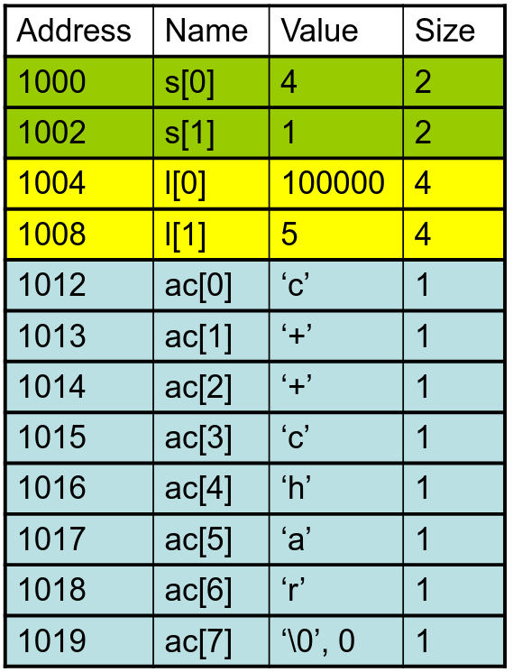
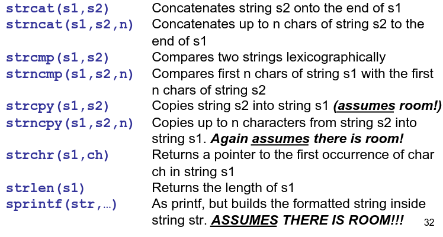

# 2. Pointer Arithmetic
_07/02/23_

## Arrays
- Can create uninitialised arrays by adding `[]` to the end of variable declaration. Values are unknown and not initialised.
	- `char* names[12];`
- Creating initialised array using `{}`. Can also let the compiler work out the size of the array
	- `short rants[2] = { 4, 1};`
- Access arrays by using `ac[4]`
- Can take the address of an element `char* pc1 = &(ac[0])`
- Array names can be used as if they were pointers to the first element, so these are equivalent. Pointers can be treated as arrays

## Arrays in memory
- `%p` will display a pointers location in hex
- Value of pointers are undefined
- Do NOT dereference a pointer which does not point at something meaningful 
- C-Arrays are stored in consecutive addresses in memory. From the address of the first element you can find the addresses of the others
- The relative locations of different arrays, or variables are NOT fixed

Can find length with `#elements = sizeof(array)/sizeof(element)`

C will let you read/overwrite whatever happens to be stored in the address if you read/write outside of array bounds.

## String Literals
`char*` is a pointer to a character. Normally terminated by `\0` or `0`

- `char c1[] = "Hello";` - Creates an array
- `char* c3 = "Hello";` - Creates a pointer
- `const char*` - For string literals

## Command Line Arguments
- Can declare `char* argv[]` as `char** argv`
- `argc` - count of arguments - including the filename
- `argv[]` - array of `char*`s
- `argv[i]` - a `char*` pointing to an array of chars

## Pointer Arithmetic
- **Pointer Increment** - Incrementing a pointer increased the value of the address stored at the pointer. Can move through the array (++)
- **Pointer Decrement** - Decreased the value of the address stored by an amount equal to the size of the thing the pointer thinks that it points at (--)
- **Pointer Subtraction** - Same type. Number of bytes different / by size of element