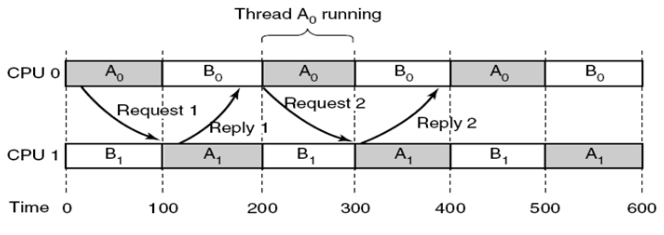

# 5. Process Scheduling
_14/10/22_

## Multi-level Feedback Queues
- Defining characteristics of feedback queues include:
	- Number of queues
	- Scheduling algorithms used for individual queues
	- Migration policy between queues
	- Initial access to the queues
- Feedback queues are highly configurable and offer significant flexibility

From windows 7 they used multi-level feedback queues.
- An **interactive system** using a preemptive scheduler with two classes and 16 priority levels in each class.
	- "Real time" processes/threads have a fixed priority level
	- "Variable" processes/threads can have their priorities boosted temporarily
- Round robing algorithm is used within the queues.

- Priorities are based on the process base priority (between 0-15) and thread base priority.
- A threads priority dynamically changes during execution between its base priority and the maximum priority within its class
	- Interactive I/O bound processes receive a larger boost
	- Boosting priorities prevents priority inversion

## Scheduling in Linux
### Completely fair scheduler
- Process scheduling has evolved over different Linux versions. This accounts for multiple processors/cores, processor affinity, and load balancing between cores
- Distinguishes between two types of tasks for scheduling:
	- Real time tasks (POSIX compliant): real time FIFO tasks, real time Round Robin tasks
	- Time sharing tasks using a preemptive approach
- Most recent scheduling in Linux for **time sharing tasks** is *completely fair scheduler*

### Real time tasks
Real time is the wrong name as you cant guarantee hard deadlines.
- Real time FIFO tasks have the highest priority and are scheduled using FCFS approach, using preemption if a higher priority job shows up
- Real time round robin tasks are preemptable for clock interrupts and have a time slice associated with them
- Both approaches cannot guarantee hard deadlines 

### Time scheduling in Linux 
#### Equal priority
- The CFS devices the CPU time between all processes/threads
- If all *N* processes/threads have the same priority:
	- They will be allocated a 'time slice' equal to 1/N times the CPU time
- Length of the time slice and the "available CPU time" are based on the targeted latency.
- If *N* is very large the context switch time will be dominant, hence a lower bound on the time slice is impose by the minimum granularity.
#### Different Priority
- A weighting scheme is used to take different priorities into account
- If process/threads have different priorities:
	- Every thread *i* is allocated a weight w that reflects its priority
- The tasks with the lowest proportional amount of used cpu time are selected first

## Multi-processor Scheduling
### Scheduling Queues
- **Single processor** machine: **which process(thread)** to run next
- Scheduling decisions on a multi-processors/core machine include

### Shared Queues
- A single or multi-level queues shared between all CPUs
- Advantage:
	- Automatic load balancing
- Disadvantage:
	- Contention for the queues
	- Does not account for processor affinity (cache becomes invalid when moving to a different CPU)
- Windows will allocate the highest priority threads to the individual CPUs/cores

### Private Queues
- Each CPU has a private (set) of queues
- Advantages:
	- **CPU affinity** is automatically satisfied
	- **Contention** for shared queues is minimised
- Disadvantages:
	- Less load balancing
	- Push and pull migration between CPU is required

## Related vs. Unrelated Threads
- **Related**: multiple threads that communicate with one another and ideally run together (search algorithm)
- **Unrelated**: processes threads that are independent, possibly started by different users running different programs

## Scheduling Related Threads
### Working together
- Threads belong to the same process and are cooperating (exchange messages or share information)
- They try to send messages to the other threads, which are still in the ready state

- The aim is to get threads running, as much as possible, at the same time across multiple CPUs
### Space Scheduling
- Approach:
	- *N* threads are allocated to *N* dedicated CPUs
	- *N* threads are kept waiting until *N* CPUs are available 
	- Non-preemptive
- Number of *N* can be dynamically adjusted to match processor capacity
### Gang Scheduling
- Time slices are synchronised and the scheduler groups thread together to run simultaneously 
- A preemptive algorithm 
- Blocking threads result in idle CPUs
	- If a thread blocks, due to an I/O call, the rest of the time slice will be unused