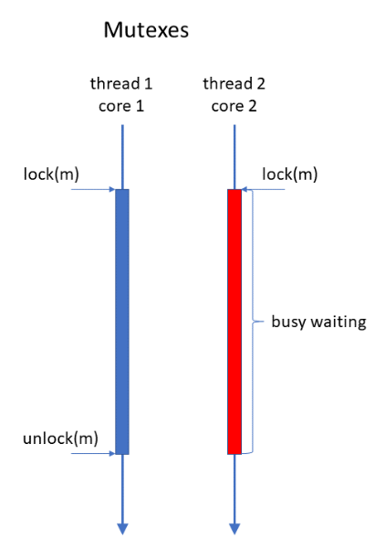
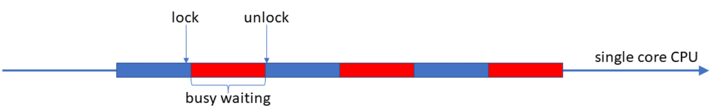
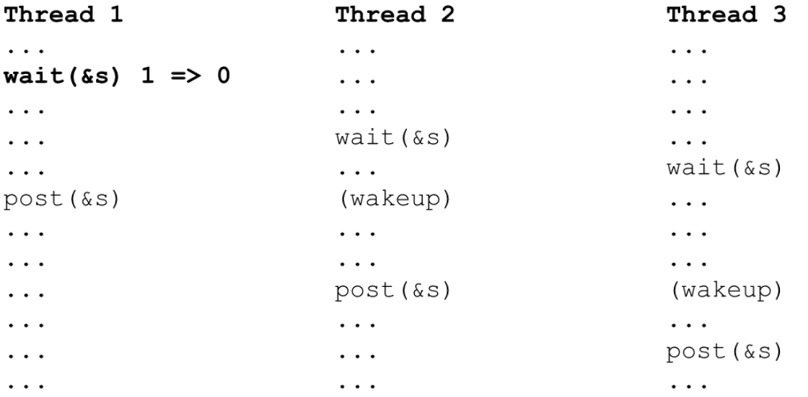
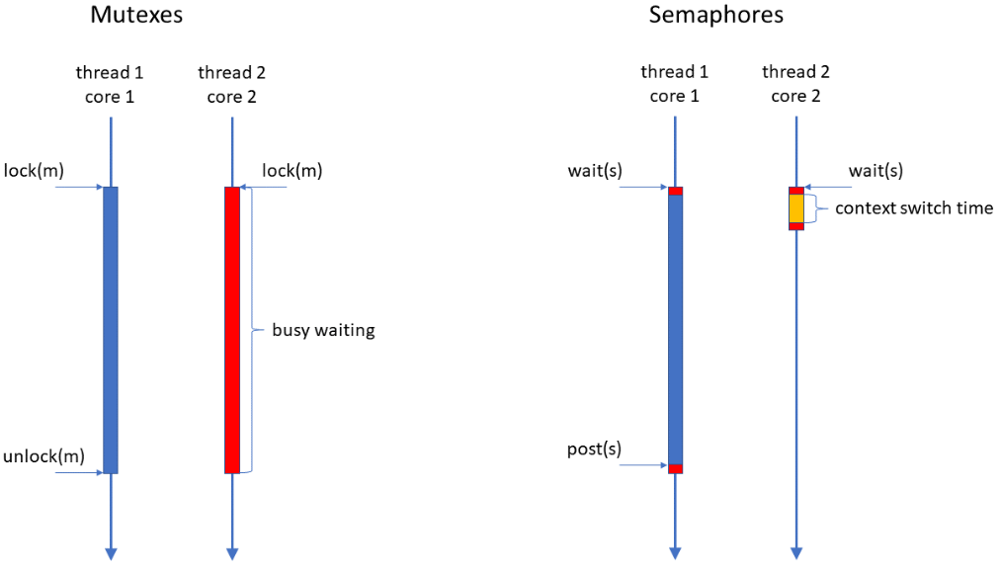
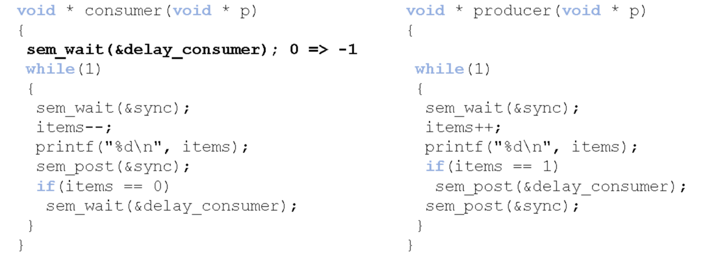

# 8. Mutexs & Stemaphores
_21/10/22 _
## Mutex Locks
- Mutexes are an approach for mutual exclusion provided by the operating system.
	- Contains boolean lock variable to indicate
	- Lock variable is set to **true** if the lock is **available**. **false** if **unavailable**
- Two Functions used. These must be atomic instructions:
	- `acquire()` - called before a critical selection, sets bool to false
	- `release()` - called after the critical section, sets bool to true
- The process that acquires the lock must release the lock
- Key disadvantage of mutex locks is that calls to `acquire()` result in busy waiting. Detrimental for performance on single CPU systems.
- Key advantages of mutex locks include:
	- Context switches can be avoided
	- Efficient on multi-core/multi-processor systems when locks are he,d for a short time only
- Single core is easy to waste time, multi core higher chance it gets released quickly as it could be on a separate core

Mutexs binary lock 

*Mutex Example*

*Mutex Example*
## Semaphores
Doing the opposite, put the process on the execution, and puts it to sleep.

- Semaphores are an approach to mutual exclusion provided by the operating system
	- Contain an integer variable
	- Well distinguish between binary (If negative means processes are available.) and counting semaphores. (User uses it so it can go above 1.) 
	- Can be used to force mutual exclusion, and represent resources
- Two atomic functions:
	- `wait()` - called when a resource is acquired, the counter is decremented
	- `signal()`/`post()` - is called when a resource is released
- Strictly positive values indicate that the semaphore is available, negative values indicate the number of processes/threads waiting

*Semaphores example*

- Calling `wait()` will block the process/thread when the internal counter is negative
	1. Process/thread joins the blocked queue
	2. Process/thread state is changed from running to blocked
	3. Control is transferred to the process scheduler
- Calling `post()` removes a process/thread from the blocked queue if the counter is equal to or less than 0
	1. Process/thread state is changed from blocked to ready
	2. Joins the read queue
- **Different queuing strategies can be employed to remove processes/threads. Queue as FIFO**
- `block()` and `wakeup()` are system calls provided by the OS
- `post()` and `wait()` must be atomic. Can be achieved through mutexes. Busy waiting is moved from the critical section to `wait()` and `post()`
- 

*Mutexes vs Semaphores*

Mutexs can be implemented as semaphore.

- Semaphores within the same process can be declared as global variables of the type `sem_t`
	- `sem_init()` - initialises the value of the semaphore
	- `sem_wait()` - decrements the value of the semaphore
	- `sem_post()` - increments the values of the semaphore 

## Efficiency
- Synchronising code does result in a performance penalty
	- Synchronise only when necessary
	- Synchronise a few instructions as possible (unnecessary instructions will delay others when entering critical state)

## Caveats
- Starvation: Poorly designed queuing approaches (LIFO) may result in fairness violations
- Deadlocks: Every thread in a set is waiting for an even that can only be caused by another thread in the same set
- Priority inversion: high priority process waits for a resource held by a low priority process
- Priority inversion can happen in chains. Prevented by priority inheritance/boosting

## The Producer/Consumer Problem
- Producers and consumers share *N* buffers that are capable of holding one item each.
	- Buffer can be bounded or unbounded size
	- Can be one or multiple consumers and/or producers
- The producer(s) adds items and goes to sleep if the bugger is full
- The consumer(S) removes items and goes to sleep if the buffer is empty
### First Version
- One producer, one consumer, and an unbounded buffer. 
- A counter (index) represents the number of items in the buffer
- The solution uses two binary semaphores:
	- `sync`: synchronises access to the buffer (counter) - initialised to 1
	- `delay_consumer`: puts the consumer to sleep when the buffer is empty - initialised to 0

*Single producer/consumer with unbounded buffer*
- Any manipulations of count will have to be synchronised. 
- Race conditions still exist
	- When the consumer has exhausted the buffer, should have gone to sleep, but the producer increments `items` before the consumer checks it
### Second Version

*Single producer/consumer and an unbounded bugger: Race condition (items = -1*