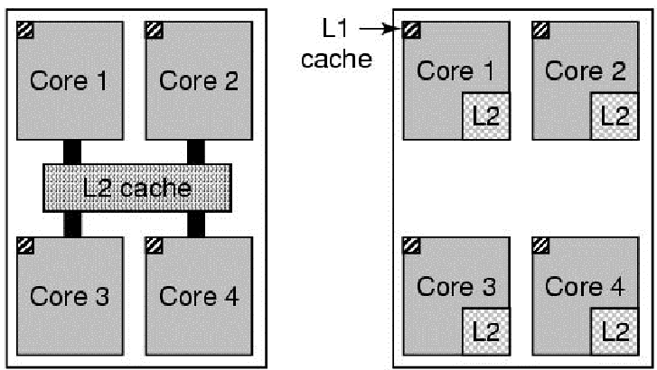
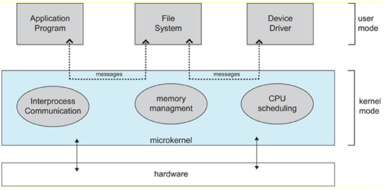

# 1. Introduction (2)

_04/10/22_

## Computer Hardware (CPU Design)

Basic Cycle - Fetch Decode Execute. Tasks are done in parallel. 
Higher end - Multiple parallel pipelines that simultaneously fetch and decode them in a holding buffer where there's multiple execution units that will take the instructions and carry them out. 

### Registers

- **Data Registers** - Any sort of data for special functions. 
- **Program Counter-** Holds the next instruction.
- **Program status word**  - admin, stores the mode bit. Which mode the CPU is in, kernel mode or user mode.
- **User Mode** - Direct access to a subset of instructions the CPU can carry out
- **Kernel mode** - Access to the full set of instructions. Including privileged memory locations. 
- Normally compiler decides which mode to use

When running program data would be stored in the same address, even if run more than once. But value wont affect the program/value

### Memory Management Unit

Name given to a variable, is a synonym, to the location of an address. 
One cannot know where in memory an executable will run. Variables require memory, they need to have a memory address

- **Logical Address Space** - Used by the processor and the compiler (starts at 0). What you use when you write code. Every process has one. [0, MAX^64] (theoretically)^4
- **Physical Address Space** - Seen by the hardware/OS. [0,MAX] (Determined by the amount of physical memory)
  Memory management unit is responsible for address translation
  `physical = logical + x`

Different processes require different address translation. 
Context switching requires updating the MMU

*For MacOS: Memory address is always random, to make code less predictable and as a security measure.*

### History

> **Moore's law** - The number of transistors on an integrated circuit doubles roughly every two years. 

- Closely linked but necessarily related to performance
- Moore's still continuing but the power wall slows performance improvements of single core
- Can extract parallelism automatically, can implement parallelism at the lowest level

Originally single core with high clock power, caused too much heat. Especially with more transistors and things getting closer together. Instead, they now have more cores to distribute the load and heat. 

### Multi-Core, hyper-threaded processors

Evolution in hardware has implications on operating system design. 
The process scheduling needs to account for load balancing and CPU affinity. Now need to decide when and WHERE it is going to run. 

(Left) Intel (Right) AMD

### Timer Interrupts

- Interrupts temporarily pause a processes normal operation.
  - Timer interrupts by CPU clock
  - I/O interrupts for I/O completion or error codes
  - Software generated 
- Context switches (switches between processes) can be initiated by timer interrupts after a set time

## Mirco Kernels

(Structure of a Micro Kernel)

Running it as user mode, if you do damage, less damage would be compared to kernel mode

**Monolithic Systems** - All procedures into one single executable running in kernel mode. However, they are difficult to maintain. Current versions of Windows, and Linux are implemented as this.