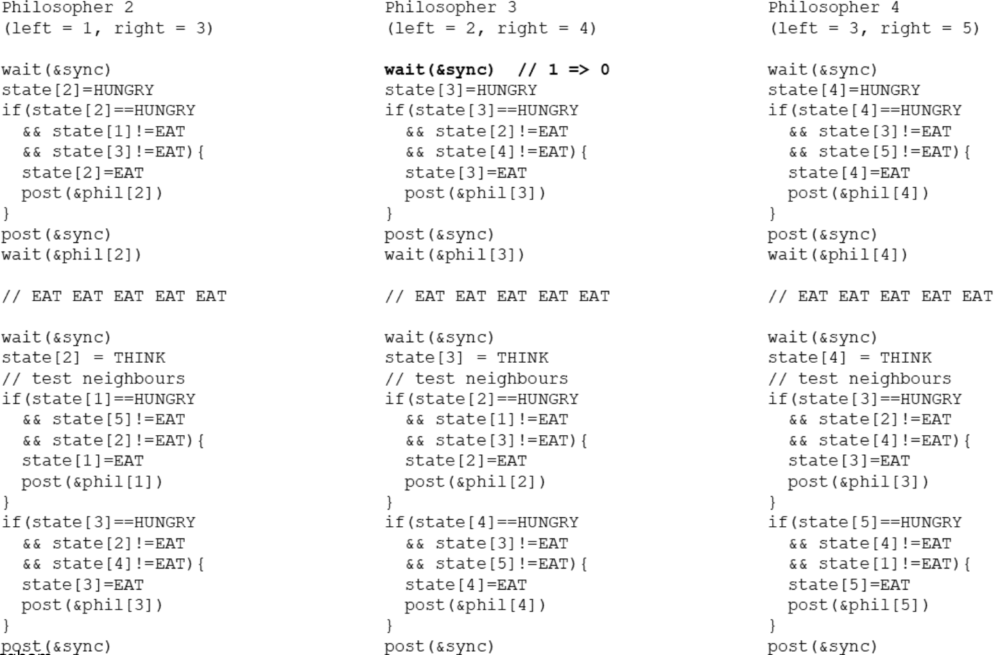
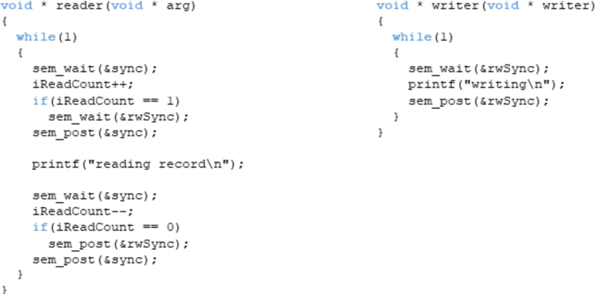

# 10.   Parallel dining philosophers & Readers/writers problem

## [The Dining Philosophers Problem - Continued](09.md#The-Dining-Philosophers-Problem)
### Solution 3 - Maximum Parallelism
- A more sophisticated solution is necessary to allow maximum parallelism. 
- The solution uses:
	- `state[N]`: one state variable for every philosopher
	- `phil[N]`: one semaphore per philosopher (not forks, initialised to 0)
		- Philosopher goes to sleep if neighbours are eating
		- Neighbours wake up the philosopher if they finish eating
	- `sync`: one semaphore/mutex to enforce mutual exclusion of the critical section (while updating the states) 
Needs to be done atomically all in one section
```c
#define N 5
#define THINKING 1
#define HUNGRY 2
#define EATING 3

int state[N] = {THINKING, THINKING, THINKING, THINKING, THINKING};
sem_t phil[N]; // sends philosopher to sleep
sem_t sync;

void * philosopher(void * id) {
	int i = *((int *) id);
	while(1) {
		printf("%d is thinking\n", i);
		take_forks(i);
		printf("%d is eating\n", i);
		put_forks(i);
	}
}

void take_forks(int i) {
	sem_wait(&sync);
	state[i] = HUNGRY;
	test(i);
	sem_post(&sync);
	sem_wait(&phil[i]);
}

void test(int i) {
	int left = (i + N - 1) % N;
	int right = (i + 1) % N;
	if(state[i] == HUNGRY && state[left] != EATING && state[right] != EATING) {
		state[i] = EATING;
		sem_post(&phil[i]);
	}
}

void put_forks(int i) {
	int left = (i + N - 1) % N;
	int right = (i + 1) % N;
	sem_wait(&sync);
	state[i] = THINKING;
	test(left);
	test(right);
	sem_post(&sync);
}
```



## The Reads - Writers Problem
- Concurrent database processes are readers and/or writers, files, I/O devices etc
- Reading a record can happen in parallel without problems, writing needs synchronisation
- Different solutions:
	1. Naive implementation with limited parallelism
	2. Readers receive priority: no reader is kept waiting (unless a writer already has access, writers may starve)
	3. Writing is performed as soon as possibly (readers may starve)
### Solution 1 - No Parallelism
```c
void * reader(void * arg) {
	while(1) {
		pthread_mutex_lock(&sync);
		printf("reading record\n");
		pthread_mutex_unlock(&sync);
	}
}

void * writer(void * writer) {
	while(1) {
		pthread_mutex_lock(&sync);
		printf("writing\n");
		pthread_mutex_unlock(&sync);
	}
}
```

### Solution 2 - Readers First
Allows parallel reading.
- Implementation requires: 
- `iReadCount`: integer tracking the number of readers
- if `iReadCount > 0` writers are blocked (`sem_wait(rSync)`)
- if `iReadCount ==>== 0` writers are released (`sem_post(rwSync)`)

