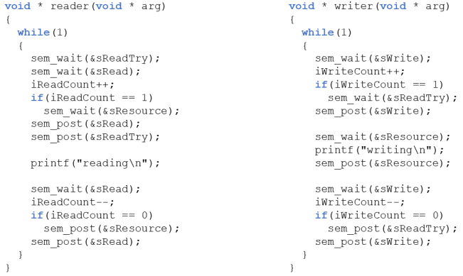

# 11. Readers/writers problem(2)

### Solution 3 - Writers 3
Give priority to writers and uses:
- `iReadCount`. `iWriteCount` - to keep track of the number of readers/writers
- `sRead/sWrite` to synchronise the readers/writers critical section
- `sReadTry` to stop readers when there is a writers waiting
- `sReasource` to synchronise the resource for reading/writing
