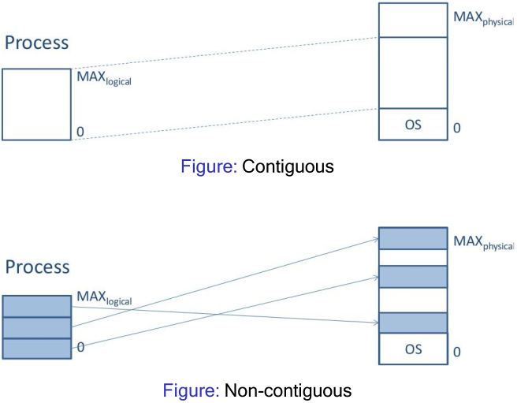
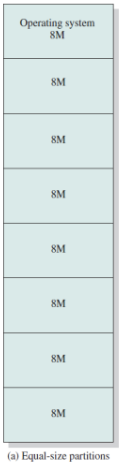
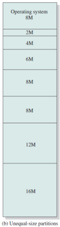
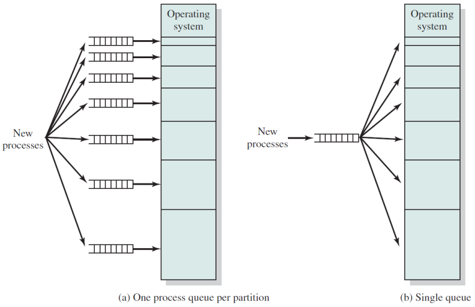

# 12. Memory Management
_31/10/22_

## Memory Management
### Memory Hierarchies
- Computers typically have memory hierarchies:
	- Registers, L1/l2/L3 cache
	- Main Memory (RAM)
	- Disks
- "Higher memory" is faster, more expensive and volatile 'lower memory' is slower, cheaper and non-volatile
- OS provides a memory abstractions
- Memory can be seen as one linear array of bytes/words
### OS Responsibilities
- Allocate/de-allocate memory when requested by process. keep track of used/unused memory
- Distribute memory between processes and simulate a 'larger than available' memory space
- Control access when multi programming is applied
- Transparently move data from memory to disk and vice versa
## Partitioning

- **Contiguous memory management models** - allocate memory in one single block without any holes or gaps
- **Non-contiguous memory management models** - capable of allocating memory in multiple blocks, or segments, which may be placed anywhere in physical memory

### Contiguous Approaches
- **Mono-programming** - one single partition for user processes
- **Multi-programming** with fixed partitions
	- Fixed equal sized partitions
	- Fixed non-equal sized partitions
- **Multi-programming** with dynamic partitions

## Mono-Programming
- Only one single user process is in memory/executed at any point in time
- A fixed region of memory is allocated to the OS, the remaining memory is reserved for a single process
- This process has direct access to physical memory
- Process is allocated contiguous block of memory
- One process is allocated the entire memory space, and the process is always located in the same address space
- Overlays allow the program to control the memory. Programmer can use more memory than available
### Shortcomings
- Direct access to the physical memory means it may have access to OS memory
- OS can be seen as a process - have two processes anyway
- Low utilisation of hardware resources
- Mono programming is unacceptable as multi programming is expected on modern machines

Direct memory access/mono programming are common in basic embedded systems, microwaves, washing machines etc

### Simulating
- Simulate multi-programming through swapping
	- Swap process out to the disk and load a new one
	- Apply threads within the same process

## Multi-Programming
- There are $n$ processes in memory
- A process spends $p$ percent of its time waiting for I/O
- CPU utilisation is calculated as 1 minus the time that all processes are waiting for. $1-p$
- Probability that all $n$ processes are waiting for I/O is $p^n$ 

### Caveats
- This model assumes that all processes are independent, not true
- More complex models could be built queuing theory, but we can still use this simplistic model to make approximate predictions 

## Partitioning 
### Fixed partitions of equal size
- Divide memory into static, contiguous and equal sized partitions that have a fixed size and fixed location
	- Any process can take any partition
	- Allocation] of fixed equal sized partitions to process is trivial
	- Very little overhead and simple implementation
	- The OS keeps a track of which partitions are being used and which ones are free

#### Disadvantages
- Low memory utilisation and internal fragmentation: partition may be unnecessarily large
- Overlays must be used if a program does not fit into a partition

### Fixed partitions of non-equal size
- Divide memory into static and non-equal sized partitions that have a fixed size and fixed location. 
- Reduces internal fragmentation
- The allocation of process to partitions must be carefully considered

### Fixed Partitions (Allocation Methods)

One private queue per partition
- Assigns each process to the smallest partition that it would fit in
- Reduces internal fragmentation
- Can reduce memory utilisation and result in starvation

A single shared queue for all partitions can allocate small process to large partitions but result in increased internal fragmentation