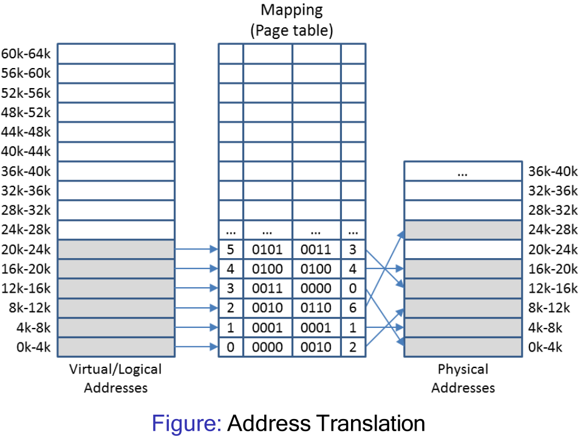

# 14. Dynamic Partitioning & Paging

## Dynamic Partitioning
Operating system is responsible for applying strategies to allocate processes to available memory and managing free space
### Allocating Available Memory
#### First Fit
Starts scanning from the start of the linked list until a link is found which represents free space of sufficient size
- If requested space is the exact same size as the 'hole', ass the space is allocated
- Else the free link is split into two
		- First entry is set to the size requested and marked 'used'
		- The secondary entry is set to remaining size and marked 'free'

#### Next fit
Maintains a record of where it got to
- Restarts its search from where it stopped last time
- Gives an even chance to all memory to get allocated 
However, simulations have shown that next fit actually gives worse performance than first fit

#### First & Next fit
First fit is a fast allocation method that just looks for the first available hole. Doesn't take into account if there is a hole later, and can break up big holes
Next fit doesn't improve that model.
#### Best Fit
Best fit always searches the entire linked list to find the smallest hole big enough to satisfy the memory request. Its slower than first git, and can also result in more wasted memory (tiny useless holes)
#### Worst Fit
Tiny holes are created when best fit splits an empty partition. The worst fit algorithm finds the largest available empty partition and splits it. Left over part will still be large and potentially more useful. 

### Summary
- **First fit**: allocate first block that is large enough
- **Next fit**: allocate next block that is large enough, i.e. starting from the current location
- **Best fit**: choose block that matches required size closest - O(N) complexity
- **Worst fit**: choose the largest possible block - O(N) complexity 

### Quick fit

- Maintains lists of commonly used sizes
	- Odd sizes can either go into the nearest size or into a special separate list
- It is much faster to find the required size hole using quick fit
- Similar to best fit, it has the problem of creating many tiny holes
- Finding neighbours for coalescing becomes more difficult/time consuming 

### Managing available memory
#### Coalescing
- Coalescing (joining together) takes place when two adjacent entries in the linked list becomes free.
- Both neighbours are examined when a block is freed
	- If either/both blocks are free, they are combined into one larger block by adding up the sizes
#### Compacting
- Even with coalescing happening automatically, free blocks may still distributed across memory
	- Can be used to join free and used memory together 
- Compacting is more difficult and time consuming to implement than coalescing 

## Contiguous Allocation Schemes
- Different contiguous memory allocation schemes have different advantages/disadvantages
	- Mono-programming: easy but does result in low resource utilisation
	- Fixed partitioning facilitates multi-programming but results in internal fragmentation
	- Dynamic partitioning facilitates multi-programming, reduces internal fragmentation, but results in external fragmentation
## Paging
- Uses the principles of fixed partitioning and core relocation to devise a new **non-contiguous** management scheme:
	- Memory is split into much smaller blocks and one or multiple blocks are allocated to a process
	- These blocks do not have to be contiguous in main memory, but the process still perceives them to be contiguous
- Benefits compared to contiguous scheme include:
	- Internal fragmentation is reduced to the last block only
	- There is no external fragmentation, since physical blocks are stacked directly onto each other in main memory
### Definitions
- Small block of contiguous memory in the logical address space
- A frame is a small contiguous block in physical memory
- Pages and frames usually have the same size

### Relocation
- Logical address needs to be translated into a physical address
- Multiple 'base registers' will be required.
- Base registers are stored in the page table

 
Page tables may not be efficient as more address there are , the bigger it gets and the slower it is