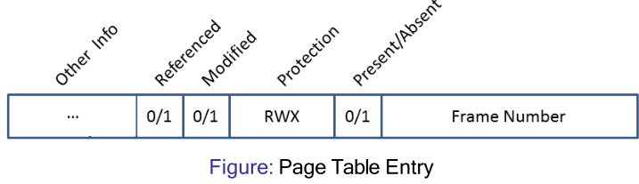

# 15. Paging & Virtual Memory
_11/11/22_

## Recall
Principles of paging
- Main memory is divided into small equal sized frames
- Each process is divided into pages of equal size
- A page table contains multiple 'relocation registers' to map the pages to frame.
- Reduced internal fragmentation
- No external fragmentation

## Paging
### Address Translation
- A logical (physical) address is relative to the start of the program (memory) and consists of two parts
	- The right most $m$ bits that represent the offset within the page (frame)
	- The left most $n$ bits that represent the page(frame number)
- The offset within the page and frame remains the same (they are the same size)
- The page number to frame number mapping is held in the page table

### Relocation
Steps in address translation:
1. Extract the page number form logical address
2. Use page number as an index to retrieve the frame number in the page table
3. Add the "logical offset within the page" to the start of the physical frame
Hardware implementation of address translation
1. The CPUs MMU intercept logical addresses
2. MMU uses a page table as above
3. The resulting physical address is put on the memory bus

### Benefits
- Code execution and data manipulation are usually restricted to a small subset.
- **Principle of locality** - code and data references within a process are usually clustered
- Pages next to one another are usually executed together
- Not all pages have to be loaded in memory at the same time $\to$ virtual memory
##  Virtual Memory
Loading an entire set of pages for an entire program into memory is wasteful
Desired blocks could be loaded on demand

### Page Faults
- The resident set refers to the pages that are loaded into main memory
- A page fault is generated if the processor accesses a page that is not in memory
	- Results in a n interrupt
	- An I/O operation is started to bring the missing page into main memory
	- A context switch take place
	- An interrupt signals that the I/O operation is complete
### Demand Paging
1. Trap operating system
2. Context switch
3. Interrupt for I/O completion
4. Context switch to original process

### Benefits
- Being able to maintain more processes in memory through the use of virtual memory improves CPU utilisation
	- Individual processes take up less space as they are only partially loaded
- VM allows the logical address to be larger than physical space size

### Page Tables
- **Present/absent bit** - set if the page/frame is in memory
- **Modified bit/dirty bit** - set if the page/frame has been modified 
- **Referenced bit** - Set if the page is or has been in use
- **Protection and sharing bits** - read, write, execute etc

### Multi level page tables
- Large page tables cannot be stored in registers
- Have to be stored in  (virtual) main memory
	- Multi-level page tables
	- Inverted page table

We can page the page table!
- Keep tree-like structures to hold page tables
- Divided the page number into an index to a page table of second level, a page within a second level page table
- No need to keep all page tables in memory all time

### Access Speed
- Root page table is always stored in memory, rest is in VM

## Summary
- Paging splits logical and physical address spaces into small pages/frames to reduce internal and external fragmentation
- Virtual memory exploits the principle of locality and allows for processes to be loaded only partially into memory, large logical address space require 'different' approaches e.g paging a page table