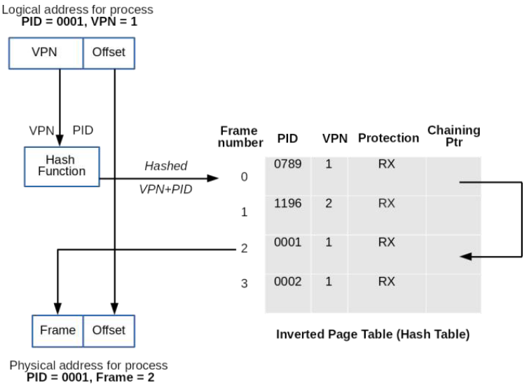
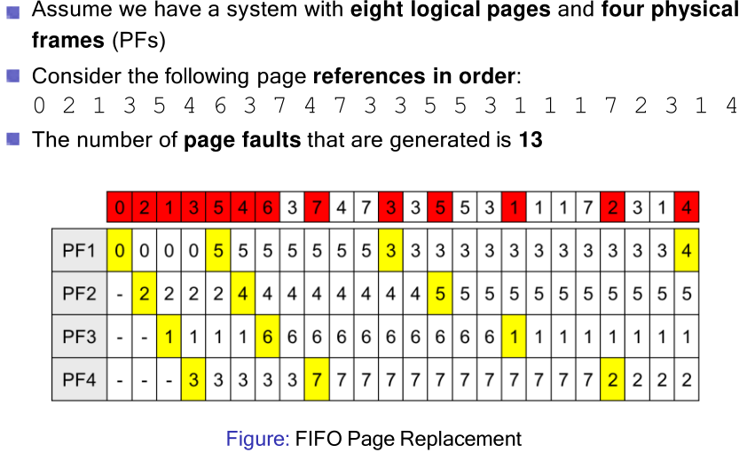

# 16. Virtual Memory & Page Replacement 
_14/11/22_

## Virtual Memory
- Memory organisation of multi-level page tables
	- The root page table is always maintained in memory
	- Page tables themselves are maintained in virtual memory due to their size
- With two levels, every memory reference already becomes 3 times slower:
	- Assuming that the second level page table is already in main memory
	- Memory access already forms a bottleneck under normal circumstances

### Translation look aside buffers (TLBs)
*Basically  a cache, most used page tables. Associative memory*
 - TLBs are usually located inside the MMU
	 - They cache the most frequently used page table entries
	 - They can be searched in parallel
- The principle behind them is similar to other types of caching in operating systems
- Remember: locality states that processes make a large number of references to a small number of pages

### Inverted Page Tables
**Normal** - Is proportional to the number of pages in the virtual address space $\to$ this can be prohibitive for modern machines

**Inverted** - Size is proportional to the size of main memory
- The inverted table contains one entry for every frame (not page) and it indexes entries by frame number.
- When a process references a page, the OS must search the (entire) inverted page table for the corresponding entry $\to$ this could be too slow
- Solution: Use a hash function that transforms page numbers into frame numbers

- The frame number will be the index of the inverted page table
- Process Identifier(PID) - The process that owns this page
- Virtual Page Number (VPN) - We don't know if its in memory
- Protection bits (Read/Write/Execution)
- Chaining Pointer - The field points toward the next frame that has exactly the same VPN. Need to solve collisions 

| Advantages                                                  | Disadvantages                                                                                    |
| ----------------------------------------------------------- | ------------------------------------------------------------------------------------------------ |
| OS maintains a single inverted page table for all processes | Virtual-to-physical translation becomes much harder/slower                                       |
| Saves lots of space                                         | Hash tables eliminates the need of searching the whole inverted table, need to handle collisions |

TLBs are particularly necessary to improve their performance 
Pages are shuttled between primary and secondary memory

Two key decisions have to be made using virtual memory
- Which pages are loaded and when $\to$ predictions can be made
- What pages are removed from memory and when $\to$ page replacement algorithms
Pages are shuttled between primary and secondary memory

### Implementation details
Avoid unnecessary pages and page replacement is important

$ma$ = denote the memory access time
$p$ = page fault rate
$pft$ = page fault time
Effective access time is given by:
$$T_a = (1-p)\times ma+pft\times p$$
*Not considering here TLBs*
## Demand Paging
Starts the process with no pages in memory
- First instruction will immediately cause a page fault
- More page faults will follow, but they will stabilise over time until moving to the next locality
- The set of pages that is currently being used is called its working set/resident set
Pages are only loaded when needed

## Pre-Paging
When the process is started, all pages expected to be used could be brought into memory at once
- This can drastically reduce the page fault rate
- Retrieving multiple (contiguously stored) pages reduces transfer times
Pre-paging loads pages before page faults are generated

## Page Replacement
- OS must choose a page to remove when a new one is loaded
- This choice is made by page replacement algorithms and takes into account
	- When the page is last used/expected to be used again
	- Whether the page has been modified 
- Replacement choices have to be made intelligently to save time/avoid thrashing 

### Optimal Page Replacement
Optimal world
- Each page is labelled with the number of instructions that will be executed/length of time before it is used again
- The page which is not going to be referenced for the longest time is the optimal one to remove
Optimal approach is not possible to implement
- It can be used for post execution analysis
- It provides a lower bound on the number of page faults

### FIFO
- Maintains a linked list and new pages are added at the end of the list
- The oldest page at the head of the list is evicted when a page fault occurs
- The (dis-)advantages are:
	- Easy to understand/implement
	- It performs poorly $\to$ heavily used pages are just as likely to be evicted as a lightly used pages

