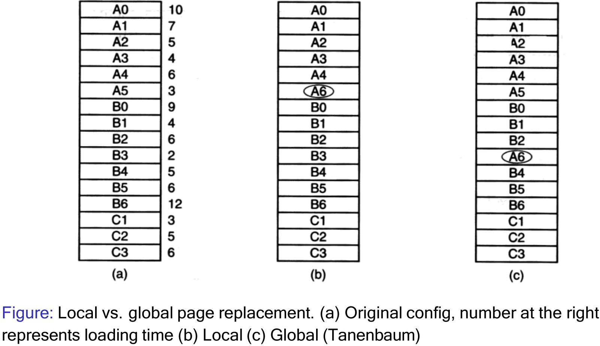

# 17. Page Replacement, Working/Resident Threads & Thrashing
_18/11/22_

## Page Replacement
### Second Chance FIFO
- If a page at the front of the line has not been referenced it is evicted
- If the reference bit is set, the page is placed at the end of the list and reference bit reset
#### (Dis)advantages
- Works better than standard FIFO
- Relatively simple, but it is costly to implement because the list is constantly changing (pages have to be added to the end of the list)
- It can degrade to FIFO if all pages were initially referenced

### The Clock Replacement Algorithm
- Second-chance implementation can be improved by maintaining the page list as a circle.
	- A pointer points to the last visited page
	- It is faster, but can still be slow if the list is long

### Not Recently Used (NRU)
- For NRU, referenced and modified bits are kept in the page table
	- Referenced bits are set 0 at the start, and reset periodically; system clock interrupt or when searching the list
- Four different page 'types' exist
	- class 0: not referenced recently, not modified
	- class 1: not referenced recently, modified
	- class 2: referenced recently, not modified
	- class 3: referenced recently, modified
- Page table entries are inspected upon every page fault
	1. Find a page from class 0 to be removed
	2. If step 1 fails, scan again looking for class 1. During this scan, set the reference bit to 0 on **each page that is bypassed**
	3. If step 2 fails, start again from step 1 (Now we should find elements from class 2 and  3 that have been moved to class 0 or 1)
- The NRU algorithm provides a reasonable performance and is easy to understand and implement

### Least-Recently-Used
- Evicts the page that has not been used the longest
	- OS must keep track of when a page was last used
	- Every page table entry contains a field for the counter
	- This is not cheap to implement as need to maintain a list of pages which are sorted in the order in which they have been used (or search for the page)
- The algorithm can be implemented in hardware using a counter that is incremented after each instruction

### Summary
- **Optimal Page Replacement** - Optimal but not realisable
- **FIFO** page replacement - Poor performance, but easy to implement
	- **Second Change Replacement** - Better than FIFO, not great implementation
	- **Clock Replacement** - Easy maintenance of the list, can still be slow
- **Not Recently Used (NRU)** - Easy to understand, moderately efficient
- **Least recently used (LRU)** - Good approx. To optimal. More difficult to implement (hardware may help)

## Resident Set
- Small resident sets enable to store more processes in memory $\to$ improved CPU utilisation
- Small resident sets may result in more page faults
- Large resident sets may no longer reduce the page fault rate (diminishing returns)
- Trade-off exists between the sizes of the resident sets and system utilisation
- Can be fixed or variable
- For variable sized resident sets, replacement polices can be:
	- Local - A page of the same process is replaced
	- Global - Page can be taken away from a different process
- Variable sized sets require careful evaluation of their size when a local scope is used (often set or the page fault frequency)

*Set of instructions which memory spends the most time in but may not use?*

## Working Sets
 - The resident set comprises the set of pages of the process that are in memory
 - The working set $W(t,k)$ comprises the set referenced pages in the last $k$ (= working set window) virtual time units for the process <- Needs monitoring
 - $k$ can be defined as 'memory references' or as 'actual process time'
	- Set of most recently used pages
	- Set of pages used within a pre-specific time interval
- Working Set size can be used as a guide for the number frames that should be allocated to a process

- Choosing the right value for $k$ is paramount
	- Too small: inaccurate, pages are missing
	- Too large: too many unused pages present
	- Infinity: all pages of the process are in the working set
- Working sets can be used to guide the size of the resident sets; monitor the working set, remove pages from the resident set that are not in the working set
- Calculating the working set constantly is costly to maintain and not practical
- **Page fault frequency (PFF)** - can be use as an approximation
	- If PFF is increased -> need to increase $k$
	- If PFF is very reduced -> may try to decrease $k$

## Resident Sets
- Global replacement policies can select frames from the entire set; they can be taken from other processes
	- Frames are allocated dynamically to processes
	- Processes cannot control their own page fault frequency; the PFF of one process is influenced by other processes
- Local replacement policies can only select frames that are allocated to the current process
	- Every process has a fixed fraction of memory
	- The locally 'oldest page' is not necessarily the globally 'oldest page'
- Windows uses a variable approach with local replacement
- Page replacements algorithms explained before can use both policies

## Paging Daemon
- It is more efficient to proactively keep a number of free pages for future page faults
	- If not, we may have to find a page to evict and we write it to the drive first when a  page fault occurs
- Many systems have a background process called paging daemon 
	- Process runs at periodic intervals
	- It inspects the state of the frames and, if too few frames are few, it selects pages to evict.
- Paging daemons can be combined with buffering (free and modified lists) $\to$ write the modified pages but keep them in main memory when possible
	- When a page has been modified - it must be updated in the drive when it is swapped out
	- Set the modified bit to 0 - which can have an effect on the page replacement algorithms
## Thrashing
- Assume all available pages are in active use and a new pages need to be loaded:
	- Page will be evicted will have to be reloaded soon afterwards
- Thrashing occurs when pages are swapped out and loaded again immediately
- CPU utilisation is low $\to$ scheduler increases degree of multi-programming
	- Add more processes $(1-p^n)$
		- $p = I/O$ wait time, $n$ is the number of processes
	- Frames are allocated to new processes and taken away from existing processes
- CPU utilisation drops further $\to$ scheduler increases degree of multi-programming

### Causes
- Degree of multi-programming is too high i.e. the total demand (sum of all working set sizes) exceeds supply
- Individual process is allocated too few pages

### Prevention
- Using good page replacement policies reducing the degree of multi-programming or adding more memory
- The page fault frequency can be used to detect that a system is thrashing