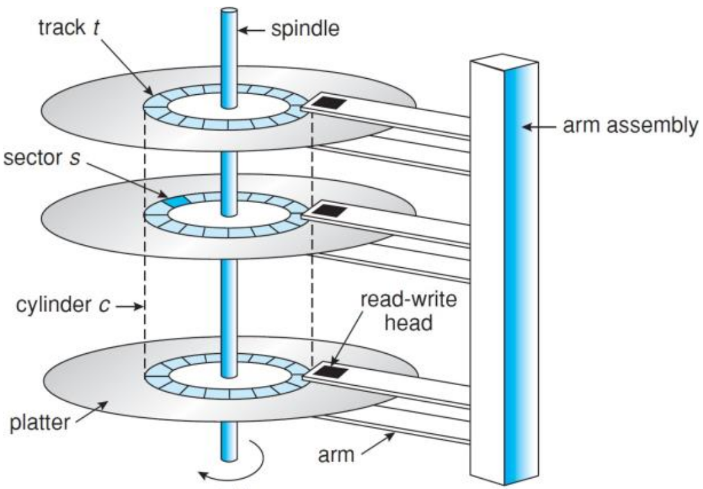

# 18. Disk Scheduling
_21/11/22_
## Hard Disks
### Construciton
- Disks are constructed as multiple aluminium/glass platters covered with magnetisable material
	- Read/write heads fly just above the surface
	- Data is stored on both sides
	- Common diameters range from 1.8 to 3.5 inches
	- Hard disks rotate at a constant speed
- Disk controller sits between the CPU and the drive
- Hard disks are currently about 4 orders of magnitude slower than main memory

### Low Level Format
- Disks are organised in:
	- **Cylinders** - Collection of tracks in the same relative position to the spindle 
	- **Tracks** - Concentric circle on a single platter side
	- **Sectors** - Segments of a track
- Sectors usually have an equal number of bytes in them, consisting of a preamble, data, and an error correcting code (ECC)
- Number of sectors increases from the inner side of the disk to the outside

### Organisation
- Disks usually have a cylinder skew i.e an offset is added to sector 0 in adjacent tracks to account for the seek time
- In the past, consecutive disk sectors were interleaved to account for transfer time
- Due to this, disk capacity is reduced

### Access Times
Access time = seek time + rotational delay + transfer time
- **Seek time** - time needed to move the arm to the cylinder
- **Rotational latency** - time before the sector appears under the head
- **Transfer time** - time to transfer the data

- Multiple requests may be happening at the same time (concurrently). Thus, access time may be increased by a queuing time
- The estimated seek time (move the arm from one track to another) is approximated by 
$$T_S = n \times m + s$$
- $T_s$ - estimated seek time
- $n$ - the number of tracks to be crossed
- $m$ - crossing time per track
- $s$ - additional startup delay

## Disk Scheduling
- OS must use the hardware efficiently:
	- The file system can position/organise files strategically
	- Having multiple disk requests in a queue allows us to minimise the arm movement
- Every I/O operation goes through a system call, allowing the operating system to intercept the request and resequence it
- If the drive (or the controller) is free, the request can be serviced immediately, if not, the request will be queued
- In a dynamic situation, several I/O requests will be made over time that are kept in a table of requested sectors per cylinder
- Disk scheduling algorithms determine the order in which disk events are processed
- None of the algorithms discussed here are optimal algorithms

- FIFO - Process the requests in the order they arrive. Causes the most amount of movement
- SSFO (Shortest seek time first) - Selects the request that is closest to the current head position to reduce head movement. However this could cause disk starvation;
	- Arm stays in the middle of the disk in case of heavy load, edge cylinders are poorly served the strategy is unfair
	- Continuously arriving requests for the same location could starve other regions

### SCAN
- Lift algorithm, SCAN - Keep moving in the same direction until end is reached. This serves all pending requests as it passes over them. When it gets to the last cylinder, it reverses direction and services all the pending requests (until it reaches the first cylinder)
- Dis(advantages) - The upper limit of the waiting time is 2 $\times$ number of cylinders
- Middle cylinders are favoured if the disk is heavily used

### C-Scan (Circular Scan )
- Once the outer/inner side of the disk is reached, the requests at the other end of the disk have been waiting longest. 
- Instead of serving requests in the reverse direction, it doesn't, it just moves. 
- This makes it fairer and equalises response times.

- Look-SCAN moves to the cylinder containing the first/last request (as opposed to the first/last cylinder)
- However, seeks are cylinder by cylinder, and one cylinder contains multiple tracks
- May happen that the arm 'sticks' to a cylinder
- N-step-SCAN only services *N* requests every single sweep
- These be a reasonable choices for the algorithms
- Performance of the algorithms is dependent on the requests/load of the disk

## Driver Caching
- Time required to seek a new cylinder is more than the rotational time
- Read more sectors than actually required and store them in cache
	- Read sectors during rotational delay
	- Modern controllers read multiple sectors when asked for the data from one sector

SSD negate these issues. FCFS is useful in general purposes systems
