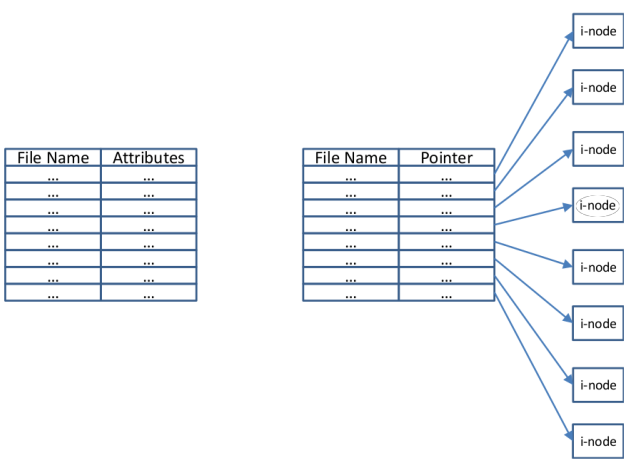
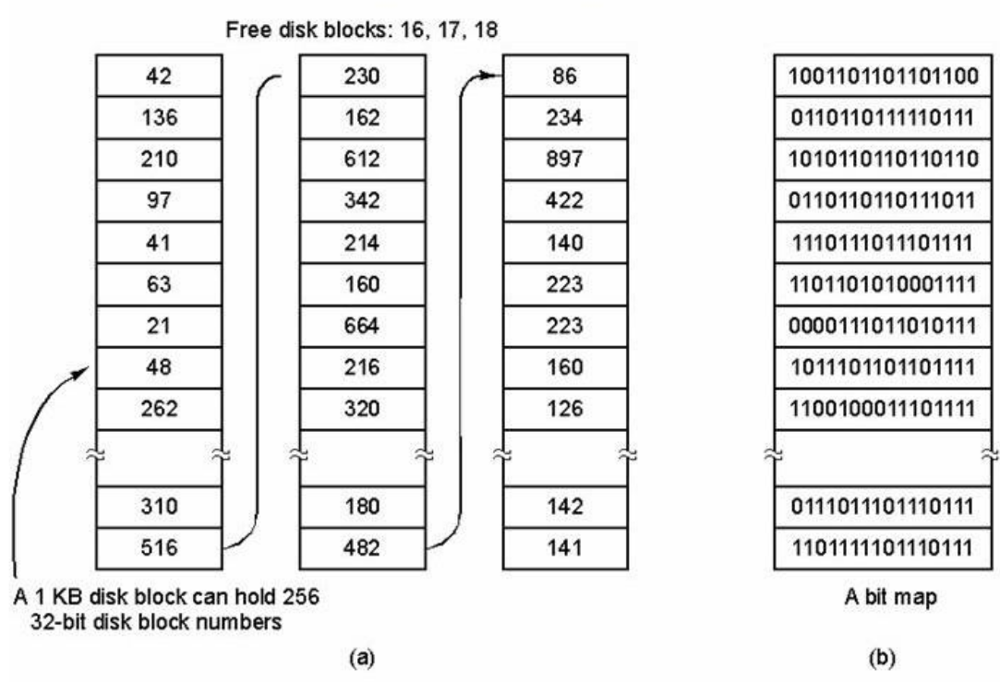

# 19.  User & Implementation view of file systems
_25/11/22_

## File Systems
- A user view that defines a file system in terms of the abstraction that the operating system provides

## User View
- **File abstraction** which hides away implementation details to the user
- File **naming policies**, user file attributes (size, protection, owner, dates)
	- Also system attributes for tiles
- **Directory structures** and organisation
- **System calls** to interact with the file system

The user view define how the file system looks like to regular users and relates to abstractions

### Files
- Many OSs support several types of file
- Both binbows and Unix have regular files and directories
	- **Regular files** contains user data in ASCII or binary format
	- **Directories** group files together
- Unix also has character and block special files
	- **Character special files** are used to model serial I/O devices
	- **Block special files** are used to model.

### System Calls
- File control blocks (FCBs) are kernel data structures (protected and only accessible in kernel mode)
- Allowing user applications to access them directly could compromise their integrity
- System calls enable a user application to ask the operating system to carry out an action on its behalf (kernel mode)
- Two different categories of system calls:
	- **File manipulation**: open(), close(), read(), write()
	- **Directory manipulation**: create(), delete(), rename()..

### File System Structures
- **Single level** - all files in the same directory
- **Two or multiple level directories** - tree structures
	- Absolute path name - from root of the file system
	- Relative path name - current working directory is used as the starting point
- **Directed acrylic graph (DAG)** - Allows files to be shared but cycles are forbidden
- **Generic graph structure** in which links and cycles can exist

The use of DAGs are generic graph structures results in significant complications in the implementations

- When searching file system; cycles can result in infinite loops, sub-trees can be traversed multiple times
- Files have multiple absolute file names
- Deleting files becomes a lot more complicated
- A garbage collection scheme may be required to remove files that are no longer accessible from the system tree

## User/Implementation View
### Directories
- Directories contain a list of human readable file names that are mapped onto unique identifiers and disk locations (mapping of the logical file onto the physical location)
- Retrieving a file comes down to searching a directory file as fast as possible:
	- A simple random order of directory entries might be insufficient
	- Indexes or hash tables can be used
- They can store all file related attributes (Windows) or they can contain a pointer to the data structure that contains the details of the file (Unix)

*Left: Windows directory implementation. Right: Unix directory implementation*

Directories are special files that group files together and of which the structure is defined by the file system

## Implementation View
- Irrespectively of the type of file system, a number of additional considerations have to be accessed, including:
	- Disk partitions, partition tables, boot sectors
	- Free space management
	- System wide and per process file tables
- Low level formatting writes sectors to the disk, high level formatting imposes a file system on top of this

### Hard Disk Structures
Master boot record is located at start of the entire drive
- Used to boot the computer (BIOS reads and executes MBR)
- Contains partition table as its end with active partition
- One partition is listed as active containing a boot block to load the operating system

### Partition Layouts
- The layout of a partition differs depending on the file system
- A UNIX partition contains:
	- Thee partition boot block:
		- Contains a code to boot the operating system
		- Every partition has boot block
	- **Super block** contains the partitions details (size, number of blocks etc)
	- **Free space management** contains bitmap or linked list that indicates the free block
	- **I-nodes** - an array of data structures, one per file, telling all about the files
	- **Root directory** - the top of the file-system tree
	- **Data** files and directories

### Disk Space Management
- Two methods are commonly used to keep track of free disk space: bitmaps and linked lists
- Not that these approaches are very similar to the ones to keep track of free memory
- Bitmaps represent each block by a single bit in a map
	- The size of the bitmap grows with the size of the disk but is constant for a given disk
	- Bitmaps take comparably less space than linked lists
- Linked list of disk blocks (Known as grouping)
	- Use free blocks to hold the number of the free blocks
	- Blocks are linked together i.e. multiple blocks list the free blocks
	- The size of the list grows with the size of the disk and shrinks with the size of the blocks
- Linked lists can be modified by keeping track of the number of consecutive free blocks for each entry

#### Summary
Bitmaps
- Require extra space. 
- Keeping it in main memory is possible only for small disks
Linked lists
- No waste of disk space
- Only need to keep in memory one block of pointers

### File Tables
Number of key data structures stored in memory:
- All in-memory mount table
- An in-memory directory cache of recently accessed directory information 
- A system-wide open file table, containing a copy of the FCB for every currently open file in the system, including location on disk, file size, and open count
- A per-process open file table, containing a pointer to the system open file table
