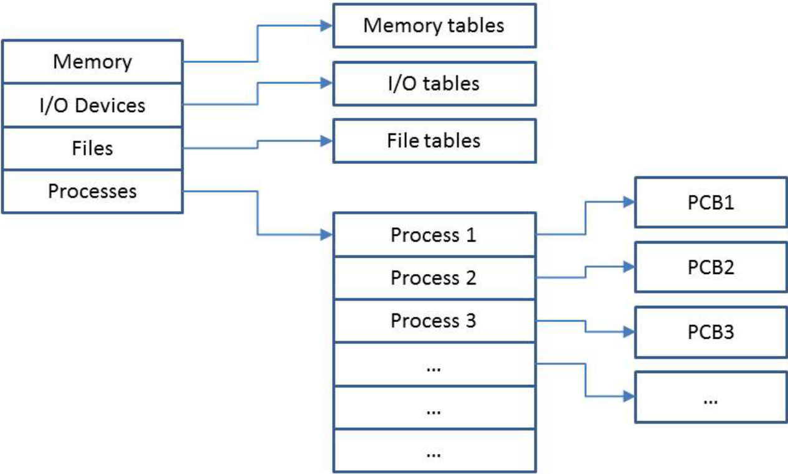

# 2. Processes 
_07/10/22_

## Processes
A process is a running instance of a program. The program is passive and 'sits' on the disk. A process may be active and may hold resources

A process has control structures - they store all necessary information related to the management of the program

## Context Switching
A process control box contains:
- Process identification (PiD, UID, Parent PiD)
- Process control information (process state, scheduling information)
- Process state information (user registers, pc etc)

The process control block is necessary for context switching in multi programmed systems    

Process control blocks are kernel data structures:
- They are stored in the process table
- They are accessible in [kernel mode](2007/1.md#registers) only
- Direct "user-mode access" could compromise their integrity
- They are accessed through system calls

## Process Implementation 

- Process table holds a process control block for each process
- Info about status of resources is maintained in tables
	- **Process tables** - process control blocks
	- **Memory tables** - memory allocation, protection, virtual memory etc
	- **I/O tables** - Availability, status, transfer information
	- **File tables** - Location, status
- Tables are in kernel space and cross referenced. 
## Process States and Transitions

- **New** process has just been created and is waiting to be admitted
- **Ready** process is waiting for the CPU to become available
- **Running** process 'owns' the CPU
- **Blocked** process cannot continue (waiting for IO)
- **Terminated** process is no longer executable
- **Suspended** process is swapped out
The interrupts lie on the basis of the transitions
## Context Switching - Multi-programming
Mutli-programming goes back to the 'MULTICS' age
This is achieved by alternating processes and context switching
- Single processor systems result in concurrent execution
- True parallelism requires multiple processors

Save CPU State -> The process control block is updated
Restore CPU State -> the process control block read

A trade-off exists between the length of time-slice and context switching.
- Slow time slices - good response times. low utilisation
- Long time slices - poor response times, better utilisation 

## Process
- A process memory image contains the program code and a data segment (stack or heap)
- Every process has its own logical address space
- Some OS use address space layout randomisation.

## System Calls
True system calls are 'wrapped' in the OS libraries following a well defined interface
- Unit: `fork()` generates an exact copy of the parent
- Windows: `NTCreateProcess()`
- Linux: `Clone()`

System calls are necessary to notify the OS and the process has terminated. 
- Resources must be de-allocated
- Output must be flushed
- Process admin may have to be carried out
### Fork 
- `fork()` creates an exact copy of the current process. **The first instruction carried out by the child in the first one after the `fork` call**
- `fork()` returns the process identifier of the child process to the parent process
- `fork()` returns 0 to the child process

