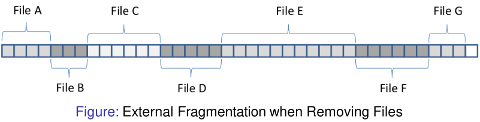
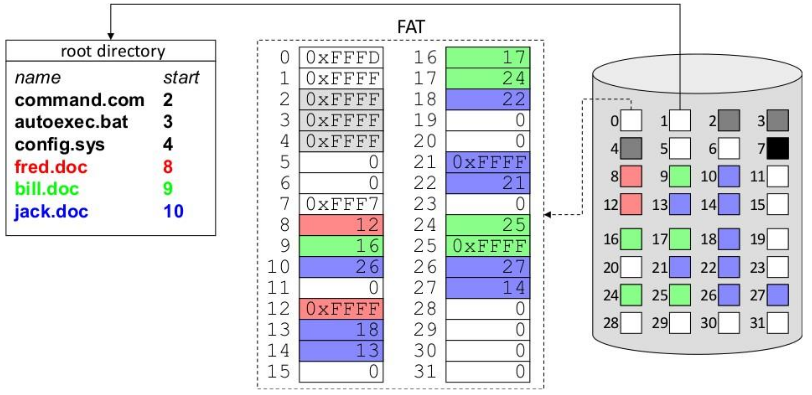
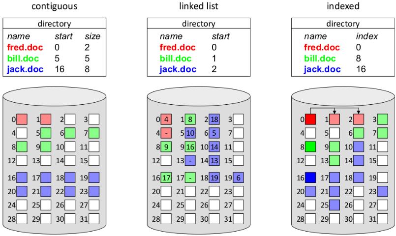

# 20. File System Implementations
_28/11/22_
## Contiguous Allocation
- Contiguous file systems are similar to dynamic partitioning memory allocation: 
	- Each file is stored in a single group of adjacent blocks on the hard disk
- Allocation of free space can be done using first fit, best fit, next fit etc

### Advantages
- Simple to implement: only location of first block and the length of the file must be stored
- Optimal read/write performance: blocks are co-located/clustered in nearby/adjacent sectors, hence the seek time is minimised
### Disadvantages
- Exact size of a file (process) is not always known beforehand: what if the file size exceeds the initially allocated disk space
- Allocation algorithms needed to decide which free blocks to allocate to a given file
- Deleting a file results in external fragmentation: de-fragmentation must be carried out regularly

## Linked Lists
- To avoid external fragmentation, files are stored in separate blocks that are linked to one another
- Only the address of the first block has to be stored to locate a file
- Each block contains a data pointer to the next block (takes up space)
### Advantages
- Easy to maintain: only the first block (address) has to be maintained in the directory entry
- File sizes can grow dynamically (file size does not have to be known beforehand): new blocks/sectors can be added to the end of the file
- Similar to paging for memory, every possible block/sector of disk space can be used (no external fragmentation)
- Sequential access is straightforward, although more seek operations/disk access may be required

### Disadvantages
- Random access is very slow, to retrieve a block in the middle, one has to walk through the list from the start
- There is some internal fragmentation on average the last half of the last block is left unused
	- Internal fragmentation will reduce for smaller block sizes
- May result in random disk access, which is very slow
	- Larger blocks(containing multiple sectors) will be faster
- Space is lost within the blocks due to the pointer, the data in a block is no longer a power of 2!
- Diminished reliability: if one block is corrupt/lost, access to the rest of the file is lost
- To prevent against this we can use FAT
## File Allocation Table (FAT)
Store the linked-list pointer in a separate index table, called a File Allocation Table in memory.

### Advantages
- Block size remains power of 2. No space is lost due to the pointer
- Index table can be kept in memory allowing fast non-sequential random access.

### Disadvantages
- Size of the file allocation table grows with the number of blocks, and hence the size of the disk
## I-nodes (lookups)
- Each file has a small data structure called I-node (index-node) that contains its attributes and block pointers.
	- I-node is only loaded when the file is open
	- If every I-node consists of n bytes, and at most k files can be open at any point in time, at most $n\times k$ bytes of main memory are required
- I-nodes are composed of direct block pointers (usually 10), indirect block pointers, or a combination thereof

### Directories
- In UNIX, all information about the file (type, size, date, owner and block pointers) is stored in its i-node.
- Therefore, directory tables are very simple data structures composed of file name and a pointer to the i-node.
- Note that directories are no more than a special kind of file, so they have their own i-node.
### Lookups
- Opening a file requires the disk blocks to be located
	- **Absolute file names** are located relative to the root directory
	- **Relative file names** are located based on the current working directory

## Comparison
