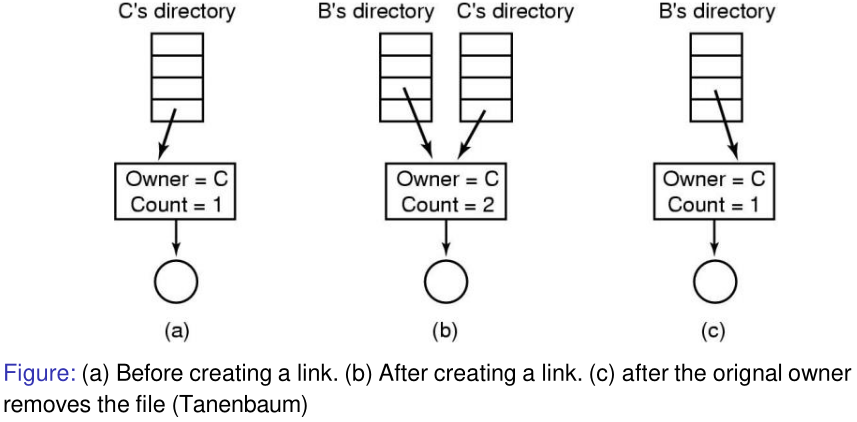
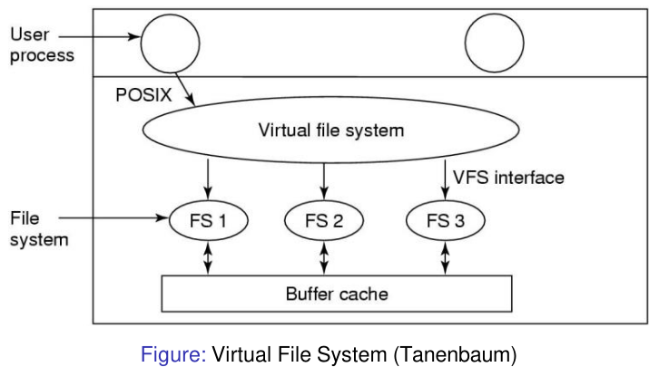

# 21. I-Nodes & File Systems
_02/12/22_

## I-nodes
- Two approaches to share a file
	- **Hard Links:** Maintain two (or multiple) references to the same i-node in B and C
	- **Symbolic/soft links**: Owner maintains a reference to the i-node. The 'referencer' maintains a small file (has its own i-node) that contains the location and name of the shared file in directory
### Hard Links
Fastest way of linking files!
- Disadvantages:
	- If the i-node is deleted, any hard link will point to an invalid i-node
	- If the i-node gets deleted and recycled to point to an other file, the hard links will point to the wrong file!
- Only solution is to delete the file, and leave the i-node intact if the 'reference count' is larger than 0

### Soft Links
- Disadvantages:
	- They result in an extra file lookup (once the link file has been found, the original file needs to be found as well)
	- They require an extra i-node for the link file
- Advantages:
	- No problems with deleting the original file -> the file simply does not exist any more
	- They can cross the boundaries of machines. Linked file can be located on a different machine

## Log Structured File System
### Context
- Consider the creation of a new file
	1. Allocate, initialise and write the i-node for the file
	2. Update and writ the directory entry for the file
	3. Write the data to the disk
- The corresponding blocks are not necessarily in adjacent locations!
- Also in linked lists/FAT file systems blocks can be distributed all over the disk

- Due to seek and rotational delays, hard disks are slow compared to other components in a computer
- A log structured file system aims to improve the speed of a file system on a traditional hard disk by minimising head movements and rotational delays using the entire disk as a great big log
- A log is a data structure that is written only at the end
### Concept
- Log structured file systems buffer read and write operations (i-nodes) in memory, enabling us to write 'larger volumes' in one go
- Once the buffer is full it is 'flushed' to the disk and written as one contiguous segment and the end of a log
	- I-nodes and data are all written to the same segment
	- Finding -nodes (normally at the start of the partition) becomes more difficuly
- An i-node map is maintained in memory to quickly find the address of i-nodes on the disk

- A cleaner thread is running in the background and spends its time scanning the log circularly and compacting it.
- Hard drive is treated as a circular buffer
- It removes deleted files and files being used right now are marked as free segments as they will be later written at the end
### Advantages
- Greatly increases disk performance on writes, file creates, deletes
- Writes are more robust as they are done as a single operation(multiple small writes are more likely to expose the file system to serious inconsistency)
### Disadvantages
- Not been widely used because it is highly incompatible with existing file systems
- In addition, the cleaner thread takes additional CPU time

## File System Implementations
Deleting a file consists of:
1. Remove the files directory entry
2. Add the files i-node to the pool of free i-nodes
3. Add the files disk blocks to the free list
- Where does it go wrong:
	- Directory entry has been deleted and a crash occurs -> i-nodes and disk blocks become inaccessible
	- The directory entry and i-nodes have been released and a crash occurs -> disk blocks become inaccessible
- Changing the order of the events does not necessarily resolve the issues
- Journaling file systems aim at increasing the resilience of file systems against crashes by recording each update to the file system as a transaction

### Concept
- Key idea behind a journaling file system is to log all events (transactions) before they take place
	- Write the actions that should be undertaken to a log file
	- Carry them out
	- Remove/commit the entries once completed
- If a crash happens in the middle of an action the entry in the log file will remain present after the crash
- The log can be examined after the crash and used to restore the consistency of the file system
- NTFS and EXT3-4 are examples of journaling file systems

### Virtual File Systems
- Multiple file systems usually coexists on the same computer
- These file systems can be seamlessly integrated by the operating system
- Usually achieved by using virtual file systems (VFS)
- VFS relies on standard object oriented principles (polymorphism)
- Can define a generic interface `public DataObject readData();` This would be the POSIX interface containing reads, writes, closes etc

- Unix and LInux unify different file systems and present them as a single hierarchy and hides away/abstracts the implementation specific details for the user
- The VFS presents a unified interface to the 'outside'
- File system specific code is dealt with in an **implementation layer** that is **clearly seperated from the interface**

- Each VFS interface commonly contains the POSIX system calls
- Each file system that meets the VFS requirements provides an implementation for the system calls contained in the interface
- Implementations can be for remote file systems

## Summary
- Logs - store everything as close as possible
- Journaling - apply the transaction principle
- VFS - apply good software design