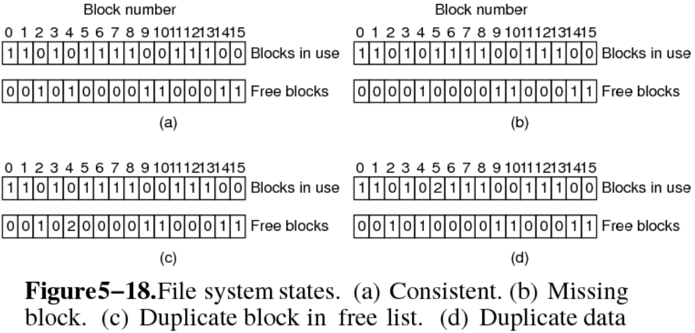
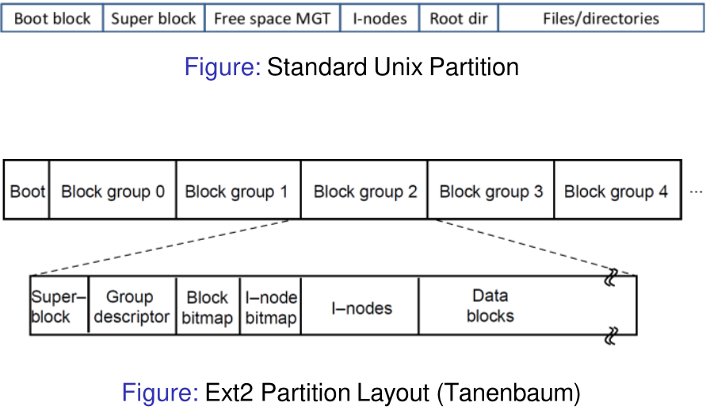

# 22. File System Recovery & Defag
_05/12/22_

## File System Consistency
### Checking Consistency
- Journaling heavily reduces the probability of having inconsistencies in a file system. The log stores what operations were not run.
- However,  it can still be possible to get some inconsistencies (data blocks weren't flushed to the drive)
- Can be problematic, especially for structural blocks such as i-nodes, directories and free lists
- System utilities are available to restore file systems
- Two main consistency checks; blocks and directory

### Block Consistency
- Checks whether blocks are assigned/used the correct way
- Block consistency is checked by building two tables:
	1. How often a block is present in a file (based on the i-nodes)
	2. Counts how often a block is present in the free list
- Consistent file system has a 1 in either of the tables for each block
- Typically, this is a very slow process, can take hours


### Restore Block Consistency
- A **missing block** - does not exist in any of the tables -> add it to the free list
- A block is **double counted** in the free list ("disaster" waiting to happen) -> re-build the free list
- A block is present in two or more files
	- Removing one file results in the adding the block to the free list
	- Remove both files will result in a double entry in the free list
	- Solution: use new free block and copy the content (file is still likely to be damaged 😞)
```
FSCK Algorith:
1. Iterate through all the i-nodes
	- retrieve the blocks
	- increment the counters
2. Iterate through the free list
	- incremenet counters for free blocks
```

### Restore I-node consistency
- Checking the directory system
- I-node counter is higher than the number of directories containing the file
	- Removing the file will reduce the i-node counter by 1
	- Since the counter will remain larger than 1, the i-node/disk space will not be released to future use
- I-node counter is less than the number of directories containing the file
	- Removing the file will (eventually) set the i-node counter to 0 whilst the file is still referenced
	- The file/i-node will be released, even though the file was still in use
```
- Recurse through the directory hierarchy
	- Check file specific counters
	- I.e. each file is associated with one counter
- One file may appear in multiple directories
	- Compare the file counters and i-node counters
	- Correct if necessary
```

## File System Defragmentation
- At the start all free disk space is in a single contiguous unit
- Creating and removing files, a disk may end up badly fragmented
- Defrag utilities make file blocks contiguous (very slow operation), and free space in one or more large contiguous regions on the disk
- Defragmentating SSD is counter-productive

## Linux File System
- **Minix File System** - Max: 64MB, file names limited to 14 char
- **Extended File System (extfs)** - file names were 255 char, max file size 2GB
- **ext2** - larger files, names, better performance
- **ext3-4** - journaling


### Directory Entries
- Superblock contains file system information
- Group descriptor contains bitmap locations, number of free blocks, i-nodes and directories
- Data block bitmap and i-node bitmap, used to keep track of free disk blocks and i-nodes
- Table of i-nodes containing file and disk block information
- Data blocks containing file and directory blocks

### EXT2
- Partition is split into several block groups
	- Reduce fragmentation by storing i-nodes and files, and parent directories and files in the same block group is possible
	- Reduce seek time and improve performance
- All groups have the same size and are stored sequentially