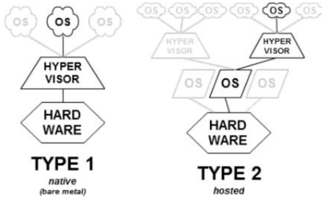

# 23. Virtualisation
_09/12/22_
## What is Virtualisation
### Basic Idea
- Abstract hardware of a single computer into several different execution environments.
- Similar to layered approach, but layer creates virtual system (virtual machine) on which operation systems or applications can run several components
- A failure in a particular VM does not result in bringing down any others.
- Virtual machine visualises an entire physical machine
	- Providing the illusion that software has full control over the hardware
	- As implication, you can run multiple instances of the as OS on the same machine.

### Components
- **Host** - underlying hardware system
- Virtual machine manager (VMM) or **hypervisor** - creates and runs virtual machines by providing an interface that is identical to the host
- **Guest** - process provided with virtual copy of the host

### Main properties
- **Isolation** - each VM is independent, so failures do not affect the host
- **Encapsulation** - state can be captured into a file
	- Check pointing, migration. It is easier than migrating processes. Just move the memory image that contains OS tables
- **Interposition** - All guest actions go through the monitor which can inspect, modify, deny operations
- Fewer physical machines save money on hardware and electricity

### Requirements for Virtualisation
- **Safety** - the hypervisor should have full control of the virtualised resources
- **Fidelity** - the behaviour of a program on a VM should be identical to that of the same program running on bare hardware. 
- **Efficiency** - much of the code in the VM should run without intervention by the hypervisor (overheads). For instance with VMware:
	- CPU intensive apps: 2-10% overhead
	- I/O intensive apps: 25-60% overhead

## Approaches to Virtualisation
- Java VM is very different from the physical machine that runs it
- Like a simulator or emulator that you can run old Nintendo games on

- **Full Virtualisation** - Tries to trick the guest into believing that it has the entire system
- **Paravirtualisation** - VM does not simulate hardware. It offers a set of hypercalls which allows the guest to send explicitly requests to the hypervisor (as a system call offers kernel services to applications)
- **Process-level virtualisation** - The aim is to simply allow a process that has written for a different OS to run. Wine in linux to run windows applications; Cygwin to run linux shell on windows

### Types of hypervisors
- **Natives (Type 1)** - Like an OS, since it is the only programming running in the most privileged mode. Its job is to support multiple copies of the actual hardware
- **Hosted (Type 2)** - Relies on a OS to allocate a schedule resources, very much like a regular process

### VMMs
#### Native Virtual Machines (Type 1 Hypervisors)
- Hypervisor installs directly on hardware
- Hypervisor is the real kernel
- OS runs in user mode
	- Virtual kernel mode
	- Privileged instructions need to be processed by the Hypervisor
	- Hardware VT technology will be necessary
- Acknowledged as preferred architecture for high-end servers
- Paravirutalised-based VMs are typically based on type 1 hypervisors
#### Hosted Virtual Machines (Type 2 Hypervisors)
- Installs and runs VMs as an application on an existing OS
- Relies on host scheduling. May not be suitable for intensive VM workloads
- I/O path is slow because it required world switch
- Process-level virtualisation will reply on type 2 hypervisors. Needs an OS.
### What needs to be 
Hypervisor must virtualise:
- Privileged instructions
	- Not safe to let guest kernel run in kernel mode. VM needs two modes; virtual user modes and virtual kernel mode. Both run in real user mode
	- When guest OS executes an instruction that is allowed only when the CPU really is in kernel mode(map virtual pages to physical pages):
		- Type-1 hypervisors: In CPU without Virtual Technology the instruction fails, and the OS crashes
		- Type-2 hypervisors could work without VT - privileged instructions are emulated (binary translation)
	- **Trap-and-emulate** - When attempting a privileged instruction in user mode causes an error(trap). VMM gains control and executes it. Returns control to guest in user mode
- CPU
	- Need to multiplex VMs on CPU. Can do this with:
		- Time-slice - Each VM will time slice its OS/Applications during its quantum
	- For type-1 - Need a relatively simple scheduler
- Memory
	- The hypervisor partitions memory among VMs; Assigns hardware pages to VM, Needs to control mappings for isolation
	- In each VM, the OS creates and manages page tables. But these tables are not used by the MMU
	- For each VM, the hypervisor creates a shadow page table that maps virtual pages used by the VM onto the actual pages the hypervisor gave it
- I/O devices
	- Guest OSs cannot interact directly with I/O devices - but the guest OS thinks it 'owns' the device
	- VMM receives interrupts and exceptions
	- Type 1 hypervisors run the drivers
	- Type 2 hypervisors - Driver knows about hypervisor/VMM and cooperates to pass the buck to a real device driver on the underlying host OS