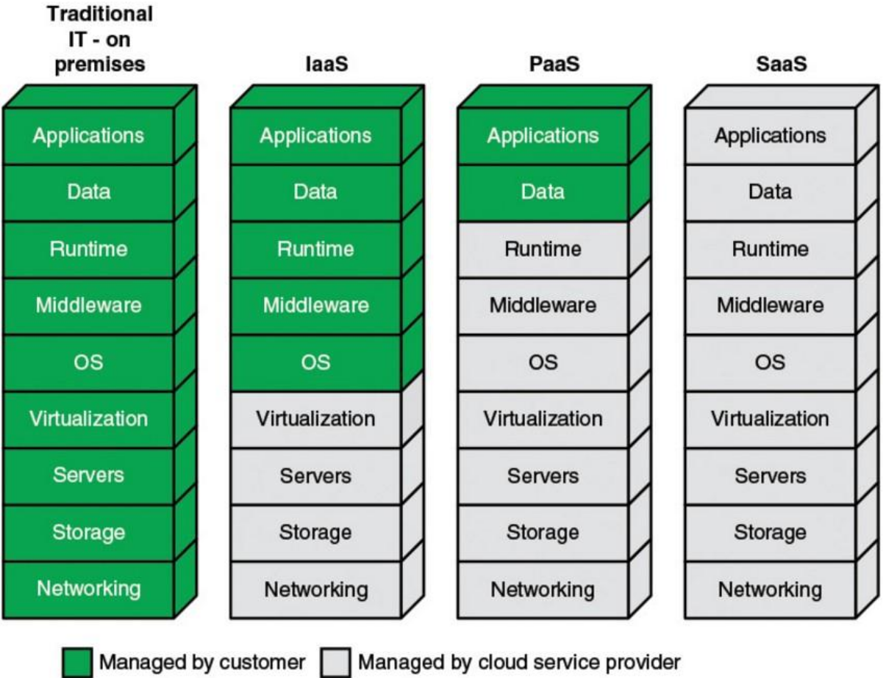
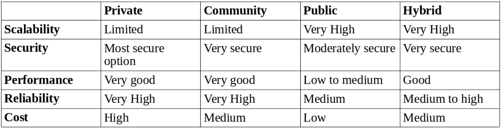

# 24.  Virtualisation & the Cloud
## Cloud Computing
- Computational paradigm
- Out-source your computation and storage needs to a well-managed data centre
- No worries about the physical machines: power, cooling, maintenance
- Virtualisation provides the necessary isolation to share multiple clients on a single physical machine
### Basic Cloud Characteristics
- Number of characteristics define cloud data, applications services & infrastructure
- **Remotely hosted** - services or data are hosted on remote infrastructure No-need-to-know in terms of the underlying details of infrastructure, application interface with the infrastructure via the APIs
- **Ubiquitous** - services or data are available from anywhere
- Flexibility and elastically allow these systems to scale up and down will:
	- Utilising resources of all kinds
	- CPU, storage, server capacity, load balancing, databases
- **Commodified** - result is utility computing model similar to traditional utilities, like gas and electricity 

### Caveats
- Easier for IT managers to deal with the computing
- Scalability, backups, depreciation, reliability, performance
- **Rapid elasticity** is currently one of the key challenges in cloud computing
- Capabilities can be rapidly and elastically provisioned 
- To the consumer, resources often appear to be unlimited and can be purchased in any quantity at a time
- **Optimisation** of the current usage will save energy!
- **Prediction** techniques may help alleviate the problem based on historical data

### Virtualisation
- Allows to carry out multiple OS and carry out a clever management
- Challenge is to move the VM from the hardware that needs servicing to a new machine without taking it down at all
- **Non-live migration** - Instead of shutting down computer, just pause the VM (checkpointing), then copy over the memory pages used by the VM to the new hardware as quickly as possible
- **Live Migration** - Idea is to start moving the virtual machine while it is still operational

### Cloud Service Models
#### Iass 
- Provides resources of the underlying cloud infrastructure to customers
- VM's with different OSs and other visualised hardware, processing, storage networks 
- End-user: typically a system administrator
#### Pass
- Provides service in the form of a platform on which the customer's applications can run
- Tools to create your own applications
- End-user: developers
#### Saas
- Provides service to customer in the form of software
- Applications that run on the cloud
- End-user: regular users

- Private - Implemented within the internal IT environment of an organisation 
- Public - An organisation selling cloud services to the general public
- Community - Somewhere in between private and public
- Hybrid - Composed of two or more clouds
